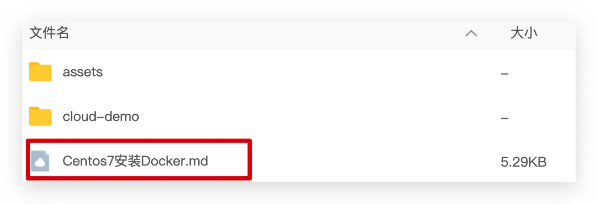

# 安装

企业部署一般都是采用Linux操作系统，而其中又数CentOS发行版占比最多，因此我们在CentOS下安装Docker。参考课前资料中的文档：

[Centos7安装Docker.md](https://github.com/scZhengChao/IT_Blogs/releases/download/assets-v1/Centos7.Docker_wnppBqXrzw.md "Centos7安装Docker.md")

[换源](./换源/index.md "换源")
