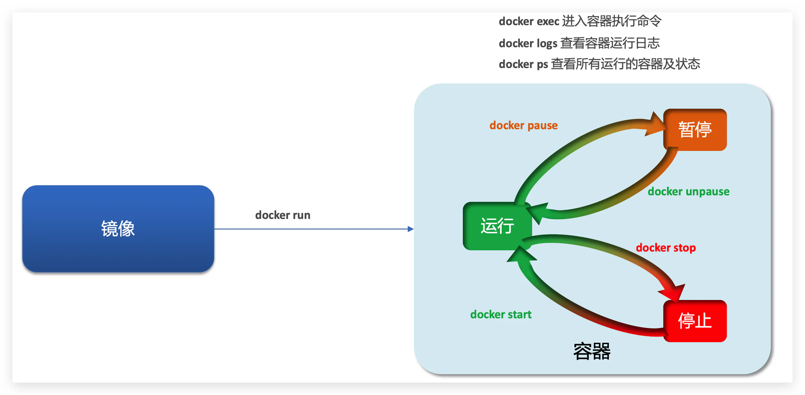

# 容器

容器保护三个状态：

- 运行：进程正常运行
- 暂停：进程暂停，**CPU不再运行，并不释放内存**
- 停止：进程终止 **，回收进程占用的内存、CPU等资源**

其中：

- docker run：创建并运行一个容器，处于运行状态
- docker pause：让一个运行的容器暂停
- docker unpause：让一个容器从暂停状态恢复运行
- docker stop：停止一个运行的容器
- docker start：让一个停止的容器再次运行
- docker rm：删除一个容器
- **docker ps -a 查看所有容器**

[创建并运行一个容器](./创建并运行一个容器/index.md "创建并运行一个容器")

[进入容器，修改文件](./进入容器，修改文件/index.md "进入容器，修改文件")

[小结](./小结/index.md "小结")

[创建并运行一个redis容器，并且支持数据持久化](./创建并运行一个redis容器，并且支持数据持久化/index.md "创建并运行一个redis容器，并且支持数据持久化")
