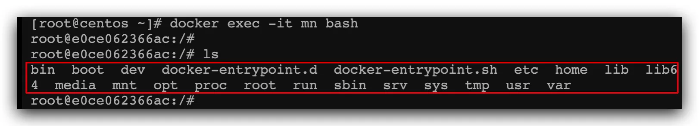
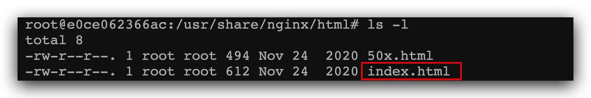
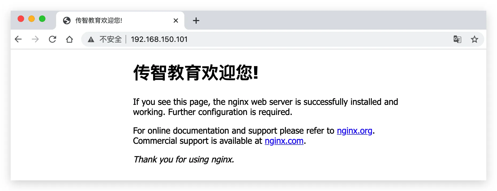
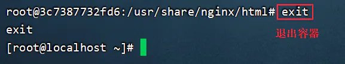

# 进入容器，修改文件

**需求**：进入Nginx容器，修改HTML文件内容，添加“传智教育欢迎您”

**提示**：进入容器要用到docker exec命令。

**步骤**：

1）进入容器。进入我们刚刚创建的nginx容器的命令为：

```docker 
docker exec -it mn bash

```


命令解读：

- docker exec ：进入容器内部，执行一个命令
- -it : 给当前进入的容器创建一个标准输入、输出终端，允许我们与容器交互
- mn ：要进入的容器的名称
- bash：进入容器后执行的命令，bash是一个linux终端交互命令
  > bash命令是shell脚本命令的超集，大多数shell脚本都可以在bash下运行，bash主要有如下这些功能：
  > &#x20;  &#x20;
  > &#x20;   cd rm mkdir....

2）进入nginx的HTML所在目录 /usr/share/nginx/html

容器内部会模拟一个独立的Linux文件系统，看起来如同一个linux服务器一样：



nginx的环境、配置、运行文件全部都在这个文件系统中，包括我们要修改的html文件。

**查看DockerHub网站中的nginx页面**，可以知道nginx的html目录位置在`/usr/share/nginx/html`

我们执行命令，进入该目录：

```bash 
cd /usr/share/nginx/html

```


查看目录下文件：



3）修改index.html的内容

容器内没有vim命令，无法直接修改，我们用下面的命令来修改：

```bash 
sed -i -e 's#Welcome to nginx#传智教育欢迎您#g' -e 's#<head>#<head><meta charset="utf-8">#g' index.html

```


说明：

> 1\)-e : 可以**在同一行里执行多条命令**
>
> 2\)**-i**就是**直接对文本文件进行操作的**

在浏览器访问自己的虚拟机地址，例如我的是：[http://192.168.150.101，即可看到结果：](<> "http://192.168.150.101，即可看到结果：")




