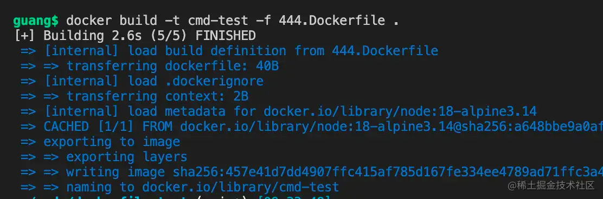

# CMD 结合 ENTRYPOINT

前面我们指定容器跑起来之后运行什么命令，用的是 CMD：


其实还可以写成 ENTRYPOINT：


**这两种写法有什么区别么？**

我们来试试：

写个 444.Dockerfile

```docker 
FROM node:18-alpine3.14

CMD ["echo", "光光", "到此一游"]

```


然后 build：

```docker 
docker build -t cmd-test -f 444.Dockerfile .

```




然后 run 一下：

```docker 
docker run cmd-test

```


**没有指定 --name 时，会生成一个随机容器名。**

就是这种：


这不是重点。

**重点是用 CMD 的时候，启动命令是可以重写的：**

```docker 
docker run cmd-test echo "东东"

```


可以替换成任何命令。

而用 ENTRYPOINT 就不会：

```docker 
FROM node:18-alpine3.14

ENTRYPOINT ["echo", "光光", "到此一游"]

```


docker build:

```docker 
docker build -t cmd-test -f 444.Dockerfile .

```


docker run:

```docker 
docker run cmd-test echo "东东"

```


可以看到，**现在 dockerfile 里 ENTRYPOINT 的命令依然执行了。**

**docker run 传入的参数作为了 echo 的额外参数。**

**这就是 ENTRYPOINT 和 CMD 的区别。**

一般还是 CMD 用的多点，可以灵活修改启动命令。

其实 ENTRYPOINT 和 CMD 是可以结合使用的。

比如这样：

```docker 
FROM node:18-alpine3.14

ENTRYPOINT ["echo", "光光"]

CMD ["到此一游"]

```


docker build：

```docker 
docker build -t cmd-test -f 444.Dockerfile .

```


docker run:

```docker 
docker run cmd-test
docker run cmd-test 66666

```


当没传参数的时候，**执行的是 ENTRYPOINT + CMD 组合的命令，而传入参数的时候，只有 CMD 部分会被覆盖**。

**这就起到了默认值的作用。**

所以，用 ENTRYPOINT + CMD 的方式更加灵活。

这是第四个技巧。
