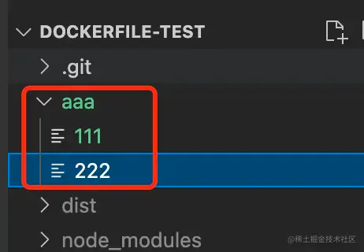
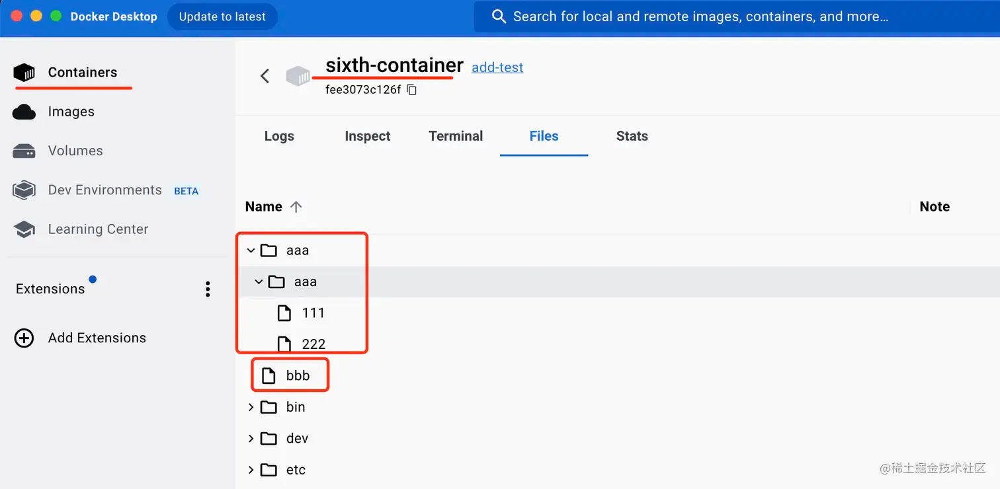
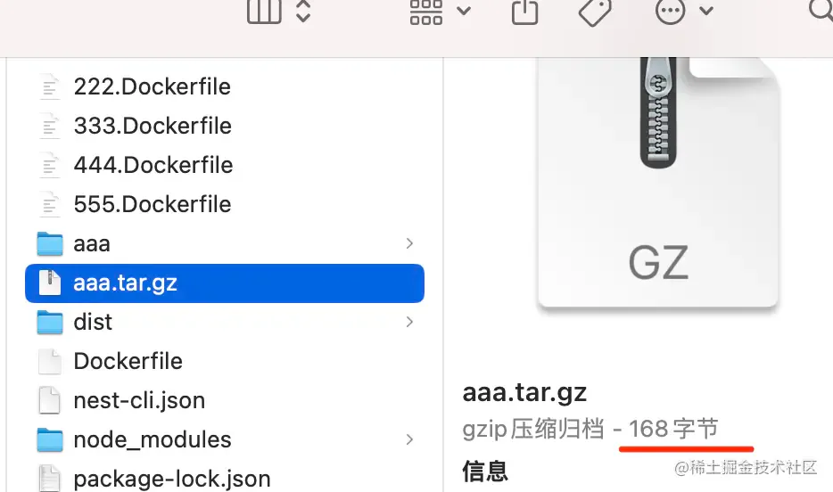

# COPY vs ADD

其实不只是 ENTRYPOINT 和 CMD 相似，dockerfile 里还有一对指令也比较相似，就是 ADD 和 COPY。

这俩都可以把宿主机的文件复制到容器内。

但有一点区别，**就是对于 tar.gz 这种压缩文件的处理上：**

我们创建一个 aaa 目录，下面添加两个文件：



使用 tar 命令打包：

```docker 
tar -zcvf aaa.tar.gz ./aaa

```


然后写个 555.Dockerfile

```docker 
FROM node:18-alpine3.14

ADD ./aaa.tar.gz /aaa

COPY ./aaa.tar.gz /bbb

```


docker build 生成镜像：

```docker 
docker build -t add-test -f 555.Dockerfile .

```


docker run 跑起来：

```docker 
docker run -d --name sixth-container add-test

```


可以看到 **，ADD 把 tar.gz 给解压然后复制到容器内了。**



而 COPY 没有解压，它把文件整个复制过去了：




**也就是说，ADD、COPY 都可以用于把目录下的文件复制到容器内的目录下。**

**但是 ADD 还可以解压 tar.gz 文件。**

一般情况下，还是用 COPY 居多。
