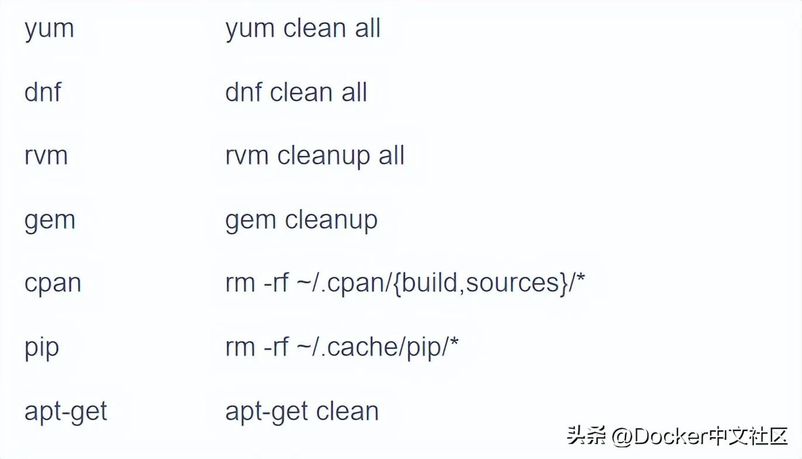

# 压缩layars

一般的包管理器，比如 apt, pip 等，**下载包的时候，都会下载缓存，下次安装同一个包的时候不必从网络上下载，直接使用缓存即可。**

但是在 Docker Image 中，我们是不需要这些缓存的。所以我们在 Dockerfile 中下载东西一般会使用这种命令：

Dockerfile 里面的每一个 RUN 都会创建一层新的 layer

```bash 
RUN dnf install -y --setopt=tsflags=nodocs \
    httpd vim && \
    systemctl enable httpd && \
    dnf clean all
```


在包安装好之后，去删除缓存。

一个常见的错误是，有人会这么写：

```bash 
FROM fedora
RUN dnf install -y mariadb
RUN dnf install -y wordpress
RUN dnf clean all
```


**Dockerfile 里面的每一个 RUN 都会创建一层新的 layer**，如上所说，这样其实是创建了 3 层 layer，前 2 层带来了缓存，第三层删除了缓存。如同 git 一样，你在一个新的 commit 里面删除了之前的文件，其实文件还是在 git 历史中的，最终的 docker image 其实没有减少。

但是 Docker 有了一个新的功能，docker build --squash。squash 功能会在 Docker 完成构建之后，将所有的 layers **压缩成一个 layer**，也就是说，最终构建出来的 Docker image 只有一层。所以，如上在多个 RUN 中写 clean 命令，其实也可以。我不太喜欢这种方式，因为前文提到的，多个 image 共享 base image 以及加速 pull 的 feature 其实就用不到了。

```bash 
docker build --squash
squash 功能会在 Docker 完成构建之后，将所有的 layers 压缩成一个 layer，
也就是说，最终构建出来的 Docker image 只有一层。
```


一些常见的**包管理器删除缓存**的方法：



另外，上面这个命令其实还有一个缺点。因为我们在同一个 RUN 中写多行，不容易看出这个 dnf 到底安装了什么。而且，第一行和最后一行不一样，如果修改，diff 看到的会是两行内容，很不友好，容易出错。

可以写成这种形式，比较清晰。

```bash 
RUN true \
    && dnf install -y --setopt=tsflags=nodocs \
        httpd vim \
    && systemctl enable httpd \
    && dnf clean all \
    && true
```
