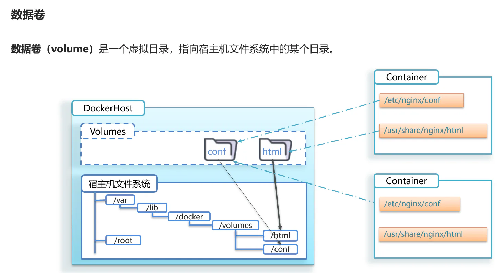
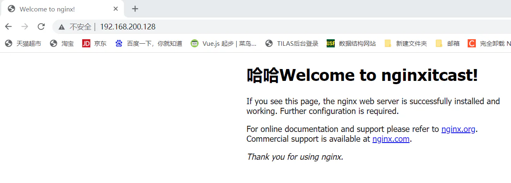

# 通过数据卷方式将容器目录挂载到宿主机指定目录

## 目录

- [案例-给nginx挂载数据卷](#案例-给nginx挂载数据卷)

我们在创建容器时，可以通过 -v 参数来挂载一个数据卷到某个容器内目录，命令格式如下：

```bash 
docker run --name mn -v html:/root/html -p 8080:80 -d nginx:latest

```


这里的-v就是挂载数据卷的命令：

- `-v html:/root/html`：把`html`**数据卷**挂载到**容器内的/root/html这个目录中**
- **html 不存在 会自动创建**



### 案例-给nginx挂载数据卷

**需求**：创建一个nginx容器，修改容器内的html目录内的index.html内容

**分析**：上个案例中，我们进入nginx容器内部，已经知道nginx的html目录所在位置/usr/share/nginx/html ，我们需要把这个目录挂载到html这个数据卷上，方便操作其中的内容。

**提示**：运行容器时使用 -v 参数挂载数据卷

步骤：

① 创建容器并挂载数据卷到容器内的HTML目录

```docker 
docker run --name mn -v html:/usr/share/nginx/html -p 80:80 -d nginx

```


> -d：后台运行容器

② 进入html数据卷所在位置，并修改HTML内容

```markdown 
# 查看html数据卷的位置
docker volume inspect html
# 进入该目录
cd /var/lib/docker/volumes/html/_data
# 修改文件
vim index.html

```


③浏览器访问


