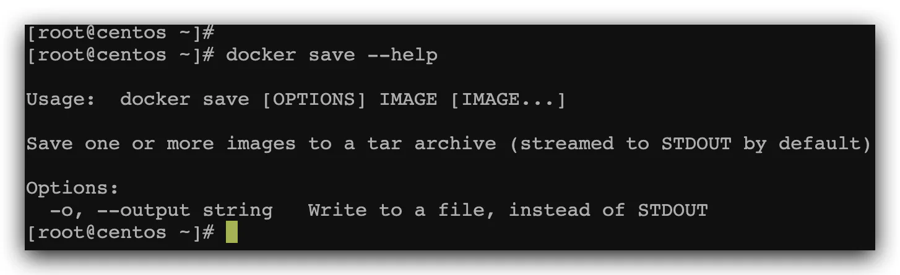
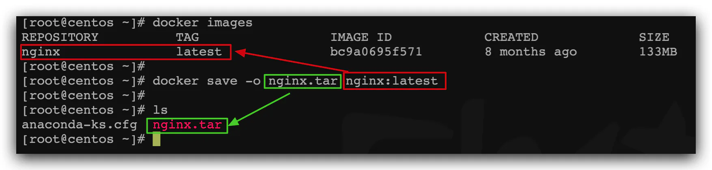
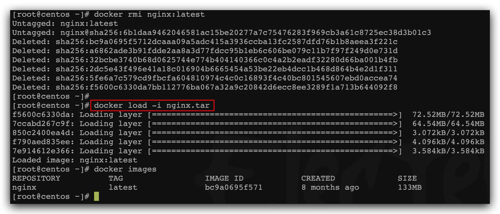

# 保存、导入镜像

需求：利用docker save将nginx镜像导出磁盘，然后再通过load加载回来

1）利用docker xx --help命令查看docker save和docker load的语法

例如，查看save命令用法，可以输入命令：

```docker 
docker save --help

```


结果：



命令格式：

```bash 
docker save -o [保存的目标文件名称] [镜像名称]
```


2）使用docker save导出镜像到磁盘

运行命令：

```docker 
docker save -o nginx.tar nginx:latest

```


结果如图：



3）使用docker load加载镜像

先删除本地的nginx镜像：

```docker 
docker rmi nginx:latest
```


然后运行命令，加载本地文件：

```docker 
docker load -i nginx.tar

```


结果：


