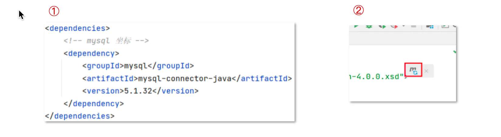
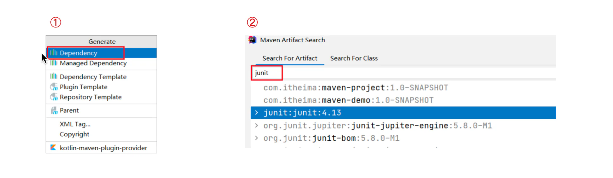

依赖管理

## 目录

- [使用坐标导入 jar 包](#使用坐标导入-jar-包)
- [使用坐标导入 jar 包 – 快捷方式](#使用坐标导入-jar-包--快捷方式)

# 使用坐标导入 jar 包

1. 在 pom.xml 中编写 \<dependencies> 标签
2. 在 \<dependencies> 标签中 使用 \<dependency> 引入坐标
3. 定义坐标的 groupId，artifactId，version
4. 点击刷新按钮，使坐标生效

# 使用坐标导入 jar 包 – 快捷方式

1. 在 pom.xml 中 按 alt + insert，选择 Dependency
2. 在弹出的面板中搜索对应坐标，然后双击选中对应坐标
3. 点击刷新按钮，使坐标生效

