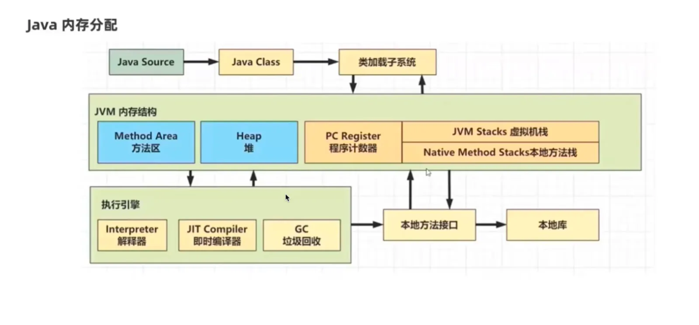
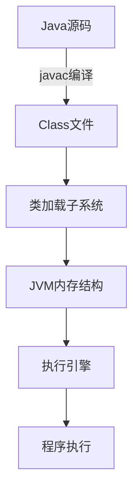

# java内存图解

Java程序在运行时，**需要在内存中分配空间**。为了提高运算效率，就**对空间进行了不同区域的划分**，

[类加载子系统](./类加载子系统/index.md "类加载子系统")

[执行引擎(解释器)](./执行引擎(解释器)/index.md "执行引擎(解释器)")

[关键内存参数配置](./关键内存参数配置/index.md "关键内存参数配置")

[内存异常分析](./内存异常分析/index.md "内存异常分析")

[对象内存分配流程](./对象内存分配流程/index.md "对象内存分配流程")

[线程内存图解](./线程内存图解/index.md "线程内存图解")

[jvm 内存划分](<./jvm 内存划分/index.md> "jvm 内存划分")

[常量池](./常量池/index.md "常量池")
