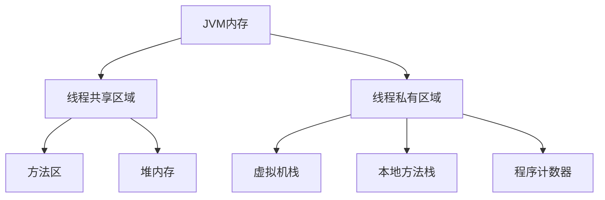
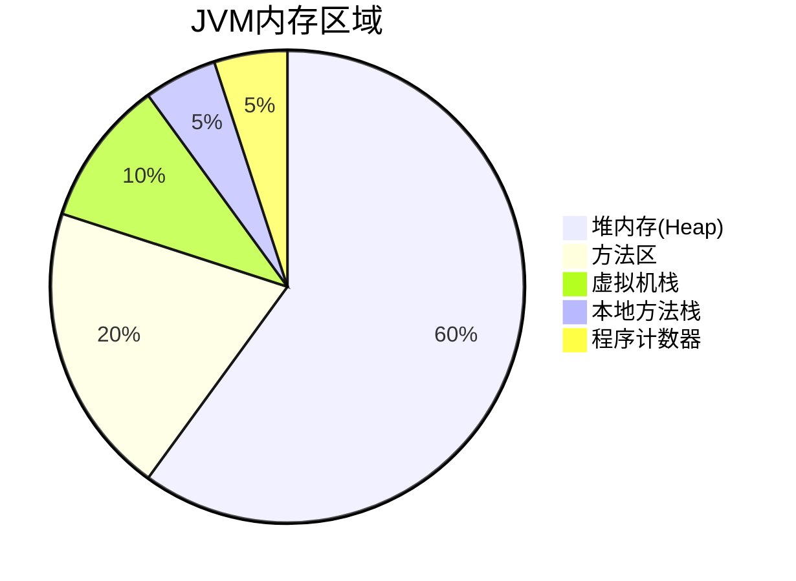

# `jvm`内存划分

## 目录

- [内存划分](#内存划分)

# 内存划分

- **方法运行**于栈里
- **对象**存在**堆里；**
- 方法区：**存放加载的class 文件**；// 方法区由N多个不同功能的小区；
- 寄存器：**和 cpu 有关**
- 本地方法区   和\*\*  内存有关\*\*

`jvm`内存划分

1. 栈
2. 堆
3. 方法区
4. 寄存器
5. 本地方法区

[线程共享区域](线程共享区域.md "线程共享区域")

[线程私有区域](线程私有区域.md "线程私有区域")
