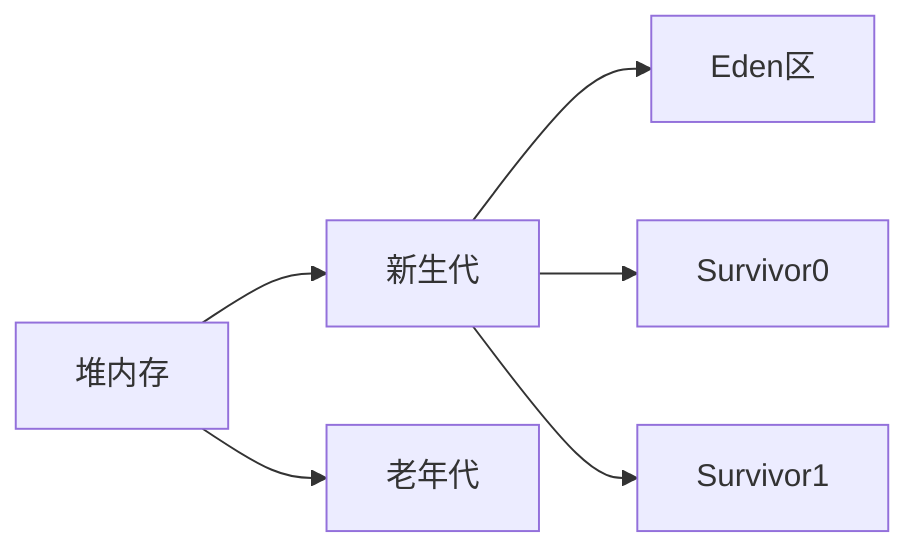
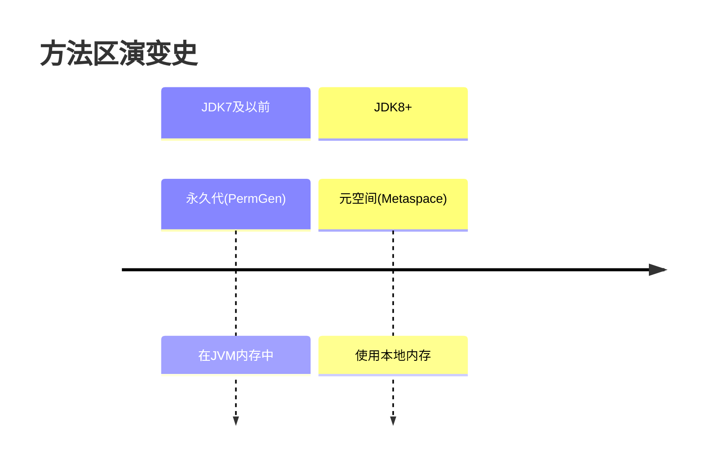

# 线程共享区域

## 目录

- [(1) 堆内存 (Heap)](#1-堆内存-Heap)
- [(2) 方法区 (Method Area)](#2-方法区-Method-Area)

#### (1) 堆内存 (Heap)




- **存储内容**：所有**对象实例和数组**
- **特点**：
  - **最大的内存区域**
  - **GC主要工作区域**
  - 线程共享
- **子区域划分**：

```markdown 
┌─────────────────┐
│     堆内存       │
├─────────────────┤
│   新生代(1/3)    │
│  ┌────┬────┐    │
│  │Eden│S0/S1│   │
│  └────┴────┘    │
├─────────────────┤
│   老年代(2/3)    │
└─────────────────┘
```


#### (2) 方法区 (Method Area)




- **存储内容**：
  - 类信息(版本/字段/方法等)
  - 运行时常量池
  - 静态变量
  - JIT编译后的代码
- **演进历史**：
  - JDK7及以前：永久代(PermGen)
  - JDK8+：元空间(Metaspace，使用本地内存)

[堆](./堆/index.md "堆")

[方法区（Method Area）](<./方法区（Method Area）/index.md> "方法区（Method Area）")
