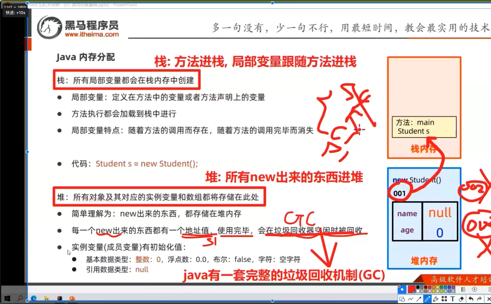

# 堆

## 目录

- [堆内存（Heap）](#堆内存Heap)

所有的**对象**及其**对应的实例变量**和**数组都**将储存到此处

- **简单的说new 出来的东西都将储存在堆内存；**
- 每一个`new`**出来的值，** 都有一个地址值，**使用 在垃圾回收器空闲时别回收；**
- 实例变量是会有初始值的；
  - **基本数据类型：整数：0；浮点数： 0.0；布尔值：false；字符：空字符**
  - **应用数据类型： null**



> **系统空闲时间自动清理内存**；进行垃圾回收；

### 堆内存（Heap）

**分区结构**：

```markdown 
┌───────────────┐
│  Young Gen    │
│ ┌───┬───┬───┐ │
│ │Eden│S0 │S1 │ │
│ └───┴───┴───┘ │
├───────────────┤
│  Old Gen      │
└───────────────┘
```


- **GC 机制**：
  - 新生代：Minor GC（复制算法）
  - 老年代：Major GC（标记-清除/整理）
