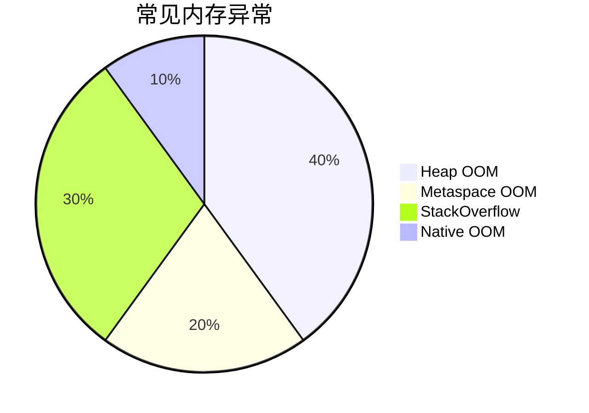
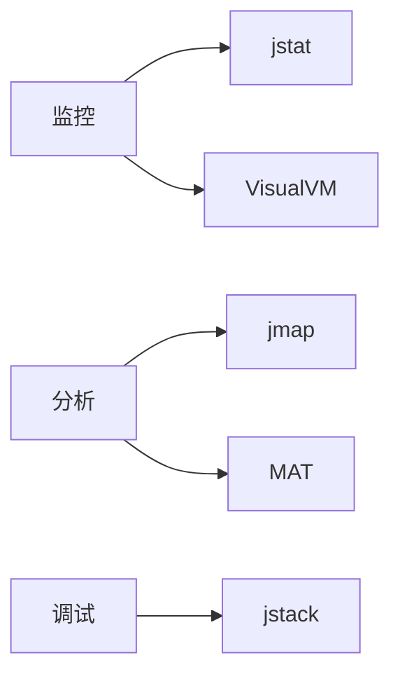

# 内存异常分析

## 目录

- [1. 常见内存异常](#1-常见内存异常)
- [2. 诊断工具](#2-诊断工具)

1. **OOM 解决方案**：
   - 堆内存不足：调整-Xmx，分析内存泄漏
   - 方法区溢出：检查动态类生成，调整元空间大小
   - 栈溢出：检查递归调用，调整-Xss参数
2. **内存分析工具**：
   - JDK 工具：jstat, jmap, VisualVM
   - 第三方：MAT, JProfiler

### 1. 常见内存异常

| 异常类型                                                     | 相关区域 | 可能原因       |
| -------------------------------------------------------- | ---- | ---------- |
| \`OutOfMemoryError: Java heap space\`                    | 堆内存  | 内存泄漏/堆设置过小 |
| \`OutOfMemoryError: Metaspace\`                          | 方法区  | 动态类生成过多    |
| \`StackOverflowError\`                                   | 虚拟机栈 | 递归调用过深     |
| \`OutOfMemoryError: unable to create new native thread\` | 栈内存  | 线程创建过多     |

### 2. 诊断工具

| 工具         | 用途        |
| ---------- | --------- |
| \`jstat\`  | 监控内存和GC情况 |
| \`jmap\`   | 堆转储分析     |
| \`jstack\` | 线程栈分析     |
| VisualVM   | 图形化监控     |
| MAT        | 内存分析工具    |

