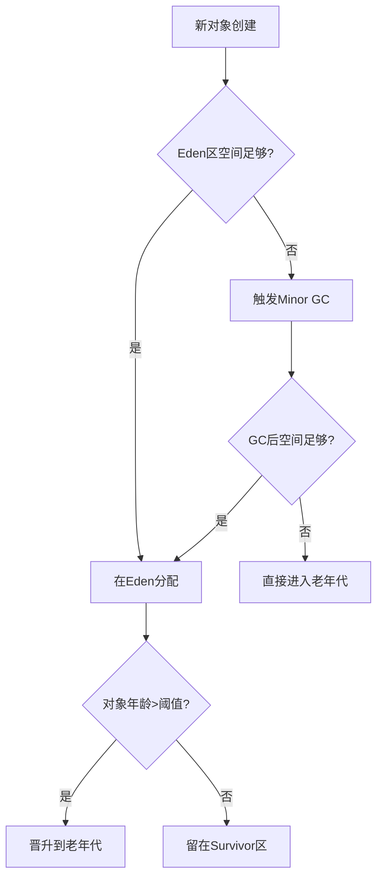

# 对象内存分配流程

```java 
public class Demo {
    public static void main(String[] args) {
        // 1. 类加载：Demo类被加载到方法区
        // 2. 内存分配：
        //    - args变量存入虚拟机栈
        //    - new的对象存入堆内存
        Object obj = new Object();
        
        // 3. 执行引擎：
        //    - 解释器逐行执行
        //    - JIT可能优化热点代码
        System.out.println(obj);
    }
}
```



