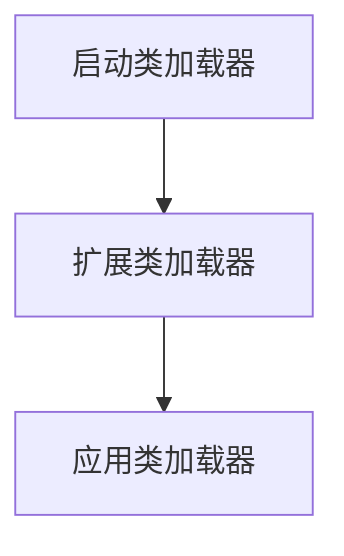

# 类加载子系统

- **核心职责**：
  - 加载：查找并载入 Class 文件
  - 验证：确保字节码安全性
  - 准备：分配静态变量内存
  - 解析：符号引用转直接引用
  - 初始化：**执行静态代码块**
- **三类加载器**：

```mermaid 
graph TD
  Bootstrap[启动类加载器] --> Extension[扩展类加载器]
  Extension --> Application[应用类加载器]
```
