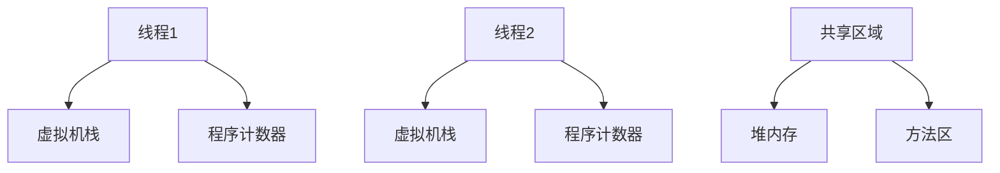

# 线程内存图解

```mermaid 
graph TB
    Thread1[线程1] --> Stack1[虚拟机栈]
    Thread1 --> PC1[程序计数器]
    
    Thread2[线程2] --> Stack2[虚拟机栈]
    Thread2 --> PC2[程序计数器]
    
    Shared[共享区域] --> Heap[堆内存]
    Shared --> MethodArea[方法区]
```
