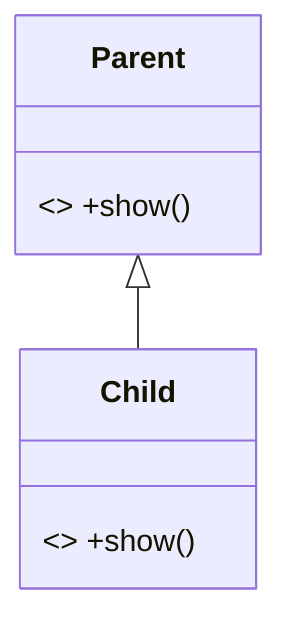

# static

## 目录

- [关键区别说明](#关键区别说明)
- [代码示例](#代码示例)
  - [1. 静态方法隐藏示例](#1-静态方法隐藏示例)
  - [2. 尝试用@Override的错误示例](#2-尝试用Override的错误示例)
- [内存机制图解](#内存机制图解)
- [设计建议](#设计建议)

在 Java 中，**`static`方法不能被重写（Override）**，但可以被隐藏（Method Hiding）。这是初学者容易混淆的重要概念。

## 关键区别说明

| 特性                          | 实例方法重写       | 静态方法隐藏       |
| --------------------------- | ------------ | ------------ |
| **使用** \*\*`@Override`\*\*​ | 可以（推荐）       | 不能（编译错误）     |
| **多态性**​                    | 有（运行时决定调用哪个） | 无（编译时决定调用哪个） |
| **调用决定方式**​                 | 基于实际对象类型     | 基于声明类型       |
| **语法要求**​                   | 方法签名完全相同     | 方法签名完全相同     |

## 代码示例

### 1. 静态方法隐藏示例

```java 
class Parent {
    static void show() {
        System.out.println("Parent的静态方法");
    }
}

class Child extends Parent {
    // 这是方法隐藏，不是重写！
    static void show() {
        System.out.println("Child的静态方法");
    }
}

public class Test {
    public static void main(String[] args) {
        Parent p = new Child();
        p.show(); // 输出: Parent的静态方法 (看声明类型)
        
        Child c = new Child();
        c.show(); // 输出: Child的静态方法
    }
}
```


### 2. 尝试用`@Override`的错误示例

```java 
class Child extends Parent {
    @Override // 编译错误！
    static void show() { 
        System.out.println("错误示例");
    }
}
// 错误信息: Method does not override method from its superclass
```


## 内存机制图解




- **静态方法**：绑定到类（方法区）
- **实例方法**：绑定到对象实例（堆内存）

## 设计建议

1. **避免隐藏静态方法**：容易造成混淆
2. **用类名调用静态方法**：`ClassName.staticMethod()`
3. **如需多态**：改用实例方法和接口
4. **工具类设计**：用`final class + private constructor`防止继承

记住黄金法则：\*\*`static`****属于类，****`非static`\*\***属于对象。静态方法没有多态性，因此不存在真正的重写。**
