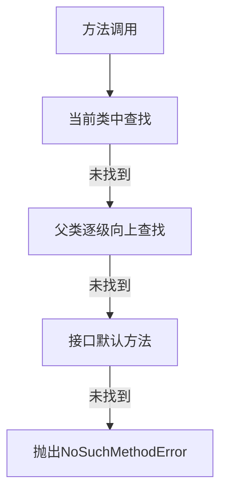

# &#x20;方法执行时的搜索机制与跨包调用

## 目录

- [一、方法调用搜索机制](#一方法调用搜索机制)
  - [1. 方法解析流程](#1-方法解析流程)
  - [2. 具体搜索规则](#2-具体搜索规则)
  - [3. 方法分派类型](#3-方法分派类型)
- [二、跨包调用机制](#二跨包调用机制)
  - [1. 跨包访问基础规则](#1-跨包访问基础规则)
  - [2. 跨包访问权限表](#2-跨包访问权限表)
  - [3. 跨包调用最佳实践](#3-跨包调用最佳实践)
- [同包不同类的情况解析](#同包不同类的情况解析)
  - [一、同包不同类的核心特性](#一同包不同类的核心特性)
    - [1. 访问权限特点](#1-访问权限特点)
    - [2. 典型目录结构](#2-典型目录结构)

## 一、方法调用搜索机制

### 1. 方法解析流程

当 JVM 执行一个方法调用时，会按照以下顺序搜索方法：




### 2. 具体搜索规则

1. **当前类查找**：先在调用方法的类中查找
2. **继承链查找**：
   - 如果是实例方法，从子类向父类逐级查找
   - 如果是静态方法，只在声明它的类中查找（不遵循继承）
3. **接口默认方法**：Java 8+ 支持接口默认方法
4. **方法匹配优先级**：
   - 精确匹配参数类型 > 自动类型转换匹配

### 3. 方法分派类型

| 分派类型      | 决定时机 | 示例   |
| --------- | ---- | ---- |
| **静态分派**​ | 编译期  | 方法重载 |
| **动态分派**​ | 运行期  | 方法重写 |

## 二、跨包调用机制

### 1. 跨包访问基础规则

```java 
// 包A
package com.a;
public class ClassA {
    public void publicMethod() {}
    protected void protectedMethod() {}
    void defaultMethod() {} // 包私有
    private void privateMethod() {}
}

// 包B
package com.b;
import com.a.ClassA;

public class ClassB {
    public void test() {
        ClassA a = new ClassA();
        a.publicMethod();    // ✅ 可访问
        a.protectedMethod(); // ❌ 不可访问（除非继承ClassA）
        a.defaultMethod();   // ❌ 不可访问
        a.privateMethod();   // ❌ 不可访问
    }
}
```


### 2. 跨包访问权限表

| 修饰符       | 同类 | 同包 | 不同包子类 | 不同包非子类 |
| --------- | -- | -- | ----- | ------ |
| public    | ✅  | ✅  | ✅     | ✅      |
| protected | ✅  | ✅  | ✅     | ❌      |
| 默认(包私有)   | ✅  | ✅  | ❌     | ❌      |
| private   | ✅  | ❌  | ❌     | ❌      |

### 3. 跨包调用最佳实践

1. **使用public方法**作为跨包API
2. **protected方法**用于子类扩展
3. **谨慎使用反射**强制访问非public方法

# 同包不同类的情况解析

在 Java 中，**同包不同类**指的是在**同一个包(package)下的不同类文件之间**的交互情况。这是 Java 包访问控制机制中的一个重要场景。

## 一、同包不同类的核心特性

### 1. 访问权限特点

在同包内的类之间：

- 可以互相访问**默认(包私有)权限**的成员
- 不需要特殊导入(但建议使用import提高可读性)
- 编译器会优化访问速度(比跨包访问略快)

### 2. 典型目录结构

```java 
src/
└── com/
    └── example/
        ├── ClassA.java   // 包com.example
        └── ClassB.java   // 包com.example
```
