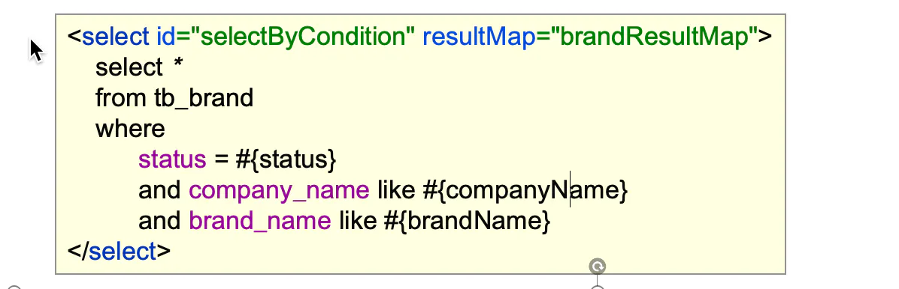

# 动态sql&#x20;

## 目录

- [MyBatis 对动态SQL有很强大的支撑：](#MyBatis-对动态SQL有很强大的支撑)
  - [if](#if)
  - [where](#where)
  - [choose](#choose)
  - [set](#set)
  - [foreach](#foreach)

**SQL语句会随着用户的输入或外部条件的变化而变化，我们称为 动态SQL**



# MyBatis 对动态SQL有很强大的支撑：

- if
- choose 、when, otherwise
- where, set
- &#x20;foreach

#### if

```xml title="if"

    <!--根据条件查询品牌数据-->
    <select id="findBrandByCondition" resultMap="brandMap">
        SELECT id,
        brand_name,
        company_name,
        ordered,
        description,
        status
        FROM tb_brand
         WHERE 1=1
          <if test="brandName != null">
            AND brand_name = #{brandName}
        </if>
         <if test="companyName != null">
            AND company_name = #{companyName}
        </if>
        <if test="status != null">
            AND status = #{status}
        </if>
    </select>


```


#### where

```xml title="where"
    <select id="findBrandByCondition2" resultMap="brandMap">
        SELECT id,
        brand_name,
        company_name,
        ordered,
        description,
        status
        FROM tb_brand
         <where>
             <if test="brandName != null">
                AND brand_name = #{brandName}
            </if>
            <if test="companyName != null">
                AND company_name = #{companyName}
            </if>
            <if test="status != null">
                AND status = #{status}
            </if>
        </where>
    </select>
```


#### choose

从多个条件中选择一个
**choose (when, otherwise)**：选择，类似于Java 中的 switch 语句

```xml 
    <select id="findBrandByCondition3" resultMap="brandMap">
        SELECT id,
        brand_name,
        company_name,
        ordered,
        description,
        status
        FROM tb_brand
        <where>
            <choose>
                <when test="brandname != null">
                    AND brand_name = #{brandname}
                </when>
                <when test="companyname != null">
                    AND company_name = #{companyname}
                </when>
                <when test="status != null">
                    AND status = #{status}
                </when>
            </choose>
        </where>

    </select>

```


#### set

```xml 
    <update id="updateBrand">
        update tb_brand
        <set>
            <if test="brandName!=null">
                brand_name= #{brandName},
            </if>
            <if test="companyName!=null">
                company_name =#{companyName},
            </if>
            <if test="ordered!=null">
                ordered =#{ordered},
            </if>
            <if test="description!=null">
                description=#{description},
            </if>
            <if test="status!=null">
                status=#{status}
            </if>
        </set>
        where id = #{id}
    </update>

```


#### foreach

```xml 
    <!--删除数据：批量删除-->
    <delete id="deleteBrandByIds">
        delete from tb_brand
        where id in
         <foreach collection="ids" item="id" separator="," open="(" close=")">
             #{id}
        </foreach>

    </delete>
```
