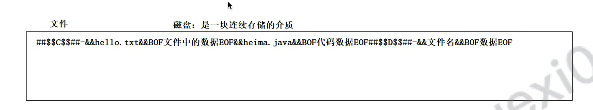

# IO &#x20;

> 磁盘： **是一块连续存储的介质**;  分盘只是逻辑上的处理；其实也还是一块磁盘；

[File](./File/index.md "File")

[IO流](./IO流/index.md "IO流")

[案例](./案例/index.md "案例")

[资源处理方式](./资源处理方式/index.md "资源处理方式")

[编码表](./编码表/index.md "编码表")

[转换流](./转换流/index.md "转换流")

[基础流](./基础流/index.md "基础流")

[缓冲流](./缓冲流/index.md "缓冲流")

[对象流](./对象流/index.md "对象流")

[打印流](./打印流/index.md "打印流")

[commons-io ](./commons-io-/index.md "commons-io ")
