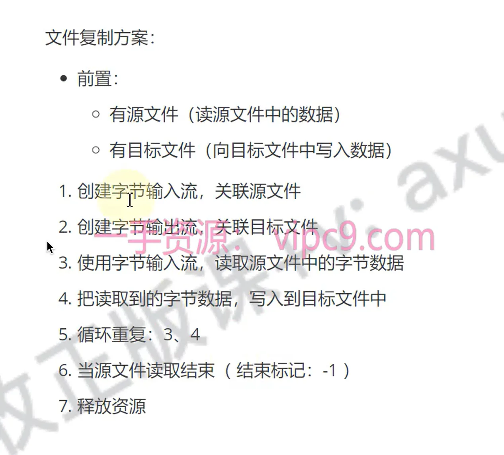

# 拷贝文件

## 目录

- [计算时间](#计算时间)
- [多字节读取](#多字节读取)

分析：
复制文件，其实就把文件的内容从一个文件中读取出来(数据源)，然后写入到另一个文件中(目的地)
数据源：
xxx.jpg --- 读数据 --- FileInputStream&#x20;
目的地：
模块名称\\\copy.jpg --- 写数据 --- FileOutputStream



```java 
package com.copy;

import java.io.FileInputStream;
import java.io.FileOutputStream;
import java.io.IOException;

public class copyFile {
    public static void main(String[] args) throws IOException {
        FileInputStream fis = new FileInputStream("files/home/img1.png");
        FileOutputStream fos = new FileOutputStream("files/img1.png");
        int data = 0;
        while ((data = fis.read()) != -1){
            fos.write(data);
        }
        fis.close();
        fos.close();
    }
}

```


# 计算时间

```java title="读入一个字节字节数据；写入一个数据"
package com.copy;

import java.io.FileInputStream;
import java.io.FileOutputStream;
import java.io.IOException;

public class copyFile {
    public static void main(String[] args)  {
        String inputPath = "files/home/img1.png";
        String outputPath = "files/img1.png";
        long startTime = System.currentTimeMillis();
        copy(inputPath,outputPath);
        long endTime = System.currentTimeMillis();
        System.out.println("花费时间！！"+(endTime-startTime)+"ms");
    }
    public static void copy(String inputPath,String outputPath){
        try(
                FileInputStream fis = new FileInputStream(inputPath);
                FileOutputStream fos = new FileOutputStream(outputPath);
        ) {
            int data = 0;
            while ((data = fis.read()) != -1){
                fos.write(data);
            }
        }catch (IOException e){
            e.printStackTrace();
        }
    }
} 

```


# 多字节读取

一次读一个字节数组的方法：

- `public int read​(byte[] b)`：从输入流读取最多b.length个字节的数据
- **返回的是真实读到的数据个数**
- 读取到文件末尾时返回-1

```java 
package com.copy;

import java.io.FileInputStream;
import java.io.FileOutputStream;
import java.io.IOException;
import java.util.Arrays;

public class CopyFile2 {
    public static void main(String[] args) throws IOException {
        FileInputStream fis = new FileInputStream("files/test.txt");
        FileOutputStream fos = new FileOutputStream("files/txt.txt");
        byte[] buf = new byte[5];
        int len = fis.read(buf);
        System.out.println("第一次读取到的数据个数"+len);
        System.out.println("第一次读取到的数据字节"+ Arrays.toString(buf));
        System.out.println("第一次读取到的数据"+new String(buf));
        len = fis.read(buf);
        System.out.println("第二次读取到的数据个数"+len);
        System.out.println("第二次读取到的数据字节"+ Arrays.toString(buf));
        System.out.println("第二次读取到的数据"+new String(buf));
        len = fis.read(buf);
        System.out.println("第三次读取到的数据个数"+len);
        System.out.println("第三次读取到的数据字节"+ Arrays.toString(buf));
        System.out.println("第三次读取到的数据"+new String(buf,0,len));
        fis.close();
        fos.close();
    }
}

new Sting(byte[])
new String(byte[],0,len)
```


> 注意：同一个bytes的实例；重写在写&#x20;

> /Library/Java/JavaVirtualMachines/zulu-17.jdk/Contents/Home/bin/java -javaagent:/Applications/IntelliJ IDEA.app/Contents/lib/idea\_rt.jar=62720:/Applications/IntelliJ IDEA.app/Contents/bin -Dfile.encoding=UTF-8 -classpath /Users/zhengchao/workSpace/JavaDeveloper/out/production/copy com.copy.CopyFile2
> 第一次读取到的数据个数5
> 第一次读取到的数据字节\[104, 101, 108, 108, 111]
> 第一次读取到的数据hello
> 第二次读取到的数据个数5
> 第二次读取到的数据字节\[119, 111, 114, 108, 100]
> 第二次读取到的数据world
> 第三次读取到的数据个数1
> 第三次读取到的数据字节\[33, 111, 114, 108, 100]
> 第三次读取到的数据!orld

Process finished with exit code 0

```java 
package com.copy;

import java.io.FileInputStream;
import java.io.FileOutputStream;
import java.io.IOException;
import java.util.Arrays;

public class CopyFile2 {
    public static void main(String[] args) {

        String inputPath = "files/home/img1.png";
        String outputPath = "files/img1.png";

        long beginTime = System.currentTimeMillis();
        copy(inputPath,outputPath);
        long endTime = System.currentTimeMillis();
        System.out.println("copy花费时间"+(endTime-beginTime)+"ms");
    }
    public static void copy(String inputPath, String outputPath)  {

         try (
             FileInputStream fis = new FileInputStream(inputPath); 
             FileOutputStream fos = new FileOutputStream(outputPath);
        ){
             byte[] buf = new byte[1024];
             int len = -1;
             while ((len = fis.read(buf)) != -1){
                 fos.write(buf,0,len);
             }
        }catch (IOException e){
             e.printStackTrace();
         }
    }
}

```


> /Library/Java/JavaVirtualMachines/zulu-17.jdk/Contents/Home/bin/java -javaagent:/Applications/IntelliJ IDEA.app/Contents/lib/idea\_rt.jar=62766:/Applications/IntelliJ IDEA.app/Contents/bin -Dfile.encoding=UTF-8 -classpath /Users/zhengchao/workSpace/JavaDeveloper/out/production/copy com.copy.CopyFile2
> copy花费时间11ms

Process finished with exit code 0
