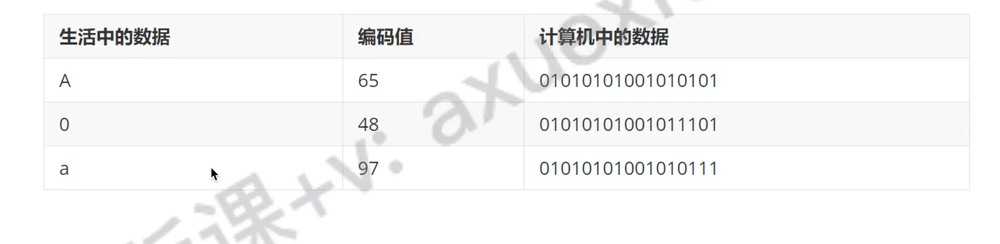
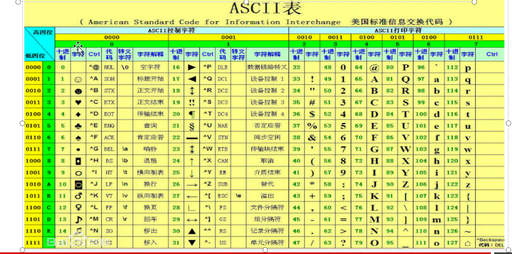
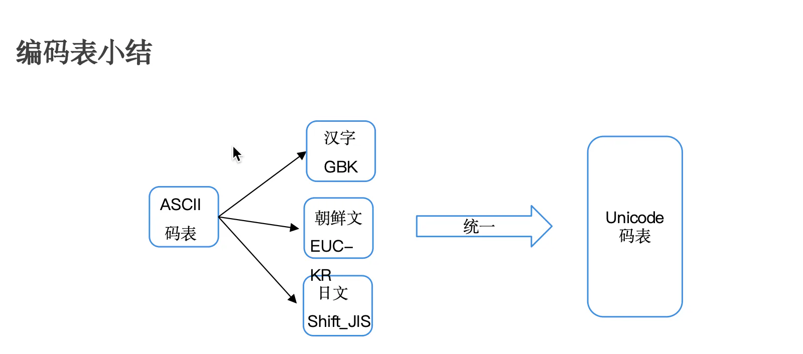
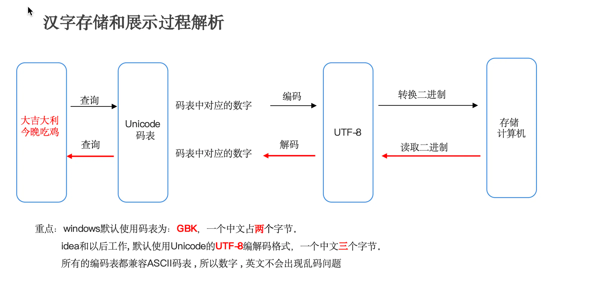

# 编码表

## 目录

- [基础知识：](#基础知识)
- [ASCII码表：
  ](#ASCII码表)
- [GBK：](#GBK)
- [Unicode码表：](#Unicode码表)
- [过程解析](#过程解析)

# 基础知识：

- 计算机中储存的信息都是用**二进制**数据表示的；我们在屏幕上看到的英文、汉字等字符是二进制数转换之后的结果
- 按照编码表规则，将字符存储到计算机中，称为**编码。**
- 按照同样的编码表规则，将存储在计算机中的二进制数据解析显示出来，称为**解码 。**
- 编码和解码使用的**码表必须一致，否则会导致乱码**。
  &#x20;    &#x20;

简单理解：
&#x20;            存储一个字符a，首先需在码表中查到对应的数字是**97**，然后按照转换成二进制的规则进行存储。称为**编码  \*\* &#x20;
&#x20;            读取的时候，先把二进制解析出来，再转成97，通过97查找早码表中对应的字符**是a。称为解码\*\*

ASCII码表：

`ASCII(American Standard Code for Information Interchange，`美国信息交换标准码表)：包括了数字字符，英文大小写字符和一些常见的标点符号字符。

> 注意：ASCII码表中是没有中文的。

&#x20;

# GBK：

`window`系统默认的码表。**兼容**`ASCII`码表，也包含了\*\*`21003`**个汉字，并支持**繁体汉字以及部分日韩文字 \*\*。

> 注意：GBK是中国的码表，一个中文以两个字节的形式存储。但不包含世界上所有国家的文字。

# Unicode码表：

由国际组织ISO 制定，是**统一的万国码表，计算机科学领域里的一项业界标准，容纳世界上大多数国家的所有常见文字和符号。**

- 但是因为表示的字符太多，所以`Unicode`码表中的数字不是直接以二进制的形式存储到计算机的，会先通过UTF-7，UTF-7.5，UTF-8，UTF-16，以及 UTF-32的编码方式再存储到计算机，其中最为常见的就是UTF-8。

注意： `Unicode`是万国码表，以`UTF-8编码后一个中文以三个字节`的形式存储

# 过程解析

- 所有编码都兼容ASCLL 码表；所以数字英文不会出现乱码问题
- utf-8中文3个字节
- GBK 中文2个字节
