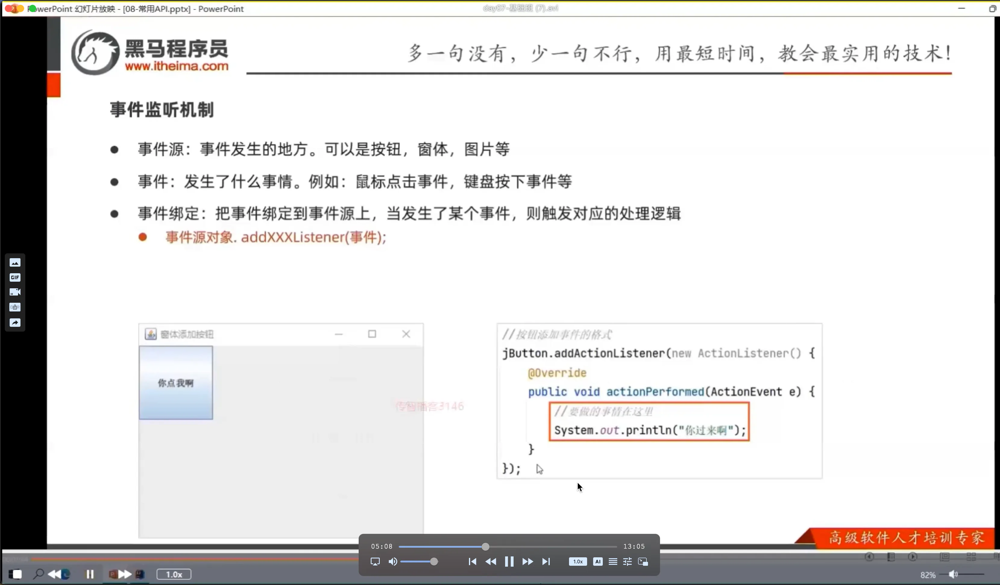
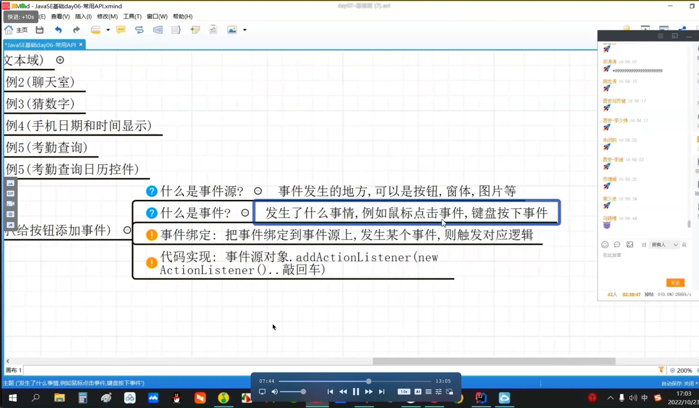

# 事件





```javascript 
        JFrame jf = new JFrame();
        jf.setSize(1000,400);
        jf.setTitle("Demo");
        jf.setLocationRelativeTo(null); // 程序的位置剧中
        jf.setDefaultCloseOperation(3); // 3 关闭时推出程序
        jf.setAlwaysOnTop(true);
        jf.setLayout(null); // 取消默认布局；

        JButton btn = new JButton("Click Me");
        btn.setBounds(100,100,100,50);
        jf.add(btn);

        btn.addActionListener(new ActionListener() {
            @Override
            public void actionPerformed(ActionEvent e) {
                System.out.println("click");
            }
        });

        jf.setVisible(true);  // 设置窗体可见；写在最后；
```
