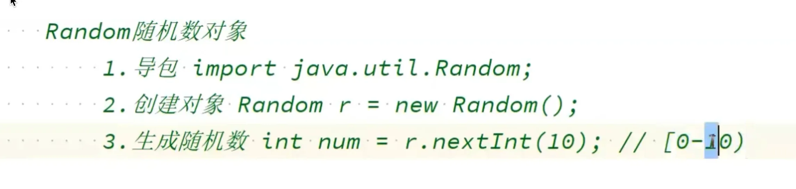
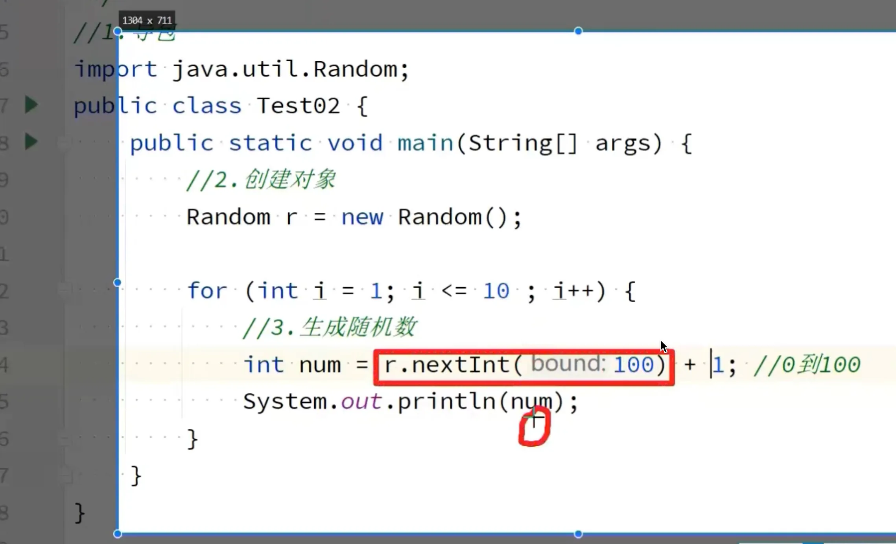
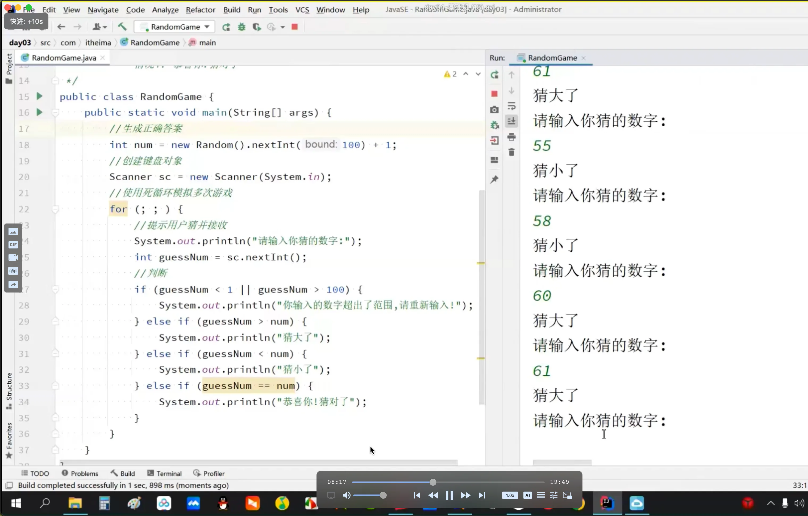

# Random







```java 
package com.zc;

import java.util.Random;
import java.util.Scanner;

public class Hello {
    public static void main(String[] args) {
        Random rd = new Random();
        System.out.println(rd.nextInt(10));
        
    }
}

```
