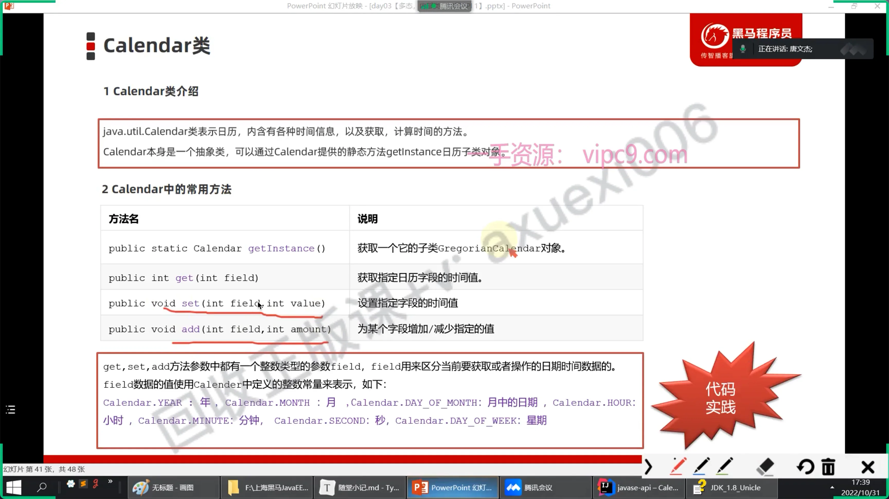

# Calendar

## 目录

- [构造方法](#构造方法)
- [成员方法](#成员方法)
  - [](#)

```java 
日历类；
代替java.utils.Date 过期方法
本身是一个抽象类


```


# 构造方法

抽象类；无法实例化

子类：`GregorianCalendar`

Calendar；提供了一个静态方法；实现对Calendar的实例化；（`实际上还是使用的是子类`）

```java 
public static void main(String[] args) {
        Calendar c = Calendar.getInstance();
        System.out.println(c);
    }
```


```java 
java.util.GregorianCalendar[
time=1726470217350,
areFieldsSet=true,
areAllFieldsSet=true,
lenient=true,zone=sun.util.calendar.ZoneInfo[id="Asia/Shanghai",offset=28800000,dstSavings=0,useDaylight=false,transitions=31,lastRule=null],
firstDayOfWeek=1,minimalDaysInFirstWeek=1,
ERA=1,YEAR=2024,MONTH=8,WEEK_OF_YEAR=38,WEEK_OF_MONTH=3,DAY_OF_MONTH=16,DAY_OF_YEAR=260,DAY_OF_WEEK=2,DAY_OF_WEEK_IN_MONTH=3,AM_PM=1,HOUR=3,HOUR_OF_DAY=15,MINUTE=3,SECOND=37,MILLISECOND=350,ZONE_OFFSET=28800000,DST_OFFSET=0]

```


# 成员方法



####

```java 
public class CalendarTest
{
    public static void main(String[] args) {
        Calendar c = Calendar.getInstance();
        int year = c.get(Calendar.YEAR);
        System.out.println(c);
        System.out.println(year);
    }
}

```


```java 
public static void method1(){
        Calendar c = Calendar.getInstance();
        int year = c.get(Calendar.YEAR);
        System.out.println(c);
        System.out.println(year);
    }
    public static void method2(){
        Calendar c = Calendar.getInstance();
        c.set(Calendar.YEAR,2000);
        System.out.println(c.get(Calendar.YEAR));
    }
    public static void method3(){
        Calendar c = Calendar.getInstance();
        c.add(Calendar.YEAR,-1);
        System.out.println(c.get(Calendar.YEAR));
    }
```
