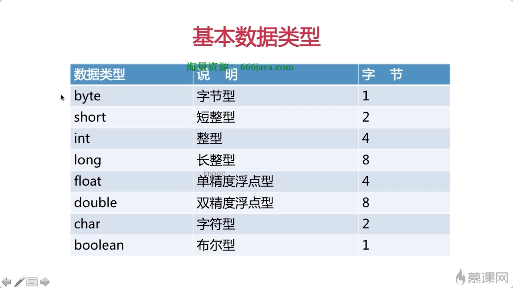

# Java  一次

> **万物皆对象**

[&#x20;
简介 - Java教程 - 廖雪峰的官方网站
&#x20;廖雪峰的官方网站 (liaoxuefeng.com) 研究互联网产品和技术，提供原创中文精品教程 https://liaoxuefeng.com/books/java/introduction/index.html](https://liaoxuefeng.com/books/java/introduction/index.html "&#x20;
简介 - Java教程 - 廖雪峰的官方网站
&#x20;廖雪峰的官方网站 (liaoxuefeng.com) 研究互联网产品和技术，提供原创中文精品教程 https://liaoxuefeng.com/books/java/introduction/index.html")

[重点知识快速入口](./重点知识快速入口/index.md "重点知识快速入口")

[基础](./基础/index.md "基础")

[设计模式](./设计模式/index.md "设计模式")

[注解](./注解/index.md "注解")

[数据结构](./数据结构/index.md "数据结构")

[独立知识点](./独立知识点/index.md "独立知识点")

[算法 ](./算法-/index.md "算法 ")

[IO  ](./IO-/index.md "IO  ")

[线程](./线程/index.md "线程")

[工程](./工程/index.md "工程")

[网络编程](./网络编程/index.md "网络编程")

[综合案例](./综合案例/index.md "综合案例")

[框架](./框架/index.md "框架")

[技巧和提示](./技巧和提示/index.md "技巧和提示")

## 子目录与文章

- [JDK](./JDK/index.md)
- [语言基础](./语言基础/index.md)
- [集合](./集合/index.md)
