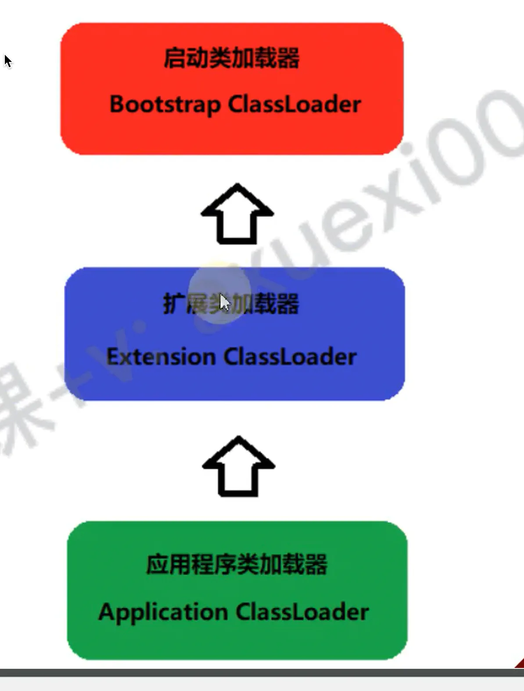

双亲委派机制

## 目录

- [3种类加载器的关系](#3种类加载器的关系)
- ["双亲委派模型"的工作机制：](#双亲委派模型的工作机制)
- [作用](#作用)

# 3种类加载器的关系

从图中可知，三种类加载器存在一定的关系：

1）应用程序类加载器的父级类加器是扩展类加载器

2）扩展类加载器的父级类加载器是启动类加载器结论：

**这种关系称为类加载器的"双亲委派模型"**

# "双亲委派模型"的工作机制：

- 某个"类加载器"收到类加载的请求，它首先不会尝试**自己去加载这个类，而是把请求交给父级类加载器**
- 因此，所有的类加**载的请求最终都会传送到顶层的"启动类加载器"中**
- \*\*如果"父级类加载器"无法加载这个类，然后子级类加载器再去加载  \*\*

# 作用

- 防止自己写的类；覆盖了系统自带的类。
