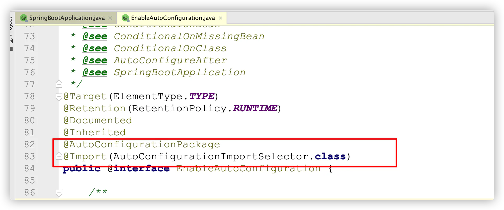
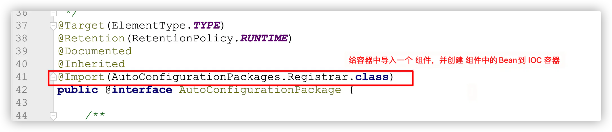
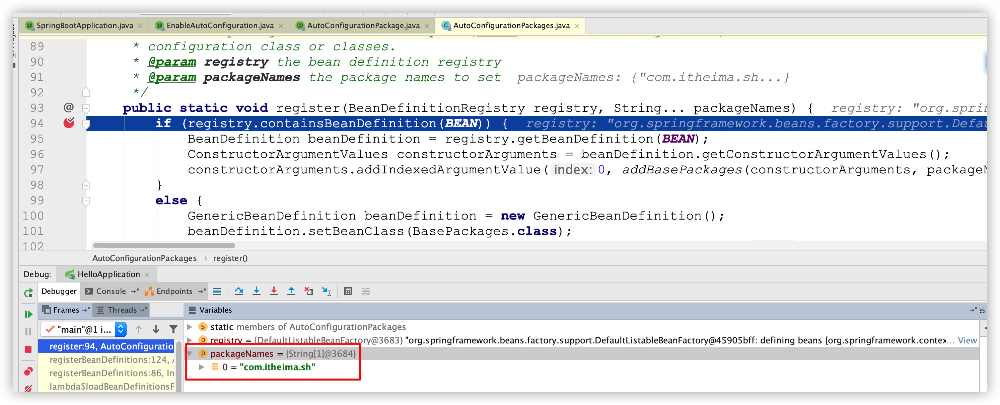
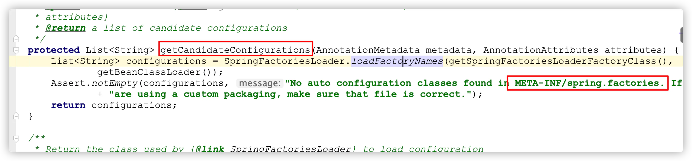
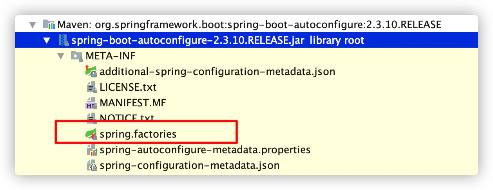
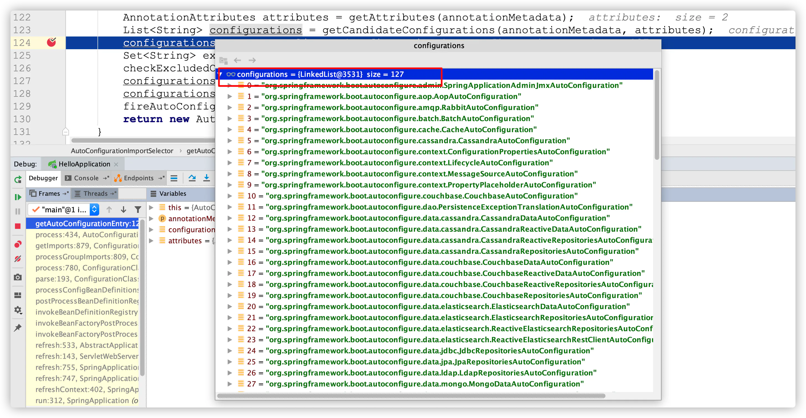

# @EnableAutoConfiguration自动配置注解

目的：理解@EnableAutoConfiguration自动化配置核心实现注解 讲解： 1、@EnableAutoConfiguration是一个组合注解

2、@AutoConfigurationPackage注解作用

作用：利用Registrar给容器中导入一系列组件

点击 `Registrar` 进入到源码的 `register` 方法，添加 断点，测试

通过 debug 程序发现，默认情况下 将引导类的所有包及其子包的组件导入进来

3、@Import(AutoConfigurationImportSelector.class)注解作用

作用：是利用`selectImports`方法中的 `getAutoConfigurationEntry` 方法给容器中批量导入相关组件

调用流程分析：

1. 调用`AutoConfigurationImportSelector`类中的`selectImports`方法
2. 调用`List<String> configurations = getCandidateConfigurations(annotationMetadata, attributes)`获取到所有需要导入到容器中的配置类
3. 利用工厂加载 `Map<String, List<String>> loadSpringFactories(@Nullable ClassLoader classLoader)`得到所有的组件
4. 从META-INF/spring.factories位置来加载一个文件。

默认扫描我们当前系统里面所有META-INF/spring.factories位置的文件

spring-boot-autoconfigure-2.3.4.RELEASE.jar包里面也有META-INF/spring.factories

**通过这个配置文件加载的自动配置：当前版本（2.3.10）是有127个默认的自动化配置**

小结：

- 自动化配置默认加载的配置文件在哪？
