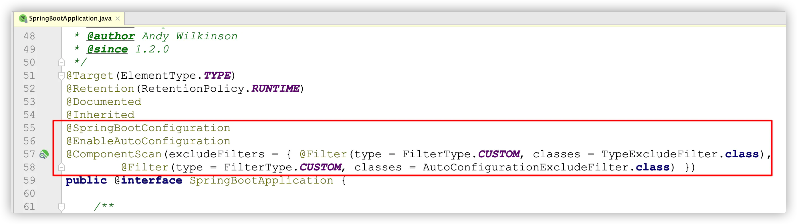

# @SpringBootApplication入口分析

目的：能够理解SpringBoot自动化配置流程中@SpringBootApplication是一个组合注解，及每一个注解的作用能够知道作用。 &#x20;

讲解： 1、SpringBoot是一个组合注解

2、@SpringBootConfiguration注解作用

- @SpringBootConfiguration是对@Configuration注解的包装，proxyBeanMethods 默认配置 true， full模式（单例Bean）
- 标识是一个配置类，所以 引导类也是配置类

3、@ComponentScan注解作用

- 组件扫描，默认扫描的规则 引导类所在的包及其子包所有带注解的类

问题：

1. 在引导类中配置 @Bean 注解可以吗？
2. 为什么Controller、service类添加完注解后，不需要添加扫描包？
