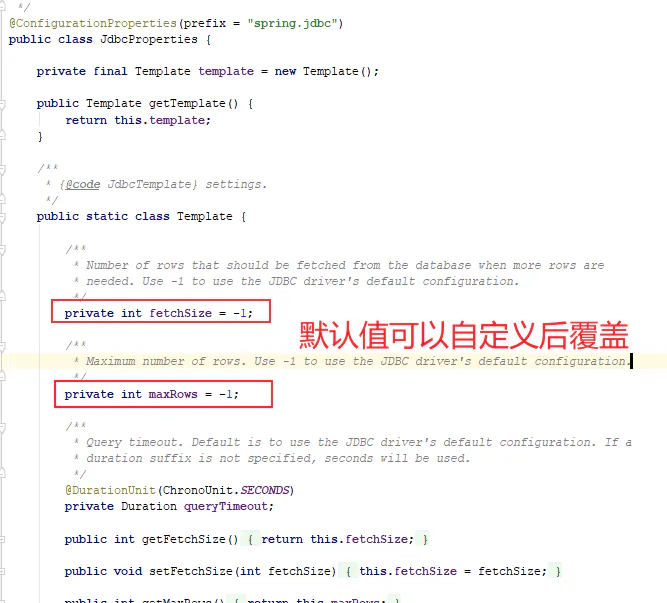
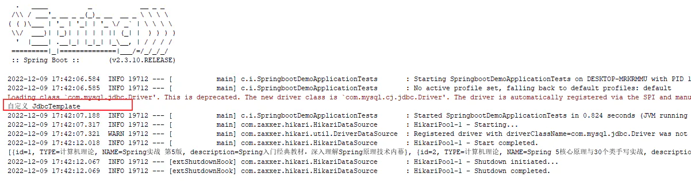

# 自动化配置原理-按条件开启自动配置类和配置项

目的：

- 能够理解所有的自动化配置虽然会全部加载，底层有大量的@ConditionalOnXXX，有很多自动配置类并不能完全开启。
- 如果配置生效了，则会加载默认的属性配置类，实现默认的对应场景的自动化配置

讲解：

1、以上通过 `META-INF/spring.factories` 配置文件找到所有的自动化配置类，但 是不是全部的生效的呢？很显然是不可能全部都生效的。

2、以 `JdbcTemplateAutoConfiguration` 为例讲解， 进入到 `JdbcTemplateAutoConfiguration` 自动化配置类。

```java 
//配置类，Lite模式
@Configuration(proxyBeanMethods = false)
//存在 DataSource、JdbcTemplate 类时再加载当前类
@ConditionalOnClass({DataSource.class, JdbcTemplate.class })

//容器中只有一个指定的Bean，或者这个Bean是首选Bean 加载当前类
@ConditionalOnSingleCandidate(DataSource.class)

//在配置类 DataSourceAutoConfiguration 之后执行
@AutoConfigureAfter(DataSourceAutoConfiguration.class)

//如果条件满足：开始加载自动化配置的属性值 JdbcProperties
@EnableConfigurationProperties(JdbcProperties.class)

@Import({JdbcTemplateConfiguration.class, NamedParameterJdbcTemplateConfiguration.class })
public class JdbcTemplateAutoConfiguration {

}

```


3、JdbcProperties，用于加载默认的配置，如果配置文件配置了该属性，则配置文件就生效。



4、通过@Import导入JdbcTemplateConfiguration

```java 
//配置类，Lite模式
@Configuration(proxyBeanMethods = false)
//没有JdbcOperations类型的bean时加载当前类，而 JdbcTemplate 是 JdbcOperations 接口实现类
@ConditionalOnMissingBean(JdbcOperations.class)
class JdbcTemplateConfiguration {

    @Bean
    @Primary
    JdbcTemplate jdbcTemplate(DataSource dataSource, JdbcProperties properties) {
        JdbcTemplate jdbcTemplate = new JdbcTemplate(dataSource);
        JdbcProperties.Template template = properties.getTemplate();
        jdbcTemplate.setFetchSize(template.getFetchSize());
        jdbcTemplate.setMaxRows(template.getMaxRows());
        if (template.getQueryTimeout() != null) {
            jdbcTemplate.setQueryTimeout((int) template.getQueryTimeout().getSeconds());
        }
        return jdbcTemplate;
    }

}

```


验证：我们可以在我们自己的项目里面创建一个 JdbcTemplate Bean，看容器创建的Bean执行的是哪一个方法。

```java 
@Configuration
public class MyConfig {

    @Bean
    public JdbcTemplate jdbcTemplate(DataSource dataSource){
        JdbcTemplate jdbcTemplate = new JdbcTemplate(dataSource);
        System.out.println("自定义 JdbcTemplate");
        return jdbcTemplate;
    }
}

```


结果：保证容器中只有一个 Bean 实例



问题：

- 这些不用的 starter 的依赖，能不能导入到我们工程里面？ 为什么？
