SpringMVC概述

## 目录

- [SpringMVC简介
  ](#SpringMVC简介)
- [表现层](#表现层)
- [业务层](#业务层)
- [数据层](#数据层)
- [步骤](#步骤)
- [入门案例-总结
  ](#入门案例-总结)
- [入门案例
  ](#入门案例)

SpringMVC技术与Servlet技术功能等同，**均属于web层开发技术**

SpringMVC简介

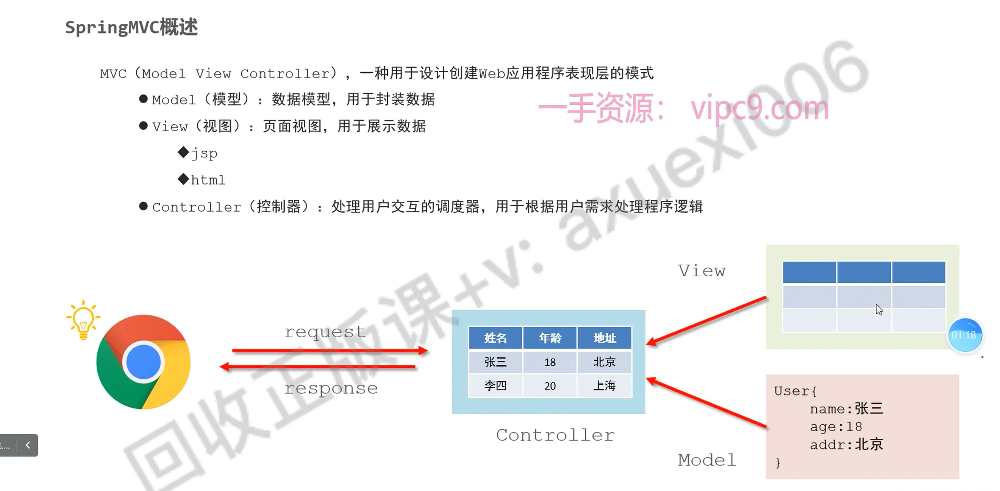

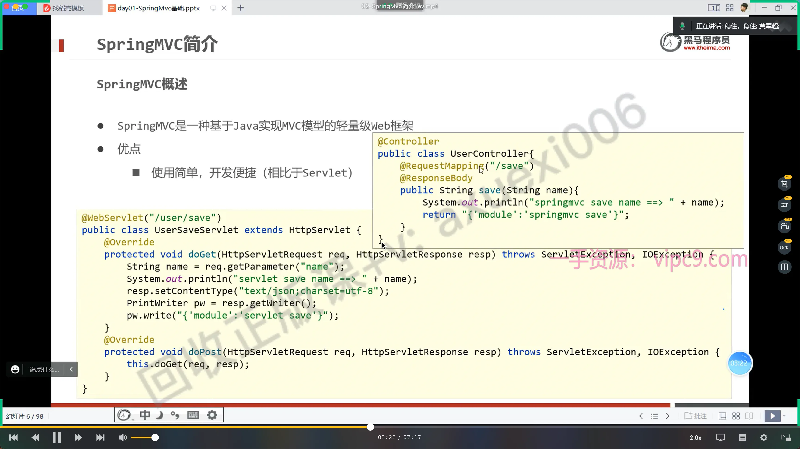

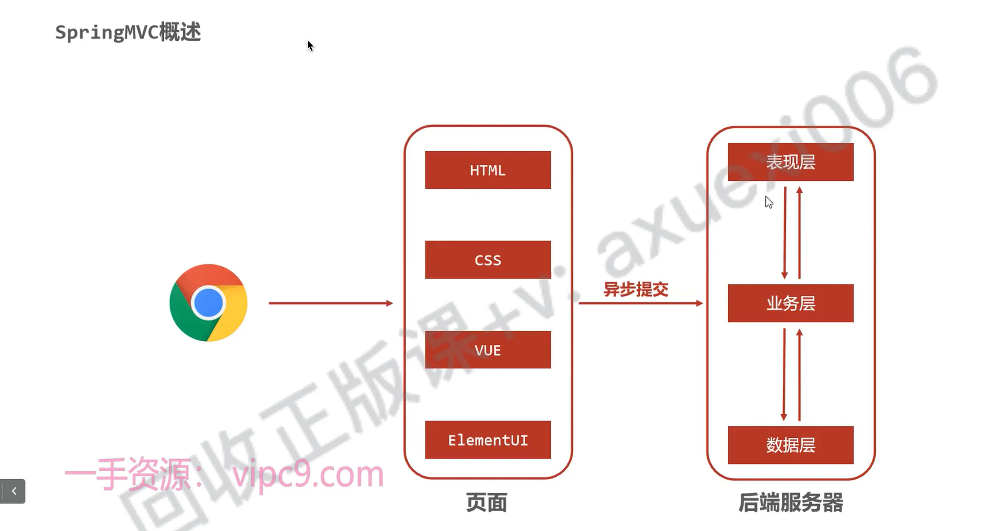

# 表现层

接受请求

返回数据

servlet   —->   springmvc&#x20;

# 业务层

写业务

# 数据层

操作数据库   &#x20;

jdbc   —>   mybatis.   —>

# 步骤

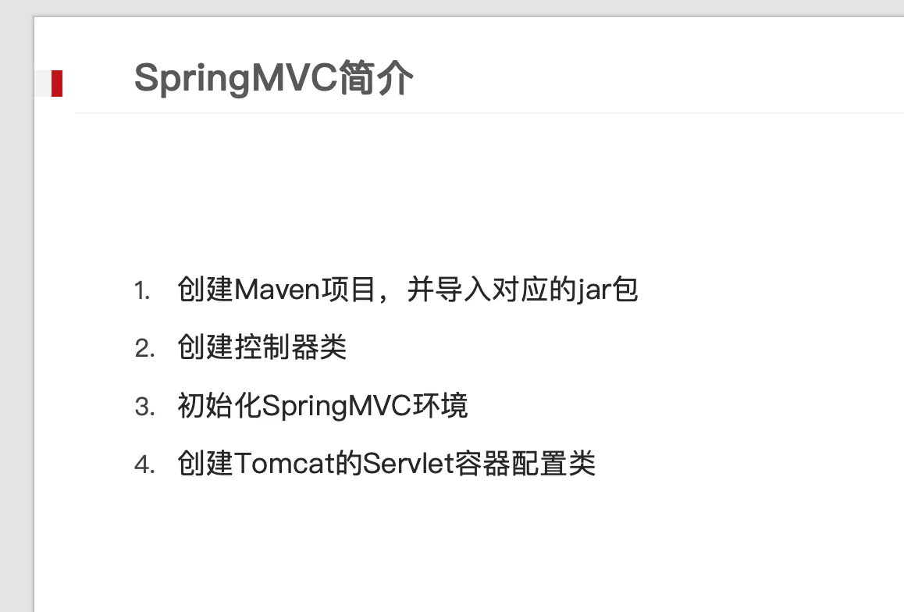

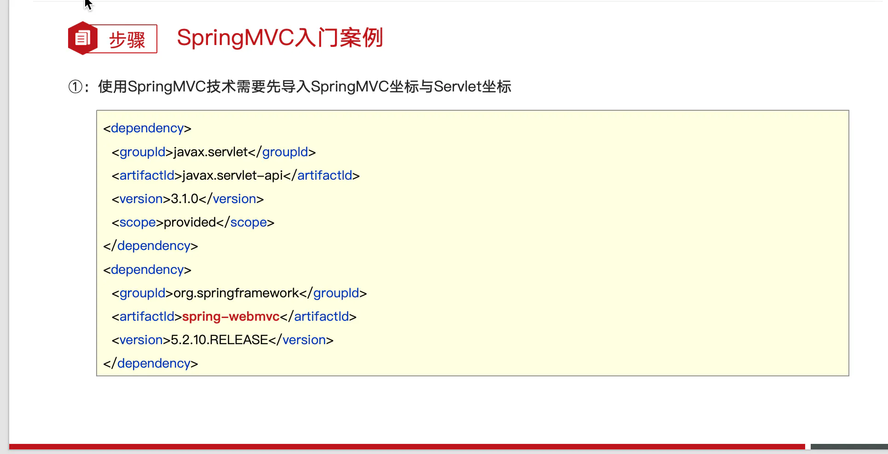

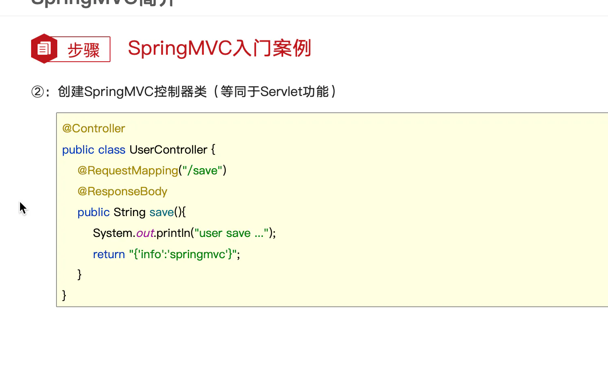

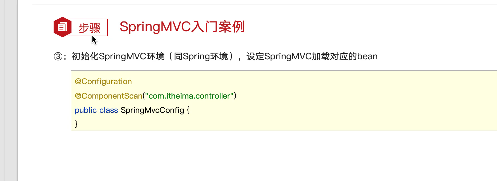

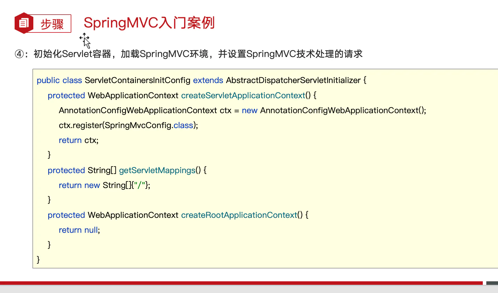

入门案例-总结

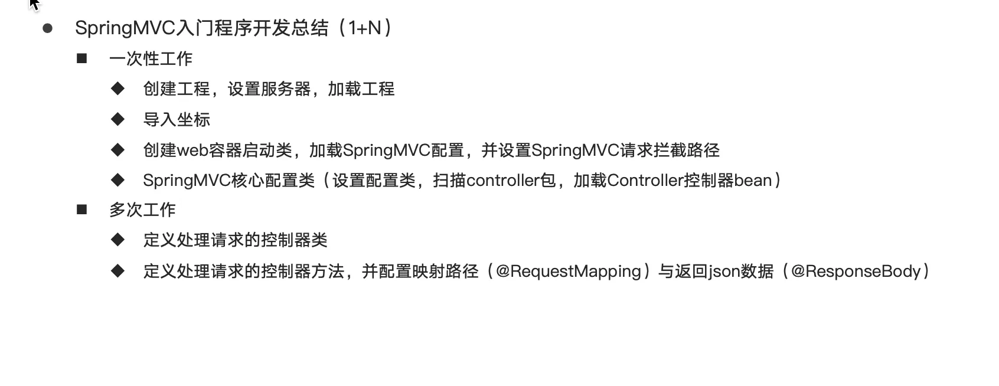

SpringMVC入门程序开发总结（1+N）
一次性工作

- 创建工程，设置服务器，加载工程
- 导入坐标
- 创建web容器启动类，加载SpringMVC配置，并设置SpringMVC请求拦截路径
- SpringMVC核心配置类（设置配置类，扫描controller包，加载Controller控制器bean）

多次工作

- 定义处理请求的控制器类
- 定义处理请求的控制器方法，并配置映射路径（@RequestMapping）与返回json数据（@ResponseBody）

入门案例

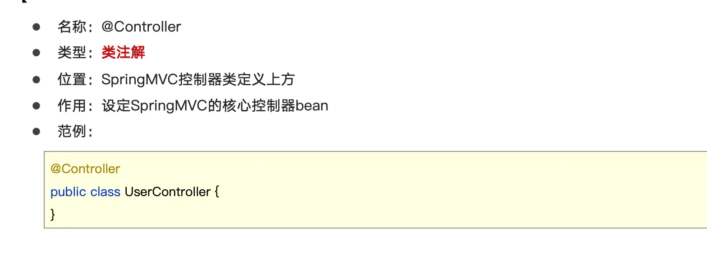

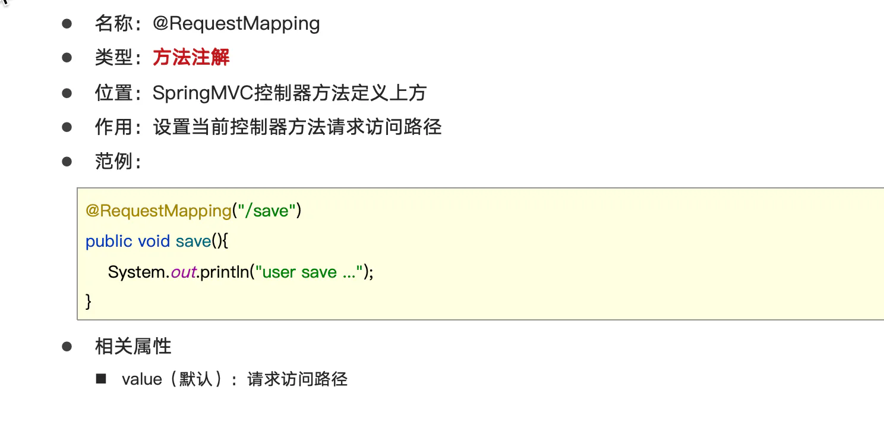

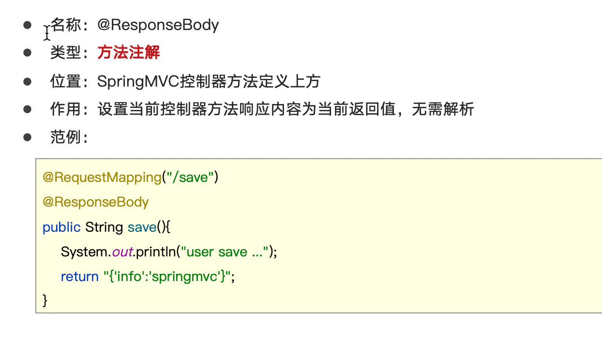

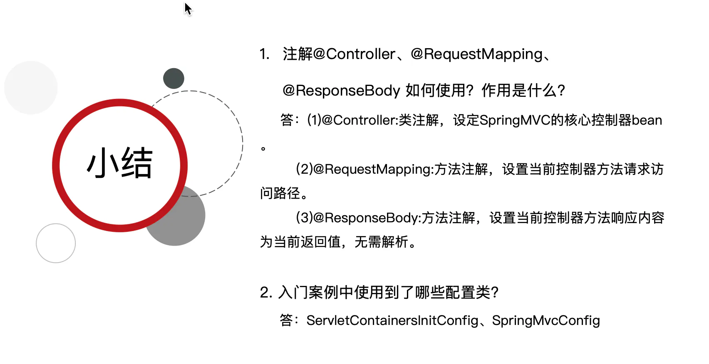
