# 请求与响应

## 目录

- [请求](#请求)
- [响应](#响应)
  - [嵌套](#嵌套)
  - [数组](#数组)
- [list](#list)
  - [map](#map)
- [新参注解](#新参注解)

# 请求

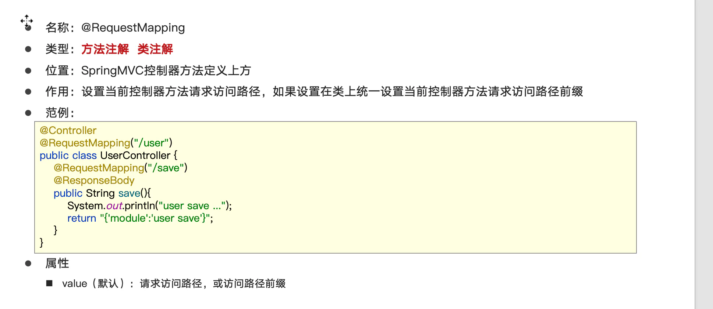

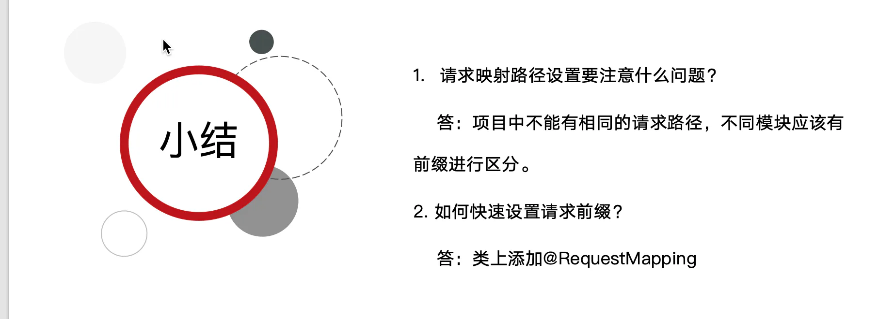

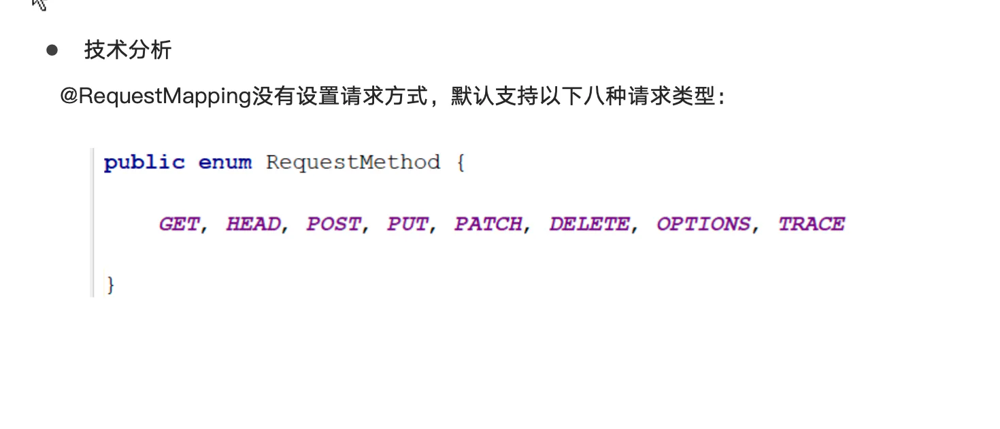

# 响应

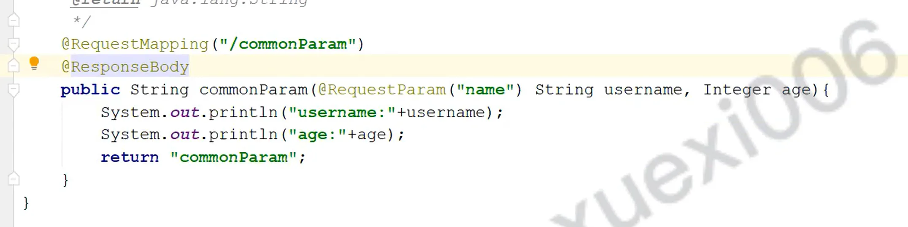

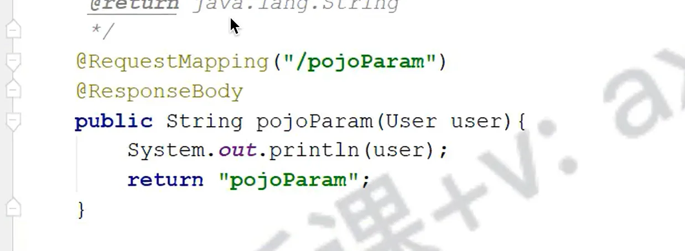

#### 嵌套

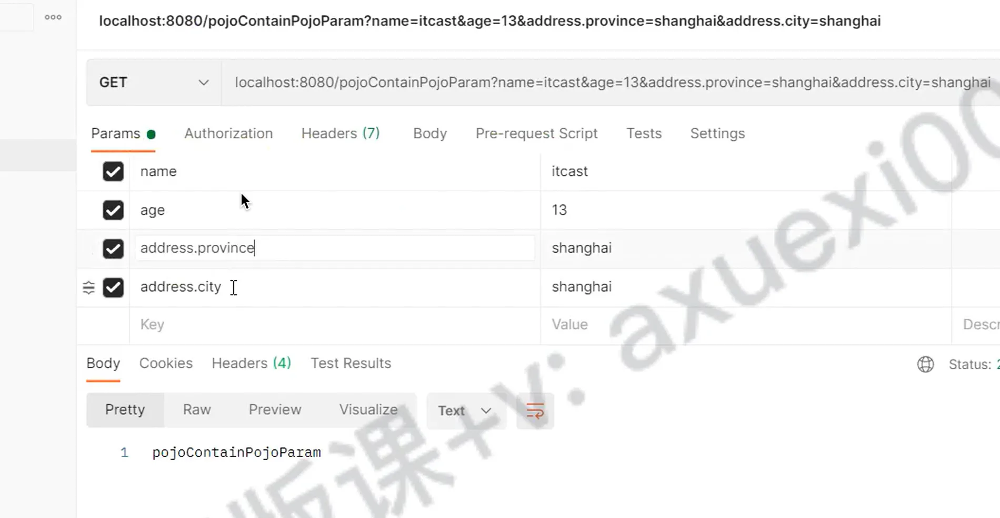

#### 数组

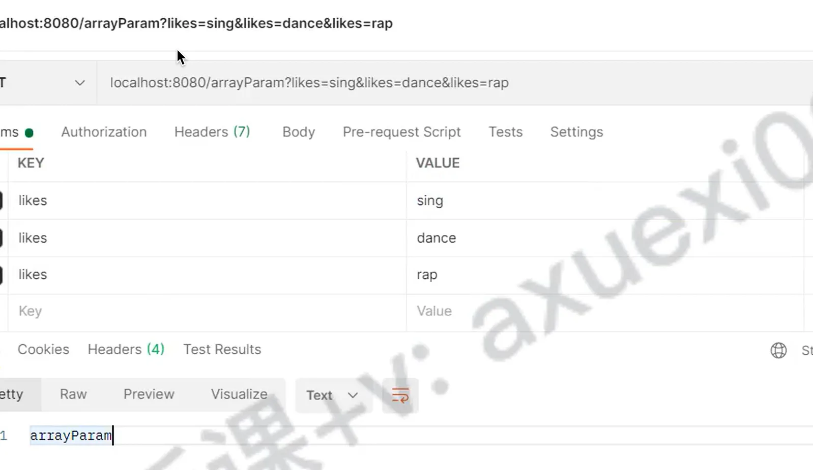

# list

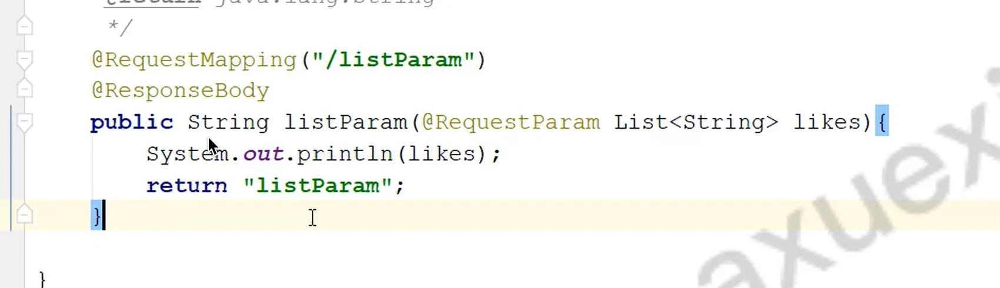

#### map

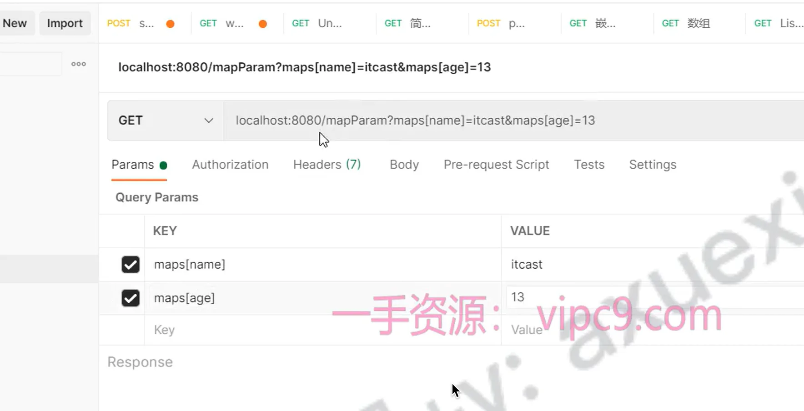

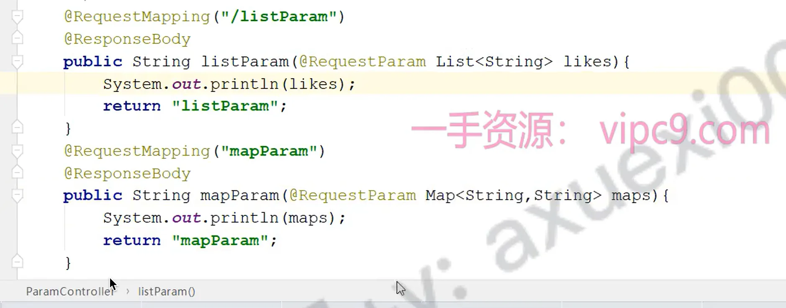

# 新参注解

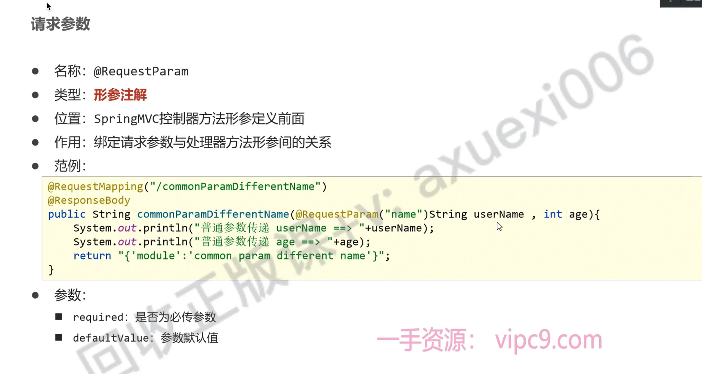

***

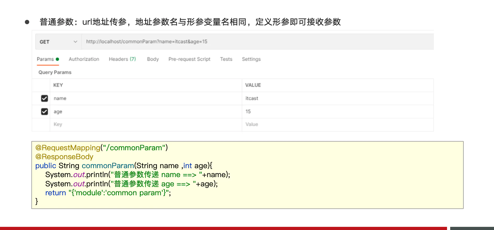

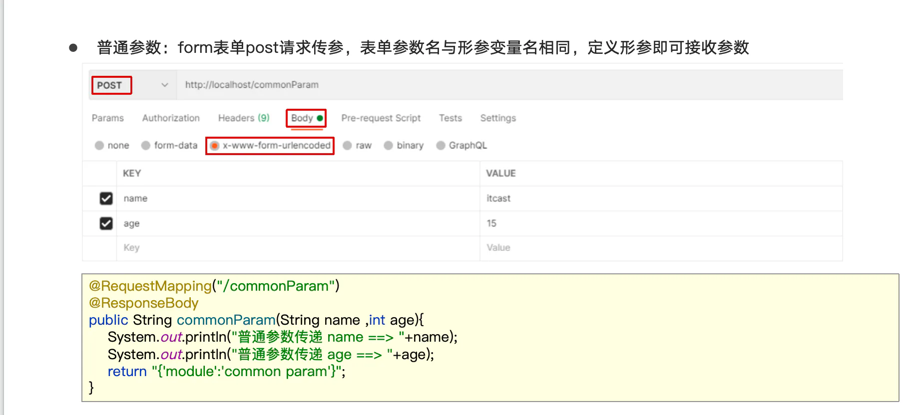

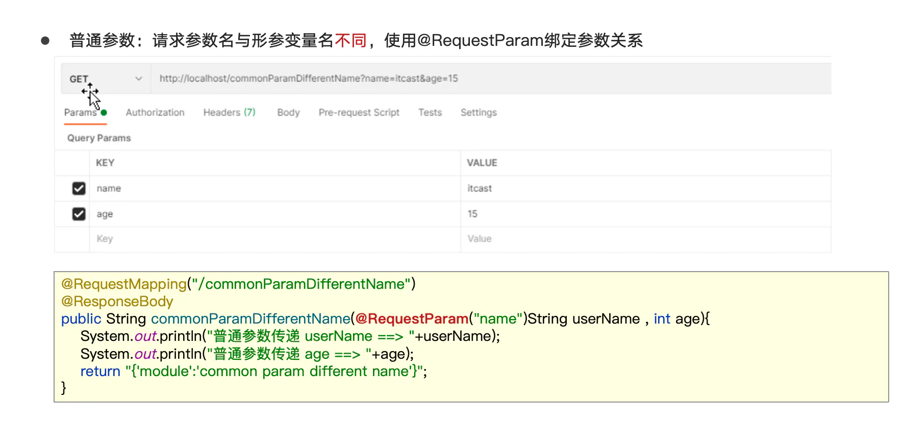

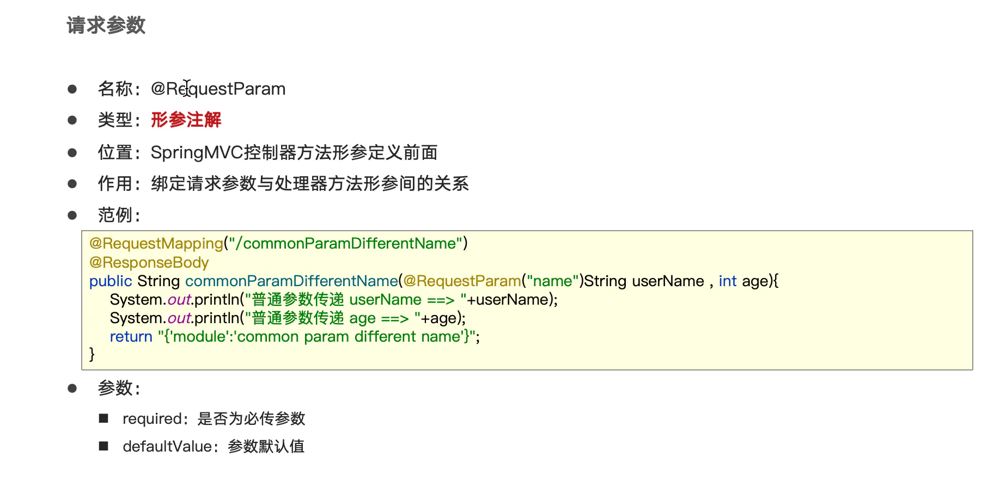

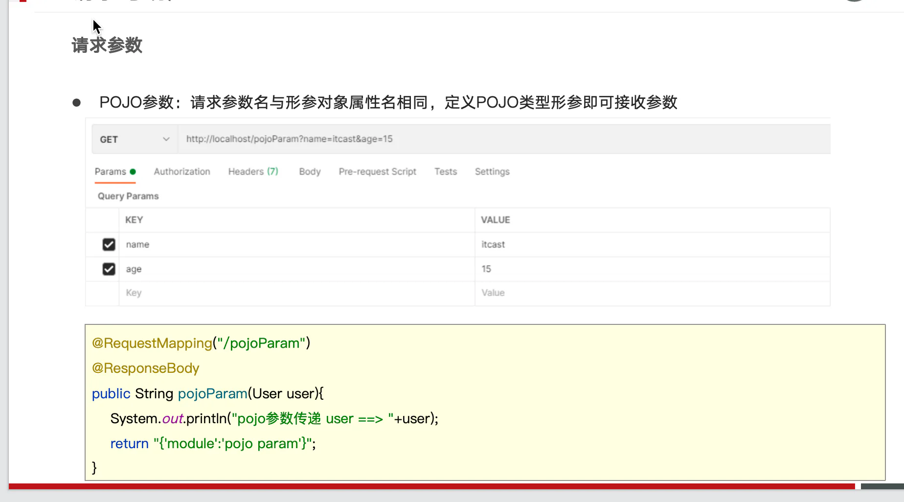

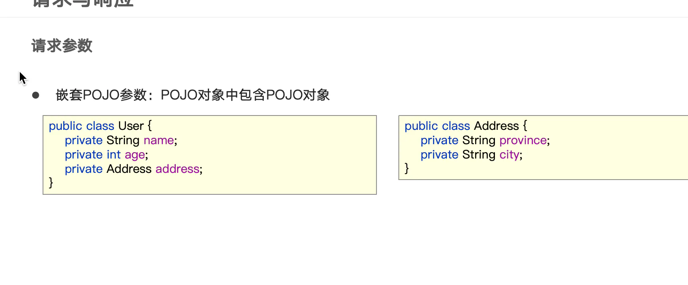

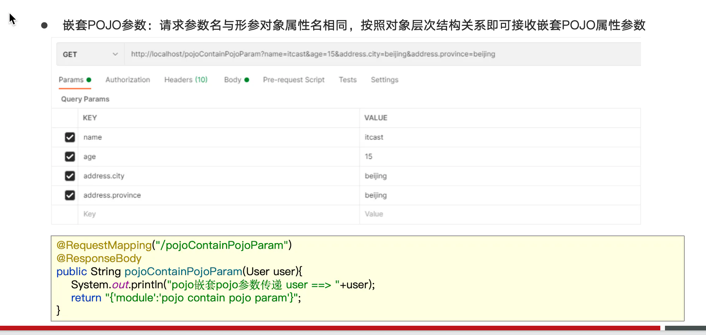

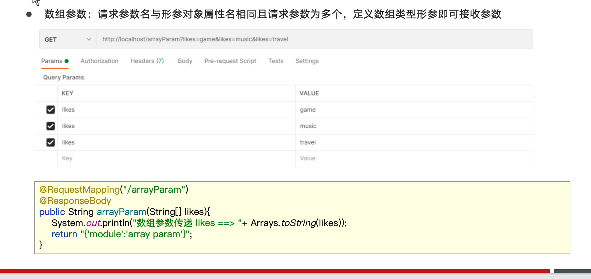

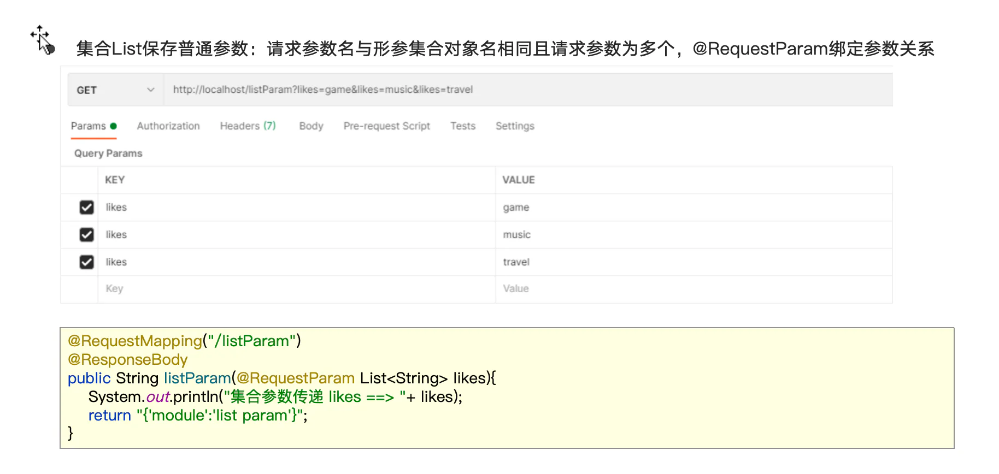

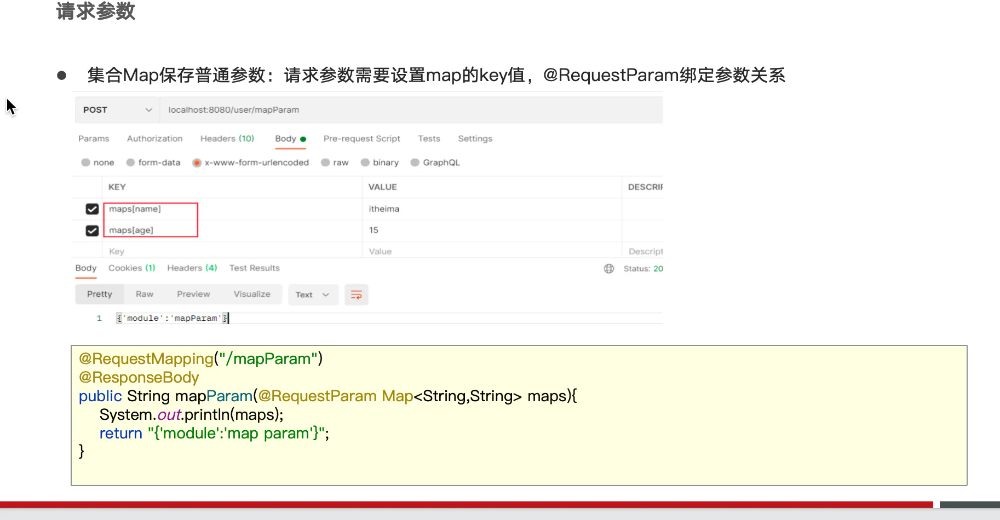

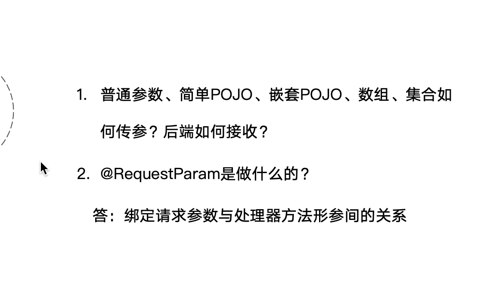
