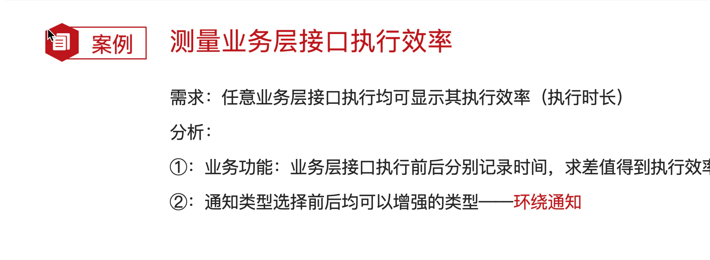
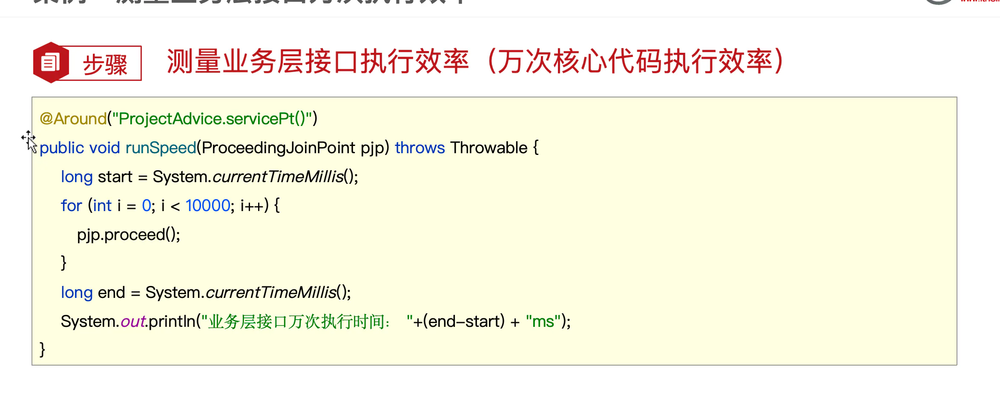
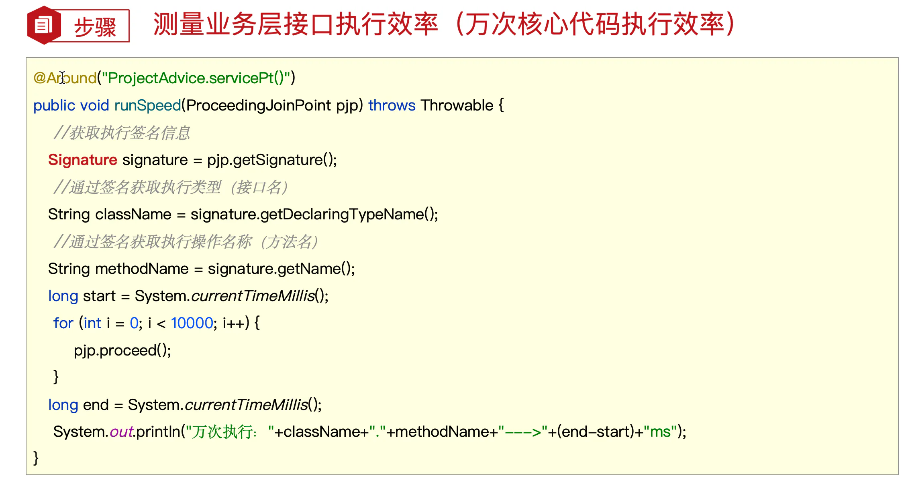
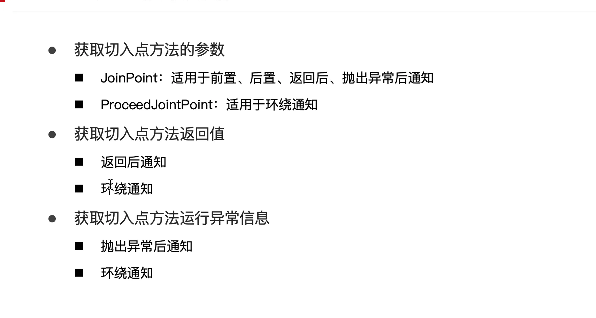
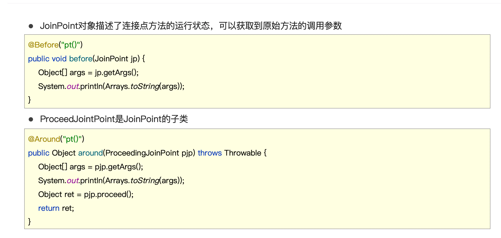
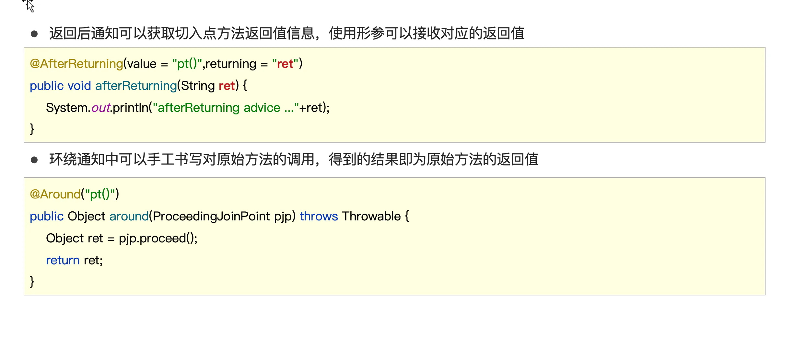
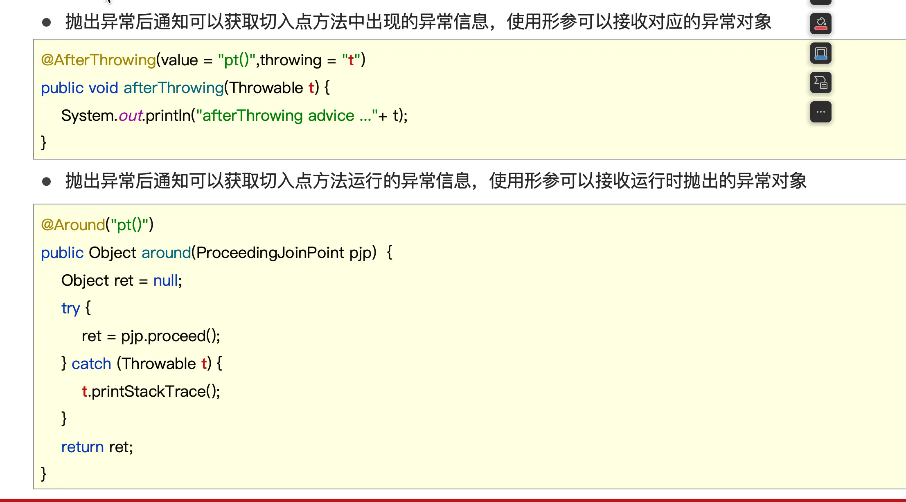
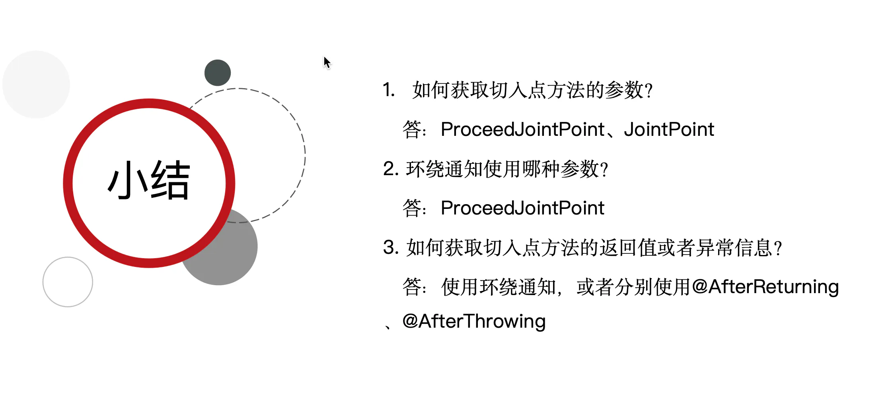
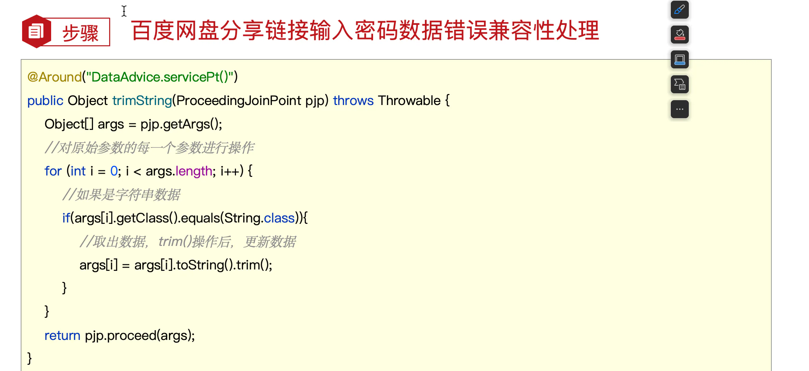

AOP案例

## 目录

- [测量业务层接口万次执行效率
  ](#测量业务层接口万次执行效率)
- [AOP通知获取数据
  ](#AOP通知获取数据)
- [AOP通知获取异常数据（了解）
  ](#AOP通知获取异常数据了解)
- [案例：百度网盘密码数据兼容处理
  ](#案例百度网盘密码数据兼容处理)

测量业务层接口万次执行效率

AOP通知获取数据

获取切入点方法的参数

- **JoinPoint：适用于前置、后置、返回后、抛出异常后通知**
- **ProceedJointPoint：适用于环绕通知**

获取切入点方法返回值
返回后通知
环绕通知
获取切入点方法运行异常信息
抛出异常后通知
环绕通知

AOP通知获取异常数据（了解）

案例：百度网盘密码数据兼容处理

