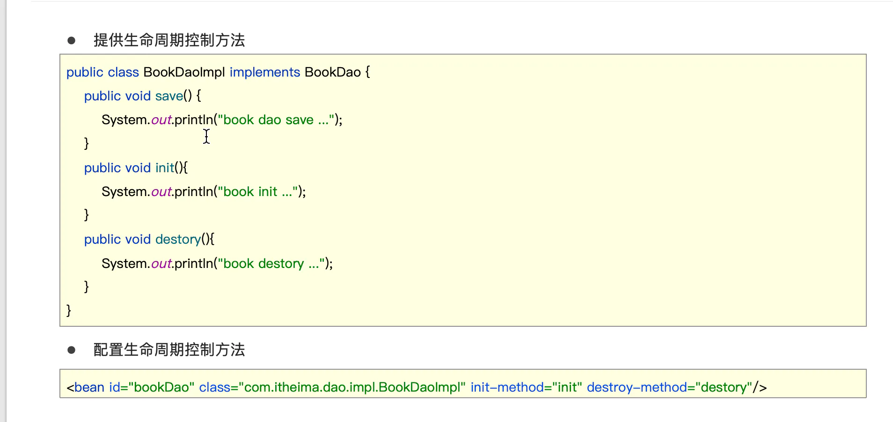
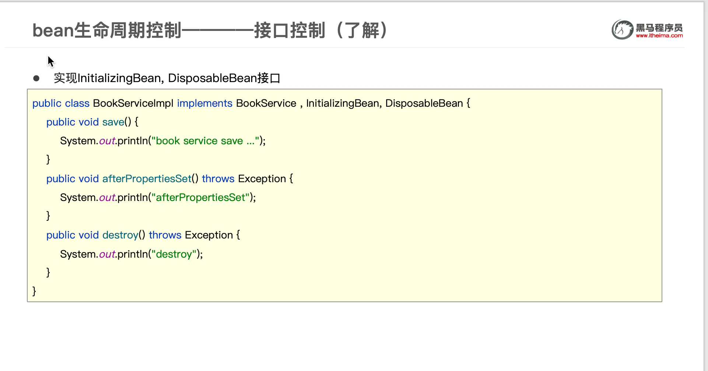
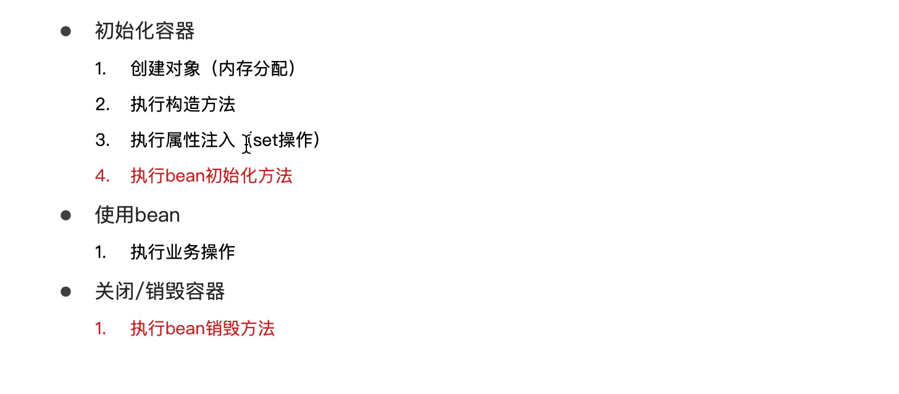
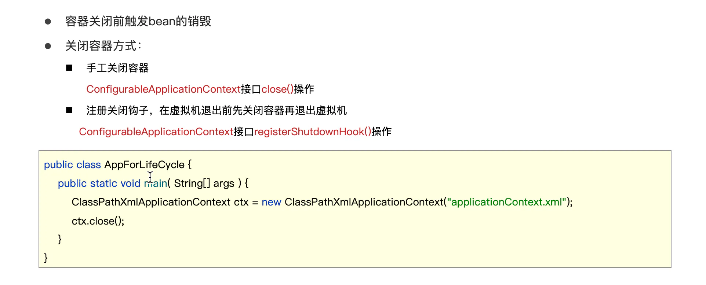
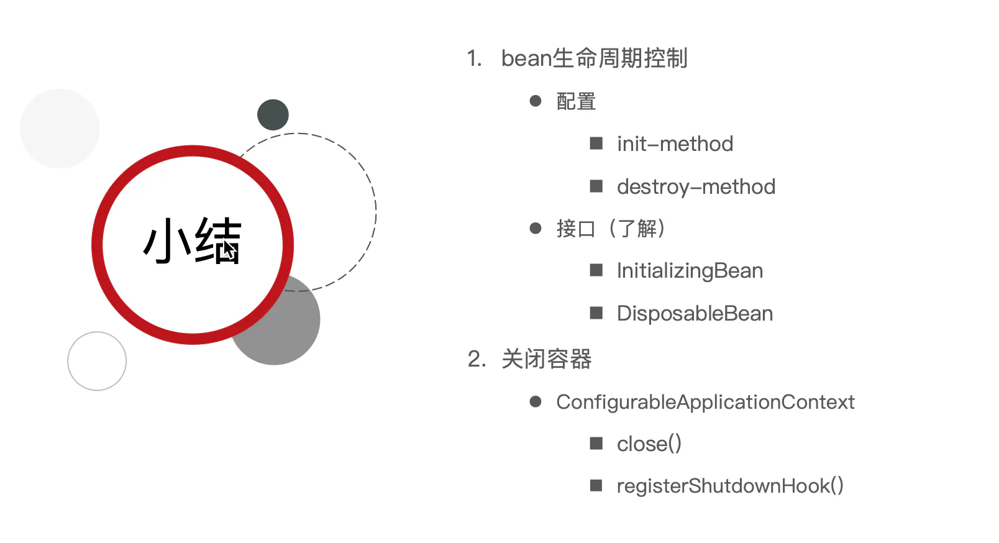

Bean的生命周期

## 目录

- [接口控制](#接口控制)
- [流程](#流程)
- [bean销毁时机
  ](#bean销毁时机)
- [bean生命周期
  ](#bean生命周期)

生命周期：从创建到消亡的完整过程
bean生命周期：bean从创建到销毁的整体过程
bean生命周期控制：在bean创建后到销毁前做一些事情

# 接口控制

# 流程

bean销毁时机

bean生命周期

