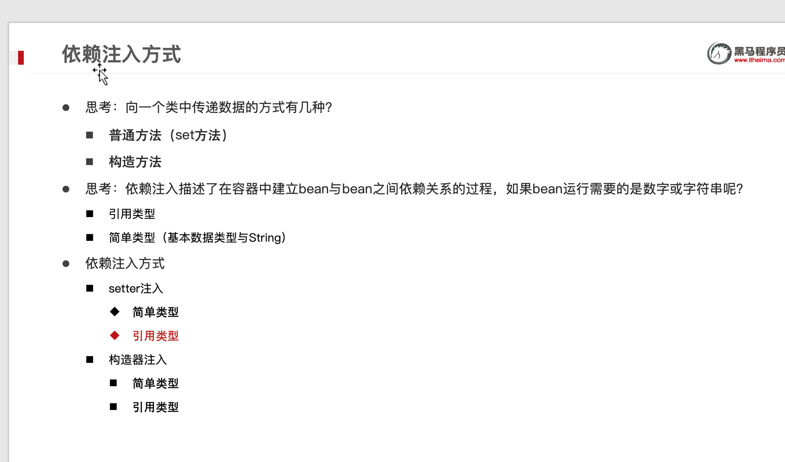
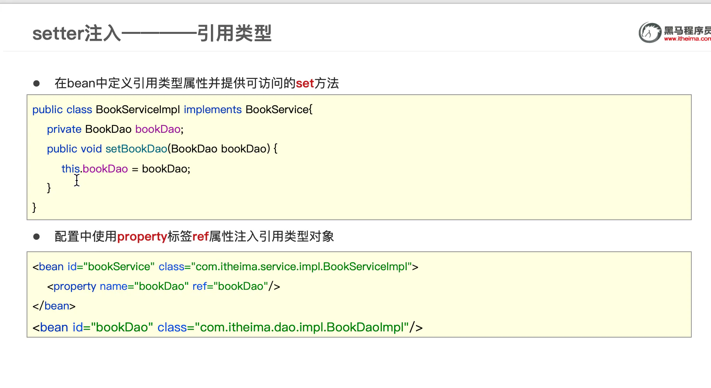
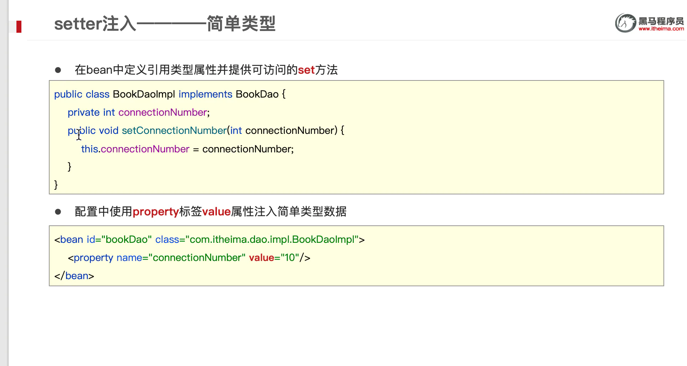
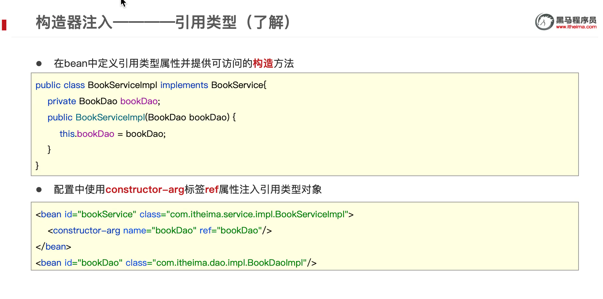
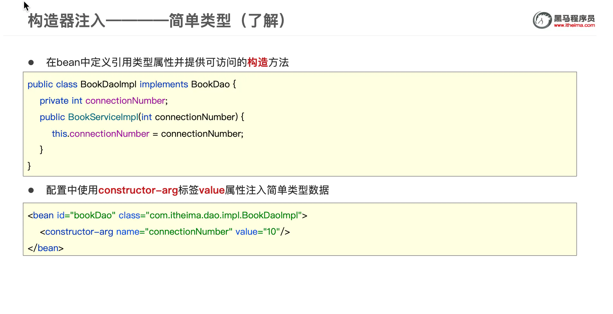
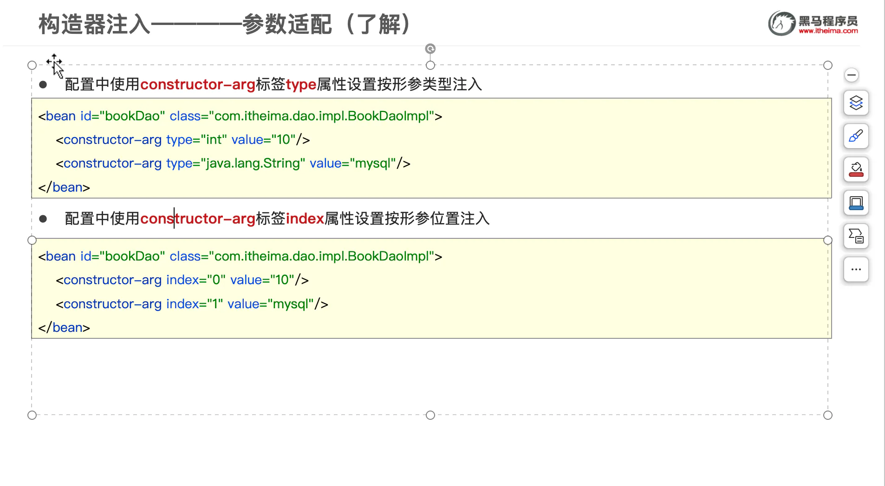

依赖注入方式

## 目录

- [setter](#setter)
- [构造器](#构造器)
  - [构造起参数适配](#构造起参数适配)
- [如何选择](#如何选择)

# setter

# 构造器

## 构造起参数适配

# 如何选择

- 强制依赖使用构造器进行，使用setter注入有概率不进行注入导致null对象出现
- 可选依赖使用setter注入进行，灵活性强
- Spring框架倡导使用构造器，第三方框架内部大多数采用构造器注入的形式进行数据初始化，相对严谨
- 如果有必要可以两者同时使用，使用构造器注入完成强制依赖的注入，使用setter注入完成可选依赖的注入
- 实际开发过程中还要根据实际情况分析，如果受控对象没有提供setter方法就必须使用构造器注入
- 自己开发的模块推荐使用setter注入
