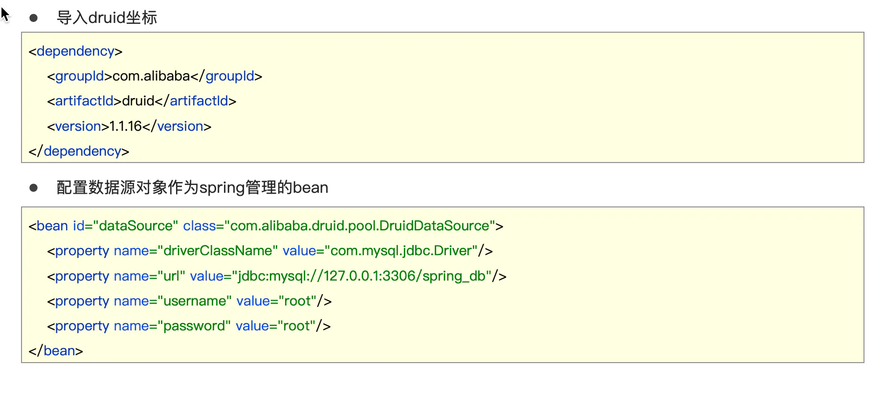
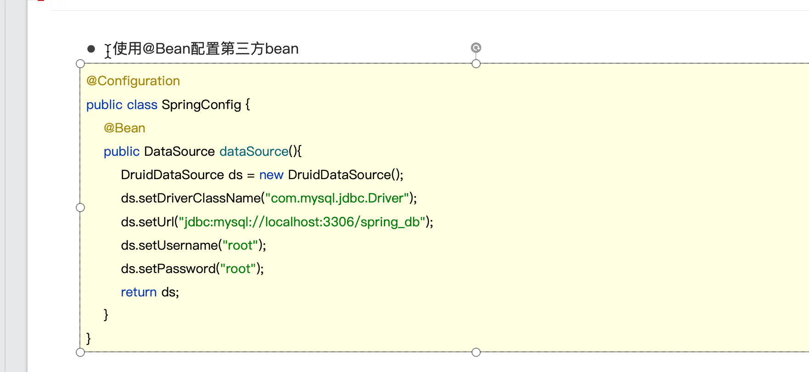
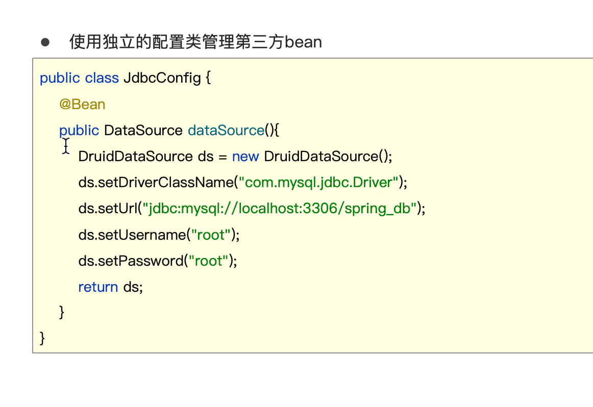
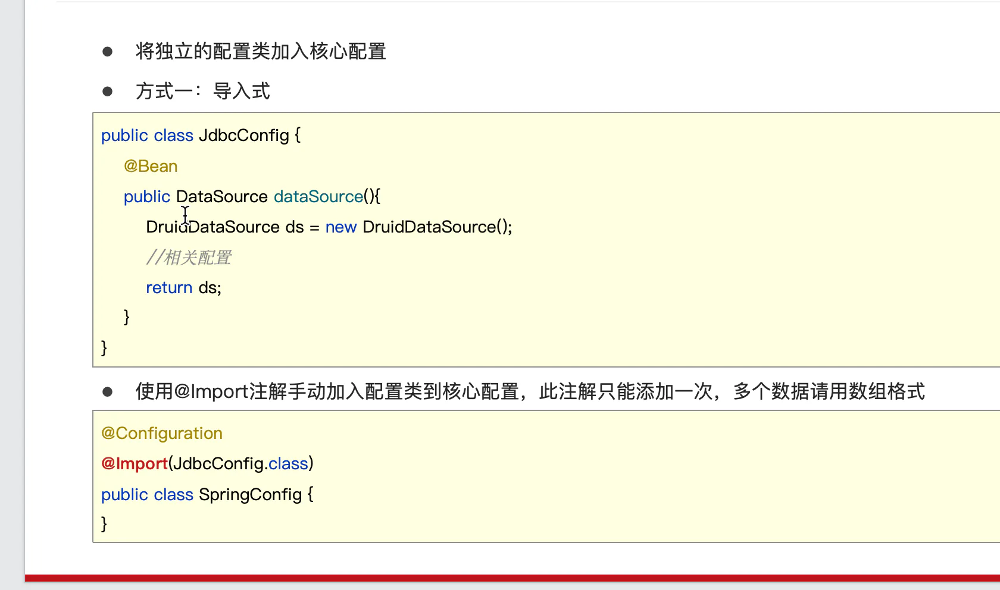
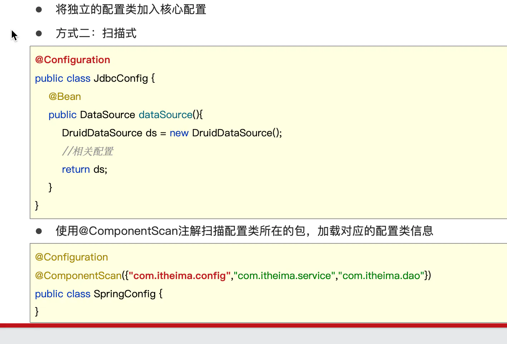
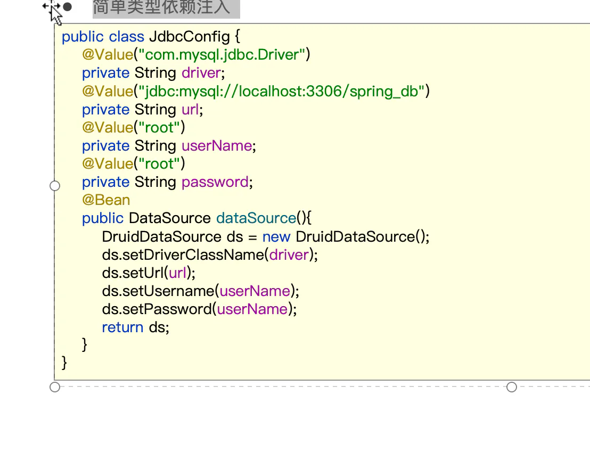
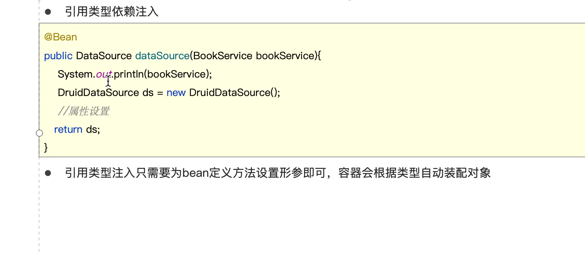

# 第三方资源管理

## 目录

- [bean 管理](#bean-管理)
  - [使用@Bean配置第三方bean
    ](#使用Bean配置第三方bean)
  - [使用独立的配置类管理第三方bean
    ](#使用独立的配置类管理第三方bean)
  - [独立的配置类加入核心配置](#独立的配置类加入核心配置)
    - [方式一：导入式
      ](#方式一导入式)
    - [方式二：扫描式
      ](#方式二扫描式)
  - [简单类型依赖注入
    ](#简单类型依赖注入)
  - [引用类型依赖注入
    ](#引用类型依赖注入)

# bean 管理

使用@Bean配置第三方bean

使用独立的配置类管理第三方bean

## 独立的配置类加入核心配置

### 方式一：导入式&#xD;

### 方式二：扫描式&#xD;

简单类型依赖注入

引用类型依赖注入

