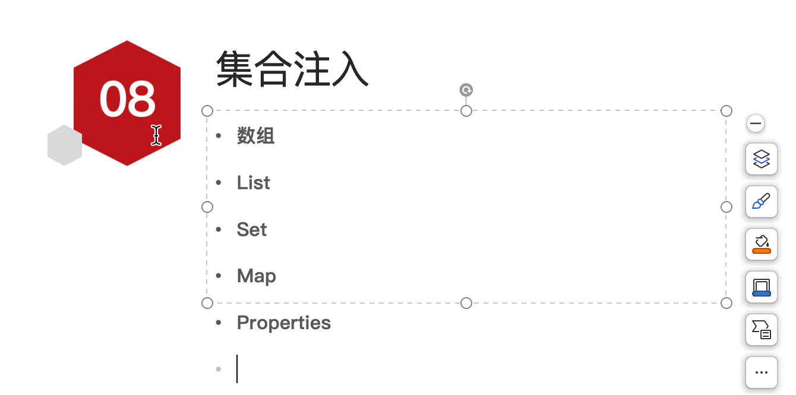
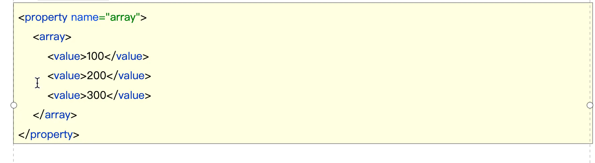
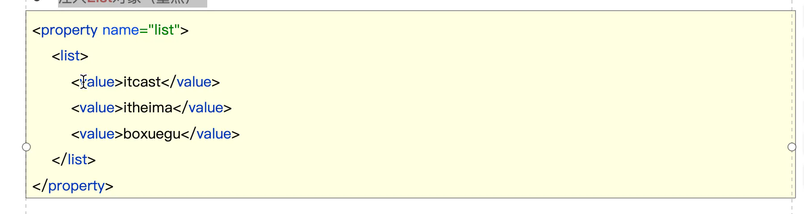
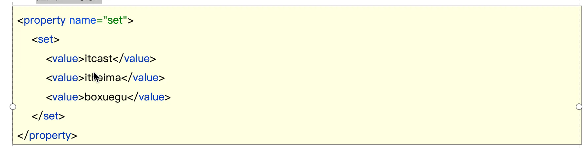
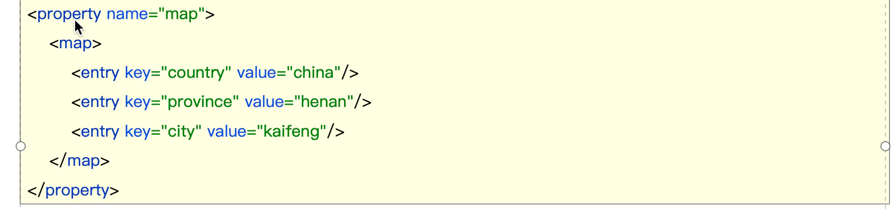
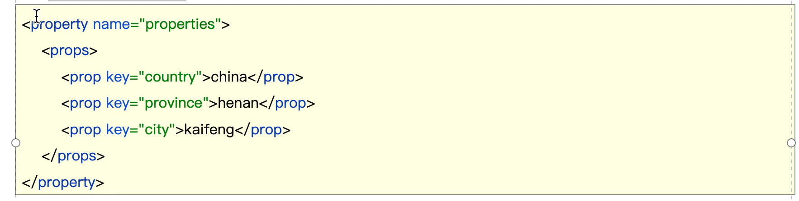

集合注入

## 目录

- [注入数组对象
  ](#注入数组对象)
- [注入List对象（重点）
  ](#注入List对象重点)
- [注入Set对象
  ](#注入Set对象)
- [注入Map对象（重点）
  ](#注入Map对象重点)
- [注入Properties对象
  ](#注入Properties对象)

注入数组对象

注入List对象（重点）

注入Set对象

注入Map对象（重点）

注入Properties对象

