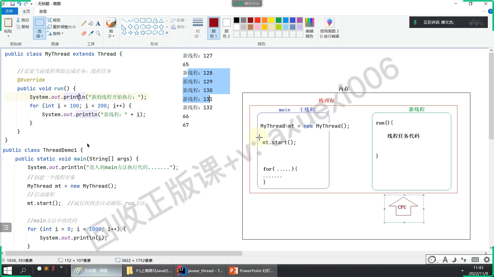

# 继承Thread类

## 目录

- [基本步骤：](#基本步骤)
- [线程类概述
  ](#线程类概述)
- [线程的创建方式1：继承Thread方式](#线程的创建方式1继承Thread方式)
- [特点](#特点)

# 基本步骤：

- 创建一个子类继承`Thread`类。（意味者不能继承其他父类）
- 在类中重写`run`方法（线程执行的任务放在这里）
- 创建`线程对象，调用线程的start方法开启线程。`
- 执行程序，观察控制台的打印数据的现象

线程类概述

`java.lang.Thread`  是线程类，可以用来给**进程创建线程处理任务使用**。要使用线程先介绍两个比较重要的方法：

- public void run​()   : 线程执行任务的方法，是线程启动后第一个执行的方法
- public void start​() : 启动线程的方法, 线程对象调用该方法后,Java虚拟机就会调用此线程的run方法。

# 线程的创建方式1：继承Thread方式

- 我们启动一个Java程序，其实默认就存在一个主线程（main方法所在线程）
- 接下来，我们在主线程启动一个线程，打印1到100的数字，主线程启动完线程后又打印1到100的数字。此时主线程和启动的线程在并发执行，观察控制台打印的结果。

# 特点

**cpu 高速切换执行**
