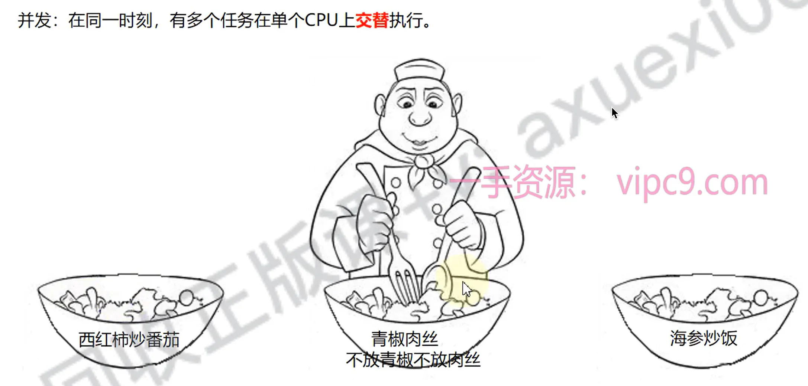
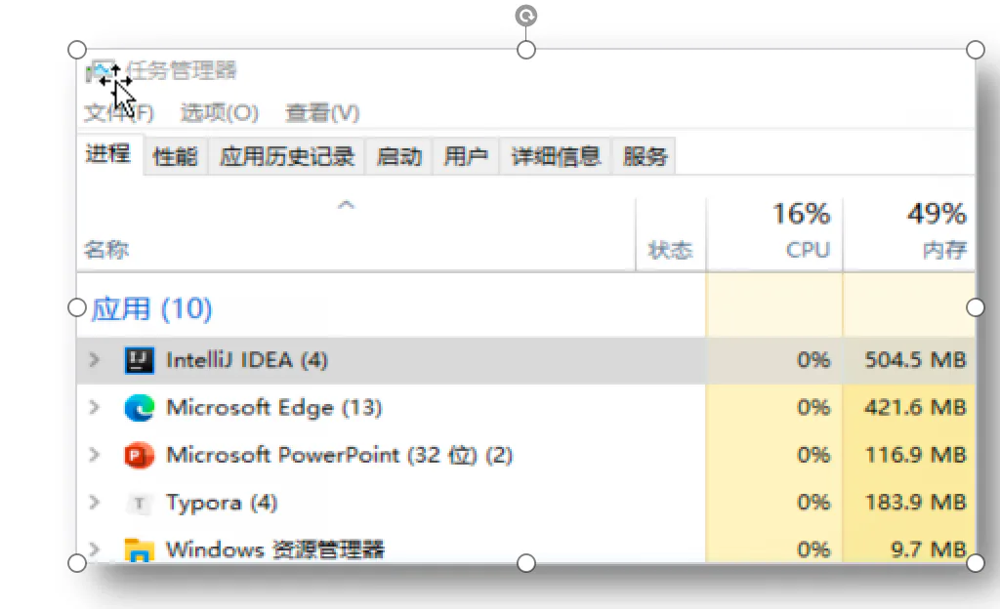

# 相关概念

## 目录

- [并发和并行
  ](#并发和并行)
  - [并行](#并行)
  - [并发](#并发)
- [进程和线程](#进程和线程)
  - [进程
    ](#进程)
  - [线程](#线程)

并发和并行

并行：在同一时刻，有多个任务在**多个**CPU上**同时**执行。
并发：在同一时刻，有 在**单个**CPU上**交替**执行。

> 多线程指的是**并发执行**； 交替执行；我们感受不到中断是因为；现在&#x20;

## 并行

## 并发

# 进程和线程

进程

进程简单地说就是在多任务操作系统中，每个独立执行的程序，所以**进程也就是“正在进行的程序**”。（Windows系统中,我们可以在任务管理器中看到进程）

## 线程

线程是程序运行**的基本执行单元**。当操作系统执行一个程序时，会在**系统中建立一个进程**，该进程**必须至少建立一个线程**（这个线程被称为主线程）作为这个程序运行的入口点。因此，在**操作系统中运行的任何程序都至少有一个线程。**
