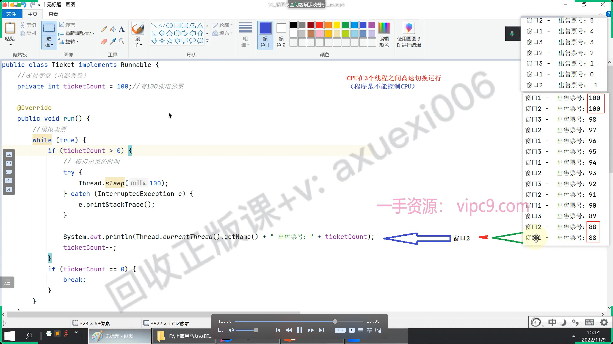

# 线程安全

**多个线程在**对**共享数据进行读改写**的时候，可能导致的**数据错乱就是线程**的安全问题了

处理时间大于cpu执行时间；导致状态不同步

[解决思路](./解决思路/index.md "解决思路")

[同步代码块](./同步代码块/index.md " 同步代码块")

[同步方法](./同步方法/index.md "同步方法")

[lock锁](./lock锁/index.md "lock锁")

[死锁](./死锁/index.md "死锁")
