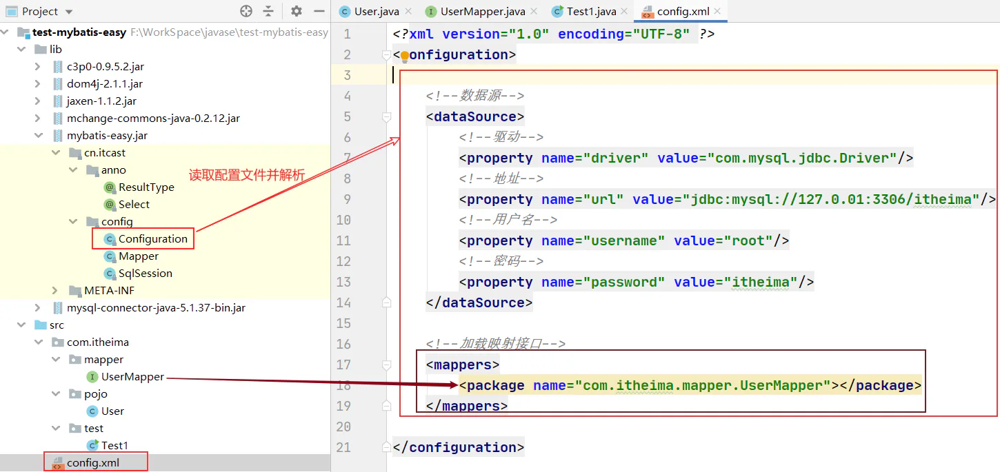
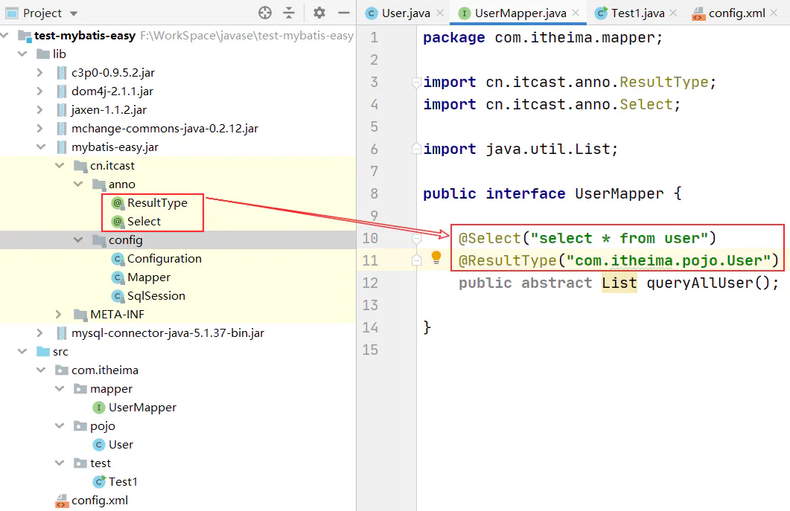
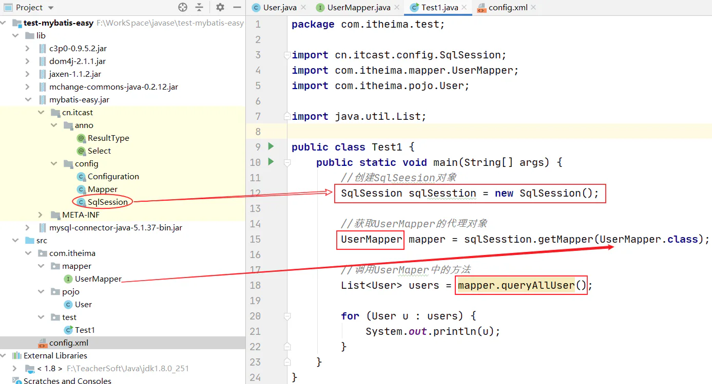

# 介绍

## 目录

- [1、需求](#1需求)
- [2、案例效果](#2案例效果)
- [3、案例分析](#3案例分析)

学习目标：

- 理解所谓的框架是如何实现的，如何使用框架

### 1、需求

需求：自定义dao层jdbc框架

- 为了方便程序员操作数据库，让程序员更关注于sql代码层面和业务层面

### 2、案例效果

使用到的技术：

- 反射
- 注解
- 动态代理
- xml解析：xpath

### 3、案例分析

自定义jdbc框架开发步骤：

1、通过软配置方式，和数据库连接

- 解析xml配置文件，获得：driver、url、username、password
- C3P0连接池
  - 根据配置文件中的参数，创建连接池对象

2、创建@Select注解

- 解析@Select注解中value值：`select查询语句`

3、创建映射接口Mapper

- 把从@Select注解中解析出来的`select查询语句`，赋值给Mapper中的sql成员变量

4、创建SqlSession类

- 提供getMapper()方法，用来获取代理对象
  - 说明：程序员在获取到代理对象后，利用代理对象调用某个方法时，会被代理对象拦截处理
