# 案例

## 目录

- [黑马云盘综合案例](#黑马云盘综合案例)
  - [学习目标](#学习目标)
  - [一 需求说明](#一-需求说明)
  - [二 概要设计](#二-概要设计)
    - [2.1 服务端实现](#21-服务端实现)
    - [2.2 客户端实现](#22-客户端实现)
  - [三 详细设计](#三-详细设计)
    - [3.1 技术选型](#31-技术选型)
    - [3.2 协议定义](#32-协议定义)
      - [协议介绍](#协议介绍)
      - [自定义协议](#自定义协议)
      - [协议的封装](#协议的封装)
    - [3.3 功能接口的定义](#33-功能接口的定义)
      - [文件浏览](#文件浏览)
      - [文件上传](#文件上传)
      - [文件下载](#文件下载)
    - [3.4 基础架构](#34-基础架构)
      - [服务端架构](#服务端架构)
      - [客户端架构](#客户端架构)
  - [四 开发实战](#四-开发实战)

# 黑马云盘综合案例

各位学生，要自己独立完成综合案例

以小组为单位，进行讨论分析

在实现案例代码过程中，有问题：先小组讨论 ， 没解决问题再找老师

基础功能：文件上传、文件下载、浏览子目录(稍微修改下代码就可完成)

如果想要锻炼自己：在完成综合案例后，自己在独立从头写一遍

- 综合案例中使用的技术：面向对象、String、File、IO、集合|数组、网络编程、多线程

想要提升自己：就把加强版的黑马云盘独立完成

- 增加：commons-io、封装了自定义协议类

## 学习目标

理解需求 ，通过文档能够独立完成代码的开发

## 一 需求说明

实现一个乞丐版云盘。

云盘项目包含客户端和服务端，通过客户端可以查看网盘内容，可以下载网盘中的文件，上传文件到网盘中


网盘内容功能：已写过

```java 
//获取给定目录下的文件内容
File类提供一个方法： File[]  listFiles()  //当前目录下所有内容

```


上传文件功能：已讲解

```markdown 
网络编程课堂案例

```


下载网盘中的文件：未完成

黑马云盘系统：

- 通过客户端，查看服务端上的文件或目录
- 通过客户端，把服务端本地文件下载到客户端
- 通过客户端，把客户端本地文件上传到服务端

## 二 概要设计

### 2.1 服务端实现

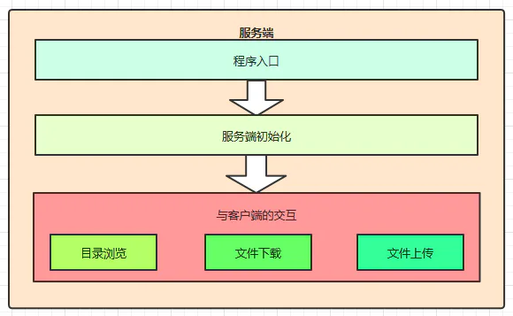

### 2.2 客户端实现

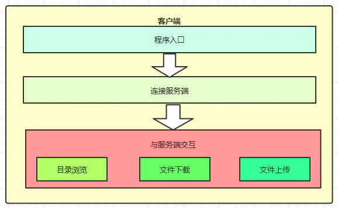

## 三 详细设计

### 3.1 技术选型

1. 使用TCP编程技术实现客户端和服务端的开发，完成文件上下传的功能
2. 自定义客户端和服务端之间的通讯协议
3. 服务端多线程技术，实现高并发访问
4. 自定义异常维护业务安全
5. 使用JDK现有的API完成相关业务
   1. Socket，ServerSocket网络编程
   2. File文件类
   3. IO流相关类
   4. ResourceBundle配置文件读取
      - 读取当前项目中src目录下的.properties配置文件

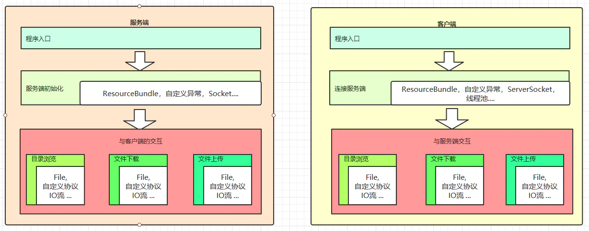

### 3.2 协议定义

#### 协议介绍

协议就是客户端和服务端通讯双方共同遵守的规定。

TCP协议是区分客户端服务端的一个比较底层的协议，传输的数据是字节码数据，如下

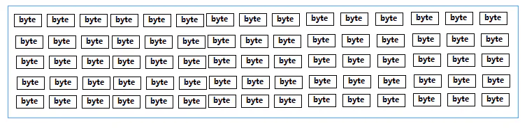

当客户端连接服务端后，若要上传一个文件到服务端。直接将文件数据传给服务端，那么服务端该如何识别这个数据呢。对于服务端来讲收到的都是字节数据，服务端该如何识别客户端的操作意图，如果是上传文件，那么文件的类型是什么，文件的名字是什么等等信息。

**怎样让双方在沟通时理解对方的信息呢？**

我们可以把要发送给对方的数据前加一行描述信息，我们可以称为头信息。这个头信息包含了我要干什么，我的数据有哪些属性等信息，发头信息后再把具体的数据发送给对方。这样对方先把头信息获取，知道了我要做什么操作，发送过来的数据是是什么有什么数据，再接收具体的数据，就搞定了。


加了头信息的数据如下：

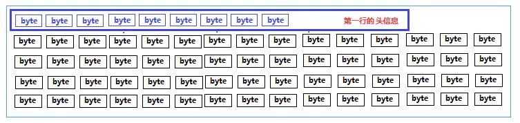

#### 自定义协议

我们约定双方发送数据前要先发送一个头信息，如下

```yaml 
type=操作类型,fileName=文件名,status=操作状态,message=说明信息\r\n

```


说明：第一行头信息要和数据分开，用行分隔符分开即可，每个信息使用 key=value键值对表示，么个信息使用逗号分隔

1. type：操作类型，对应的值可以是如下：

```markdown 
scan：表示浏览目录操作
upload：表示上传操作
download：表示下载操作

下载操作示例：
type=download

```


1. fileName：要浏览操作文件的文件名

```typescript 
下载文件“美女.jpg”示例：
type=download,fileName=美女.jpg

```


1. status：操作状态

```markdown 
表示服务端收到客户端请求后回复操作状态，ok表示成功，failed表示失败

```


1. message：说明信息

```markdown 
其他附加说明信息

```


一次文件下载的示例：

**客户端发送请求：**

```yaml 
type=download,fileName=root/美女.jpg,status=null,message=null\r\n

```


**服务端响应请求：**

- 成功

```yaml 
type=download,fileName=root/美女.jpg,status=ok,message=null\r\n
01010101010010美女数据010100101001010

```


- 失败

```typescript 
type=download,fileName=root/美女.jpg,status=failed,message=文件不存在！\r\n

```


#### 协议的封装

为了方便协议的定义和解析，我们可以使用面向对象的思想进行封装成一个类，Protocol

```java 
// 把协议封装成一个类
public class Protocol {
    //协议数据
    private String type;    // 操作类型
    private String fileName;// 操作文件
    private String status;  // 操作状态
    private String message; // 说明信息

    /**
     * 操作类型
     */
    public static class Type {
       public static final String  SCAN="scan";//浏览
       public static final String  UPLOAD="upload";//浏览
       public static final String  DOWNLOAD="download";//浏览
    }

    /**
     * 操作状态
     */
    public static class Status {
       public static final String  OK="ok";//成功
       public static final String  FAILED="failed";//失败
    }

  //省略其他构造器及getter/setter
}

```


自定义协议：客户端和服务端两端程序之间交互的一种固定格式

- 客户端：
  - 发送自定义协议：Type=操作功能,FileName=文件名或目录名,Status=交互状态,Message=状态消息
    - 自定义协议，就一个拼接的字符串
- 服务端：
  - 接收自定义协议：客户端发送的自定义协议
    - 大白话：接收客户端发送的字符串
  - 解决自定义协议
    - 把字符串进行切割，取出自己需要的内容

### 3.3 功能接口的定义

这里的接口，指定的是服务端暴露出来的功能。比如文件浏览功能，只要按照该接口指定的方式传输数据，就能完成功能了。

#### 文件浏览

- 客户端与服务端的交互流程

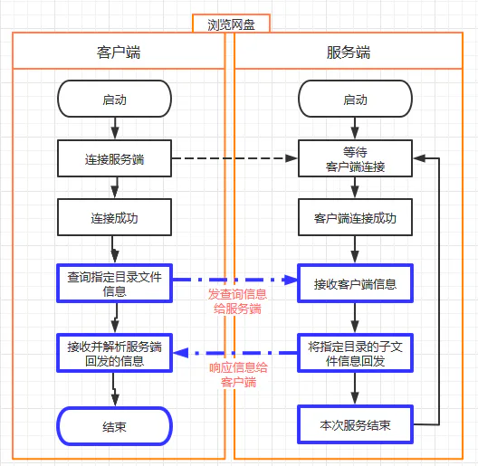

- **数据交互**

**请求：客户端 ---> 服务端**

```yaml 
type=scan,fileName=需要浏览的目录,status=null,message=null\r\n
```


**响应： 服务端 --->客户端**

1. **成功：**

```yaml 
type=scan,fileName=需要浏览的目录,status=ok,message=null,
xxx  xxxxxx       //File类型   File的名字
目录  目录名
文件  文件名

```


1. **失败：**

```typescript 
type=scan,fileName=null,status=failed,message=目录不存在，只能浏览当前子目录,
#没有后续数据

```


失败的原因，就是服务端没有对应的目录，无法遍历。

#### 文件上传

- **文件上传交换流程**

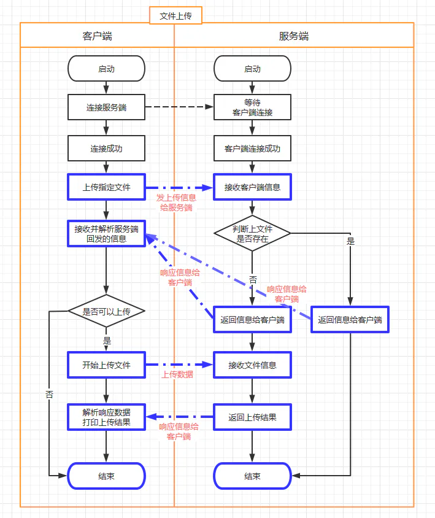

- **数据交互**

  **请求：客户端 ---> 服务端**

```typescript 
type=upload,fileName=要上传的文件,status=null,message=null,

```


- 注意：文件要体现在服务端的位置。客户端看到的文件都是基于服务端某一个文件夹而存在的，我们把这个文件夹叫做root。 &#x20;

  服务端开发时，可以任意指定一个合法的文件夹当做这个root。

**响应： 服务端 --->客户端**

1. 成功

   告诉客户端，文件可以上传的

```typescript 
type=upload,fileName=要上传的文件,status=ok,message=null,

```


客户端收到信息后，继续上传文件信息，文件接收完毕后继续响应

```typescript 
type=upload,fileName=要上传的文件,status=ok,message=文件上传成功,
```


1. 失败

   如果发现服务端已经存在该文件，提示客户端不要上传
   ```typescript 
   type=upload,fileName=要上传的文件,status=failed,message=文件已存在
   ```


#### 文件下载

- 文件下载流程

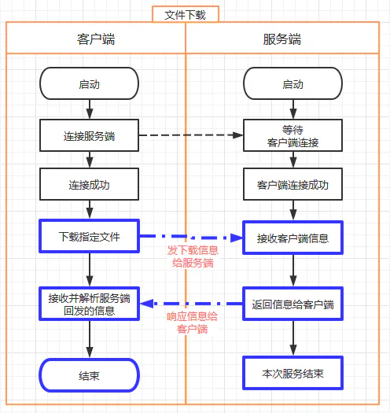

- **数据交互**

  **请求：客户端 ---> 服务端**
  ```typescript 
  type=download,fileName=下载的文件名,status=null,message=null,
  ```

  **响应： 服务端 --->客户端**
  1. 成功
     ```yaml 
     type=download,fileName=下载的文件名,status=ok,message=134448,
     010101010010下载的文件字节数据010101010010100101001010010010010101....
     ```

     需要将下载的文件字节数据保存到文件中
  2. 失败
     ```typescript 
     type=download,fileName=下载的文件名,status=failed,message=文件不存在，请选择当前存在的子文件,
     ```

     只有协议数据，没有实际下载的文件数据

### 3.4 基础架构

#### 服务端架构

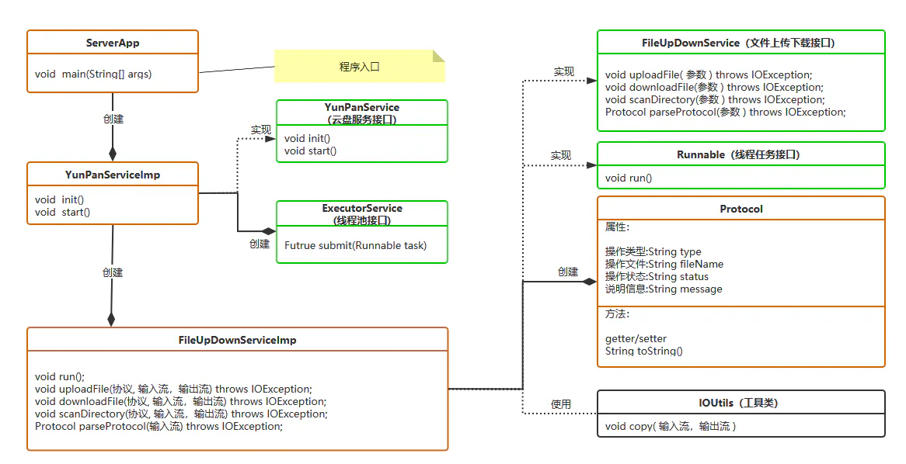

代码结构：

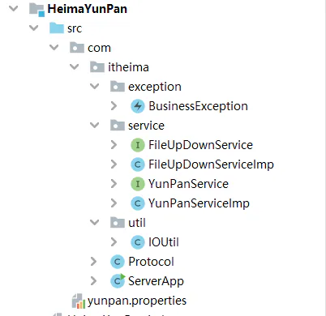

基础代码请看看今天资料

#### 客户端架构

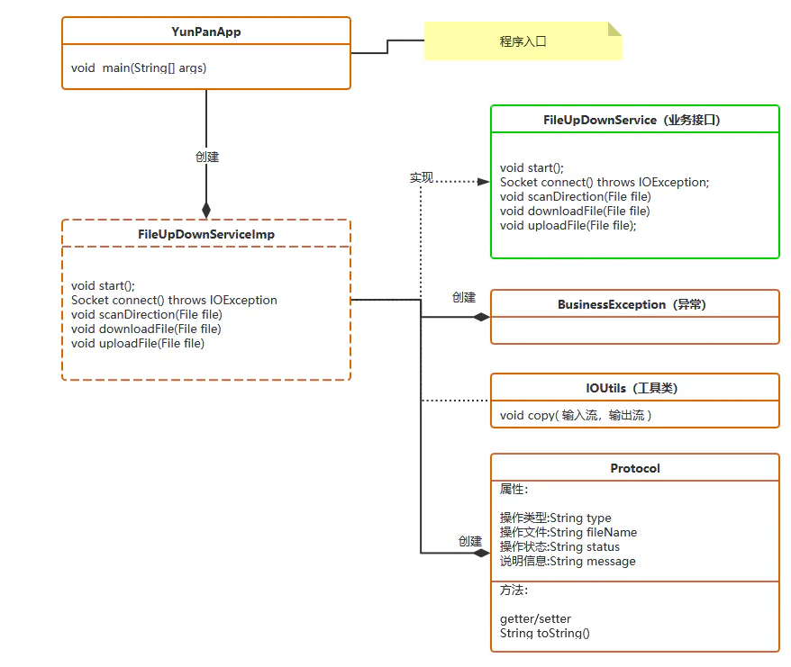

项目结构：

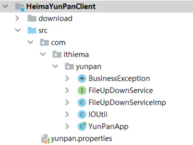

基础代码请看看今天资料

## 四 开发实战

基于资料中提供的基础框架代码，完成客户端和服务端的开发.

资料中有代码
