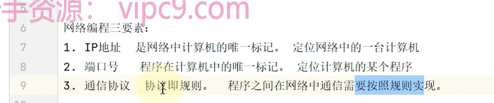
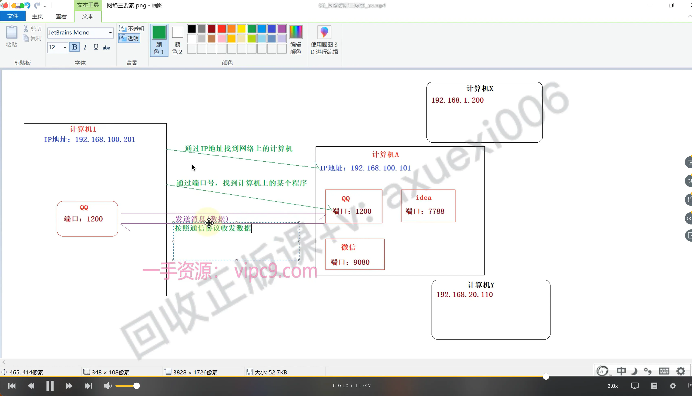

# 三要素

在网络中想要实现编程，必须有：网络三要素

- IP地址：网络上**计算机的唯一标识**
- 端口号：计算机中程序**的唯一标识（每一个程序都有自己唯一的端口号）**
- 通信协议：网络上程序之间交互的规则
  - TCP协议
  - UDP协议

[ip](./ip/index.md "ip")

[端口](./端口/index.md "端口")

[通讯协议](./通讯协议/index.md "通讯协议")
