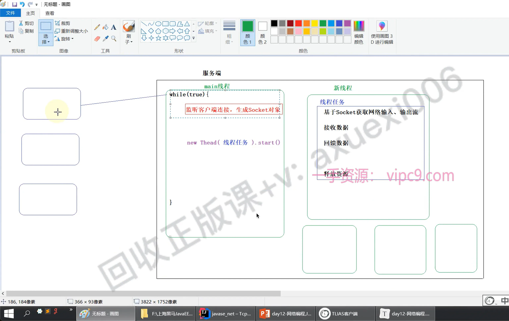

# 多线程上传

## 目录

- [代码](#代码)



# 代码

```java title="Server"
package com.Task;

import java.io.*;
import java.net.ServerSocket;
import java.net.Socket;
import java.util.UUID;
import java.util.concurrent.ExecutorService;
import java.util.concurrent.Executors;

public class server {
    public static void main(String[] args) throws IOException {
        ExecutorService es = Executors.newFixedThreadPool(20);
        ServerSocket ss = new ServerSocket(9090);
        System.out.println("服务端程序已启动：9090 ；进入阻塞状态；直到客户端链接");
        while (true){
            Socket server = ss.accept();
            System.out.println(server.getInetAddress().getHostAddress() + "客户端已链接接");
//            Thread thread = new Thread(new Task(server));
//            thread.start();
            es.submit(new Task(server));

        }

    }

}

```


```java title="client"
package com.Task;


import java.io.*;
import java.net.Socket;

public class client {
    public static void main(String[] args) throws IOException {
        Socket client = new Socket("127.0.0.1",9090);
        OutputStream netOutput = client.getOutputStream();
        FileInputStream fis = new FileInputStream("images/img3.png");
        byte[] buf = new byte[1024];
        int len = -1;
        while ((len = fis.read(buf)) != -1){
            netOutput.write(buf, 0, len);
        }
        // 当文件全部发送结束；要告知服务器
        client.shutdownOutput(); //告诉服务器上传结束

        InputStream netInput = client.getInputStream();
        BufferedReader br = new BufferedReader(new InputStreamReader(netInput));
        String msg = br.readLine();// 已换行标记作为读取结束的标记


        System.out.println(msg);


        netInput.close();
        br.close();
        fis.close();
        netOutput.close();
        client.close();


    }
}

```


```java title="Task"

package com.Task;


import java.io.*;
import java.net.Socket;
import java.util.UUID;

public class Task  implements Runnable {
    Socket server;
    public Task(){

    }
    public Task(Socket server){
        this.server=server;
    }

    @Override
    public void run() {
        InputStream netInput=null;
        FileOutputStream fos = null;
        BufferedWriter bw = null;
        OutputStream netOutput = null;
        try {
             netInput = this.server.getInputStream();
//            String fileName = System.currentTimeMillis() + "";
            String fileName = UUID.randomUUID().toString().replace("-","");
            fos = new FileOutputStream("serverSpace/"+fileName  +".png");

            byte[] buf = new byte[1024];
            int len = -1;
            while ((len = netInput.read(buf)) != -1){
                fos.write(buf,0,len);
            }
            System.out.println("上传文件接受完毕");

            netOutput  = this.server.getOutputStream();

            bw = new BufferedWriter(new OutputStreamWriter(netOutput));

            bw.write("文件上传成功");
            bw.newLine();


        }catch (Exception e ){
            e.printStackTrace();
        }finally {
            try {
                bw.close();
            } catch (IOException e) {
                throw new RuntimeException(e);
            }
            try {
                netOutput.close();
            } catch (IOException e) {
                throw new RuntimeException(e);
            }
            try {
                netInput.close();
            } catch (IOException e) {
                throw new RuntimeException(e);
            }
            try {
                this.server.close();
            } catch (IOException e) {

            }
        }

    }
}


```
