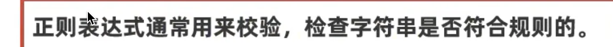
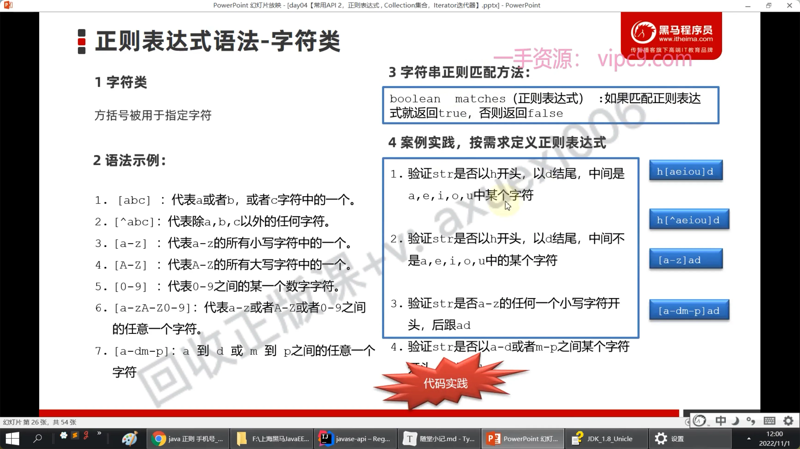
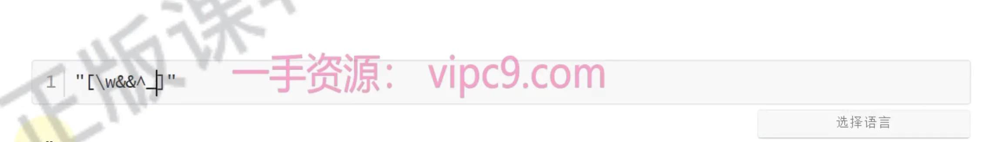
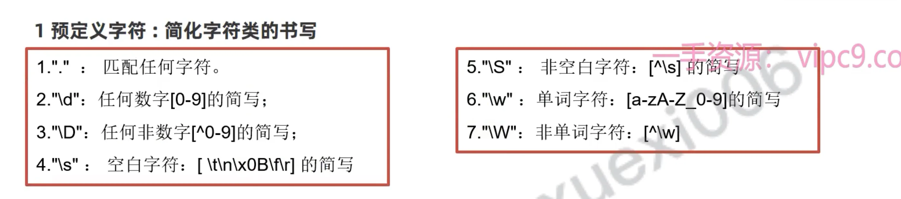
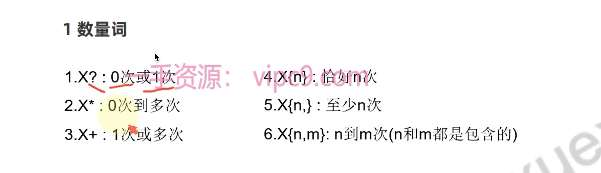
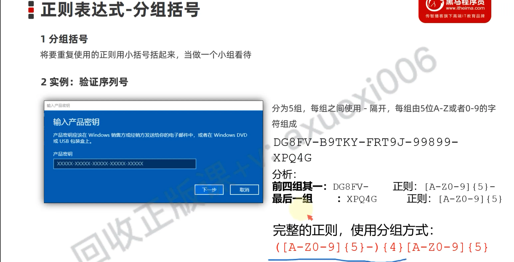
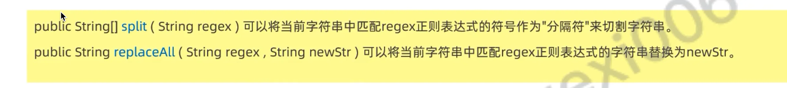

# 正则

## 目录

- [什么是](#什么是)
- [解决什么问题](#解决什么问题)
- [使用细节](#使用细节)
- [&&](#)
- [分组](#分组)
- [字符串和正则](#字符串和正则)

# 什么是

有特定字符组成的**字符校验规则**

# 解决什么问题

**校验字符串是否符合规则；**

- 只能针对**字符串格式校验**

# 使用细节

# &&

> 并且的意思

# 分组

# 字符串和正则

