# 运算符

## 目录

- [算数运算符](#算数运算符)

# 算数运算符

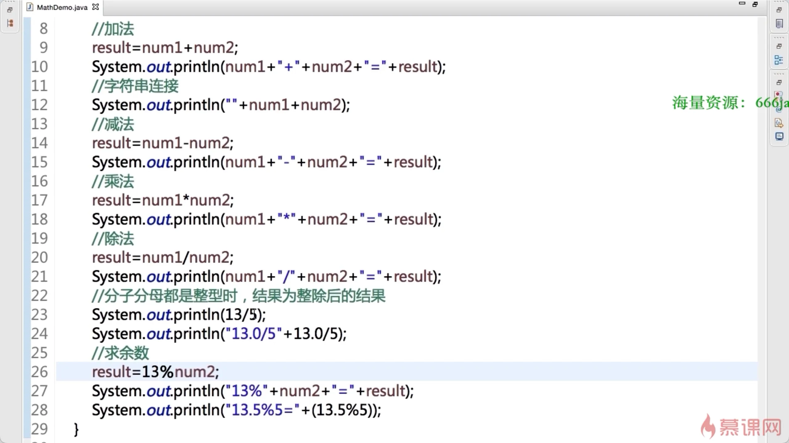

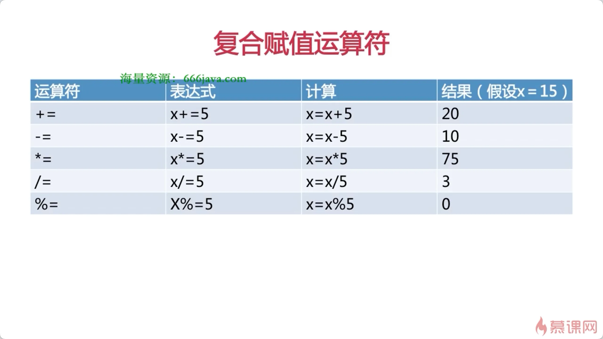

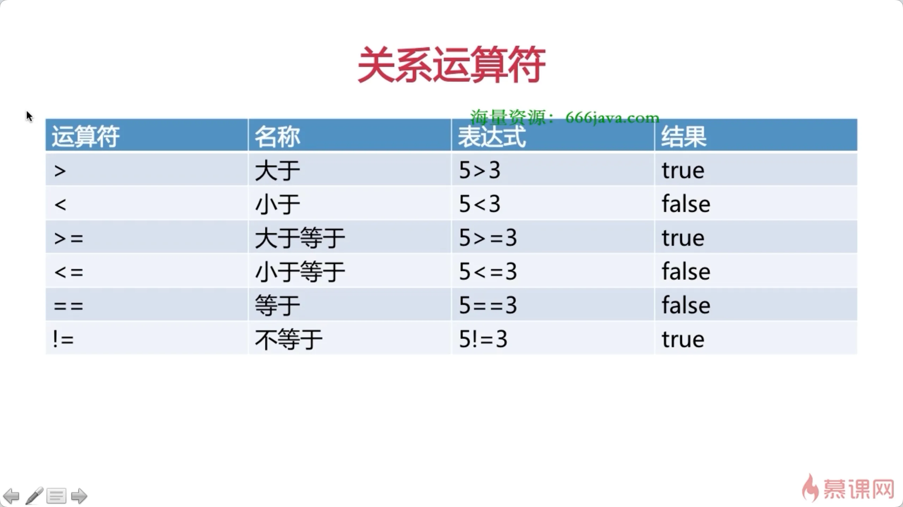

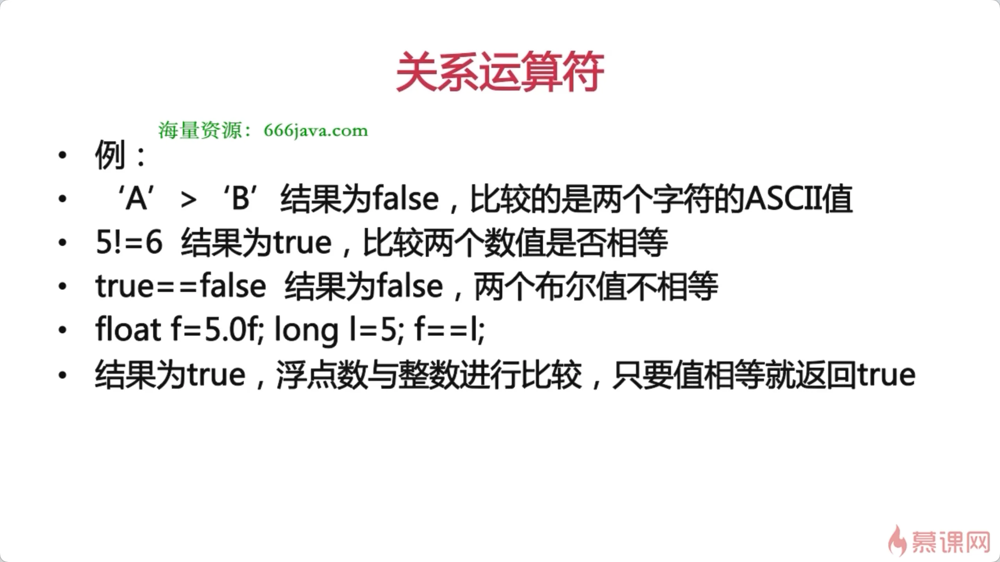

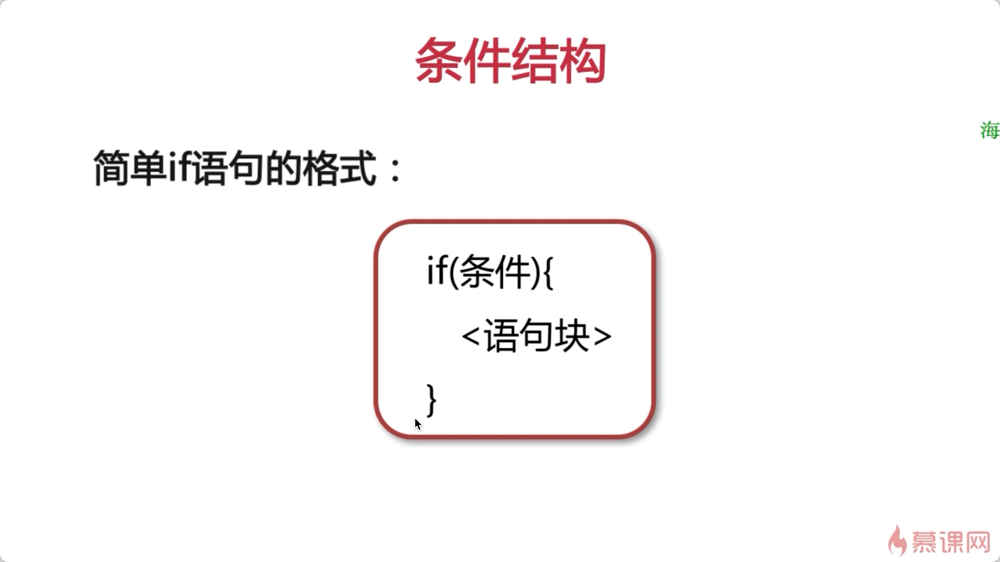

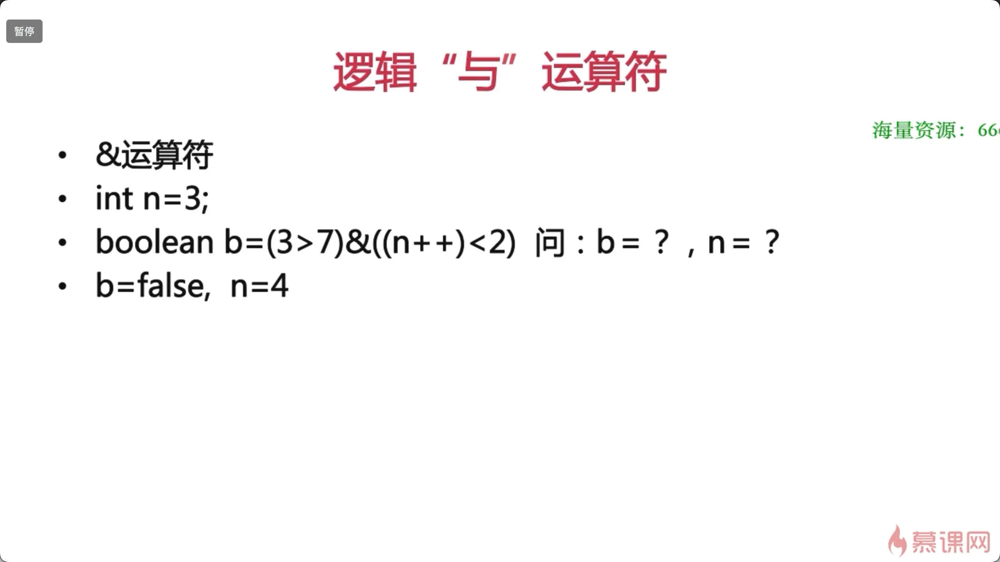

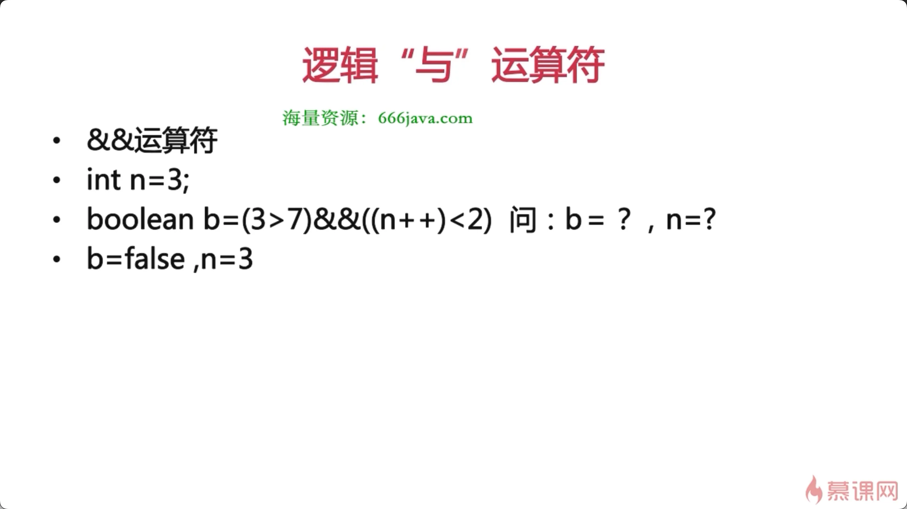

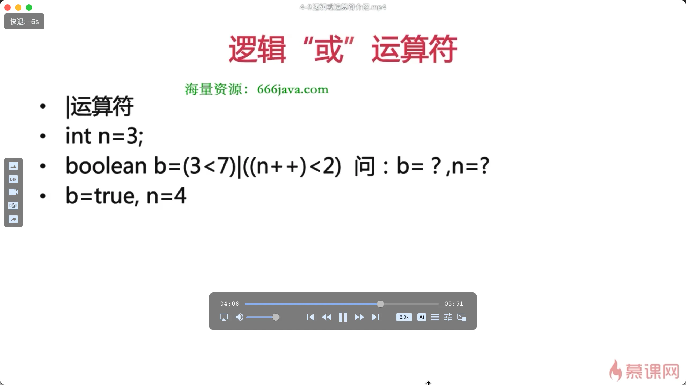

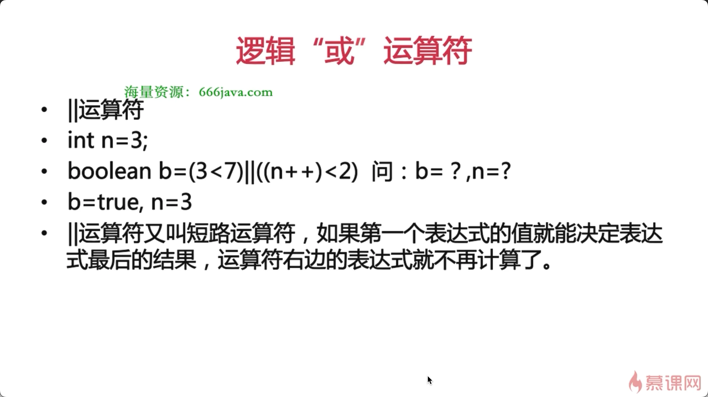

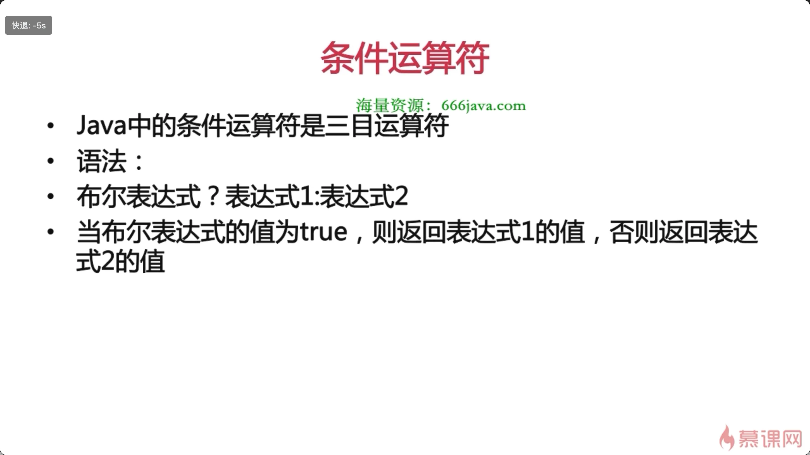

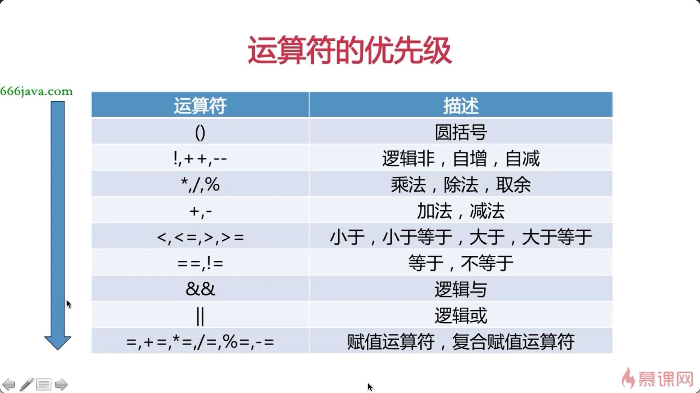

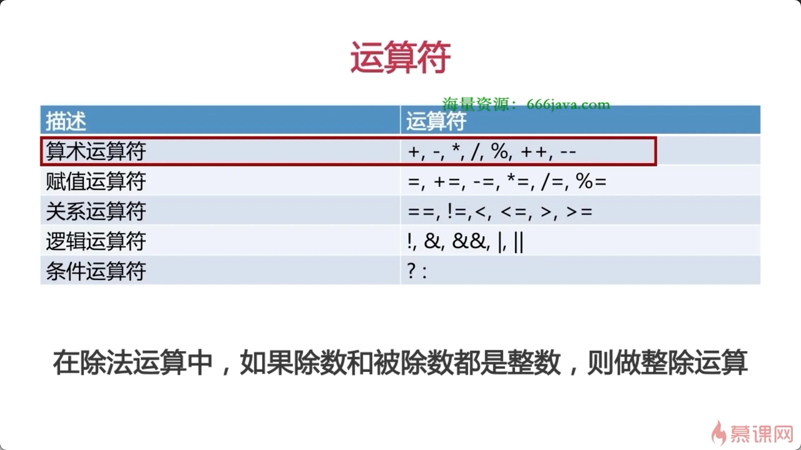

[案例](./案例/index.md "案例")

[编码](./编码/index.md "编码")

[数字相加](./数字相加/index.md "数字相加")

[字符相加](./字符相加/index.md "字符相加")

[赋值运算符](./赋值运算符/index.md "赋值运算符")

[关系运算符](./关系运算符/index.md "关系运算符")

[逻辑运算符](./逻辑运算符/index.md "逻辑运算符")

[三元运算符](./三元运算符/index.md "三元运算符")

[自增自减](./自增自减/index.md "自增自减")
