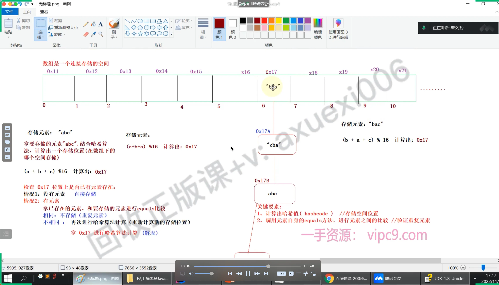
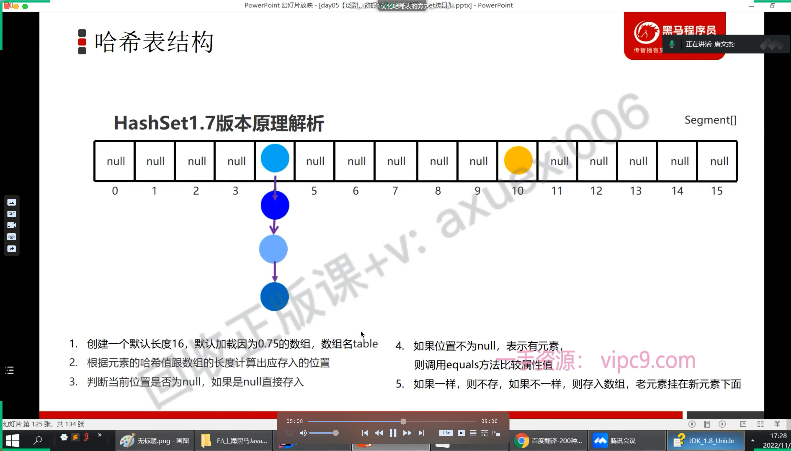
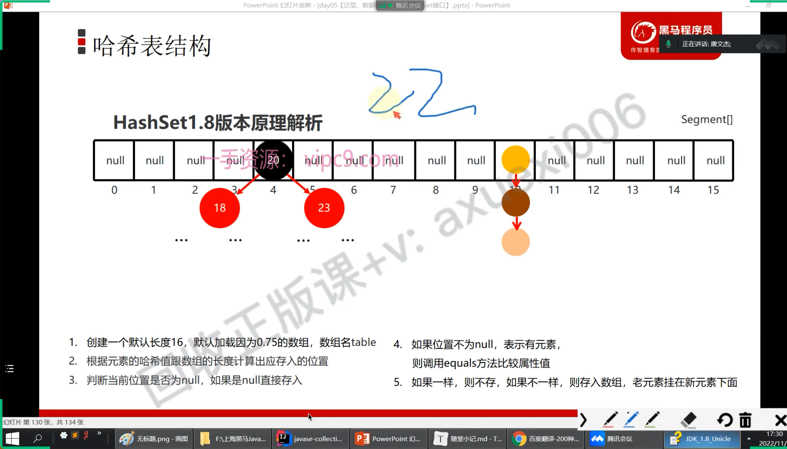

# hash表数据结构

## 目录

- [性能优化](#性能优化)

* 底册是使用大小为16的数组+链表组成的储蓄方式&#x20;
* hash表存储数据的存储方式
  - 拿存储的元素；计算出hash（存储位置）值 （调用元素的\*\*`hashCode`() \*\*）;
  - 判断计算出的存储位置；是否有元素存在；如果没有就直接存储
  - 如果存在；拿存储的元素  和 已经存在的元素进行比较；（比较内容是否相同；**equals（）**）
    - 如果相同；就不再存储
    - 不相同；在此进行hash算法；计算出新的存储位置值；然后原来的值挪到新算出来的位置上；原来的位置放入新存储的值；
    - 原来的值；和新来的值；用链表关联起来； &#x20;

# 性能优化

- jdk8 之前；数组+链表
- jdk8之后；数组+ 链表/红黑树
- 当链表的长度大于8的时候；自动转为红黑树

