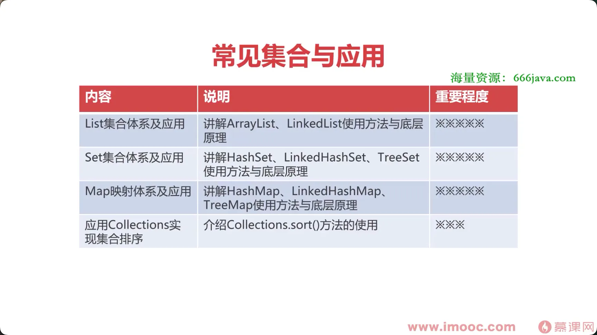
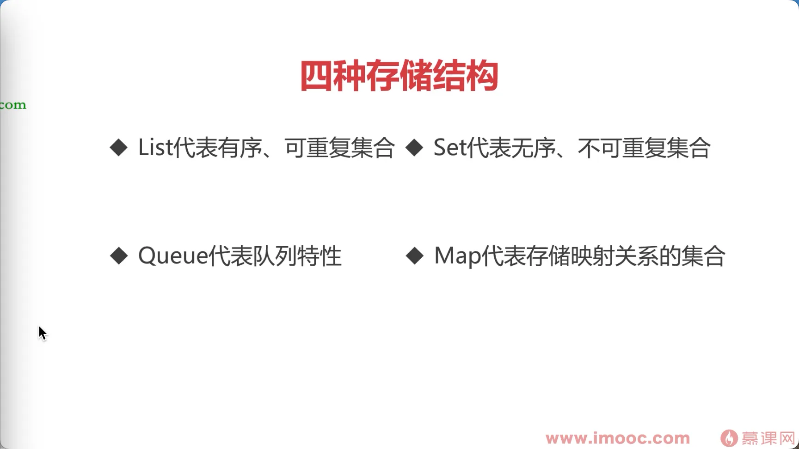
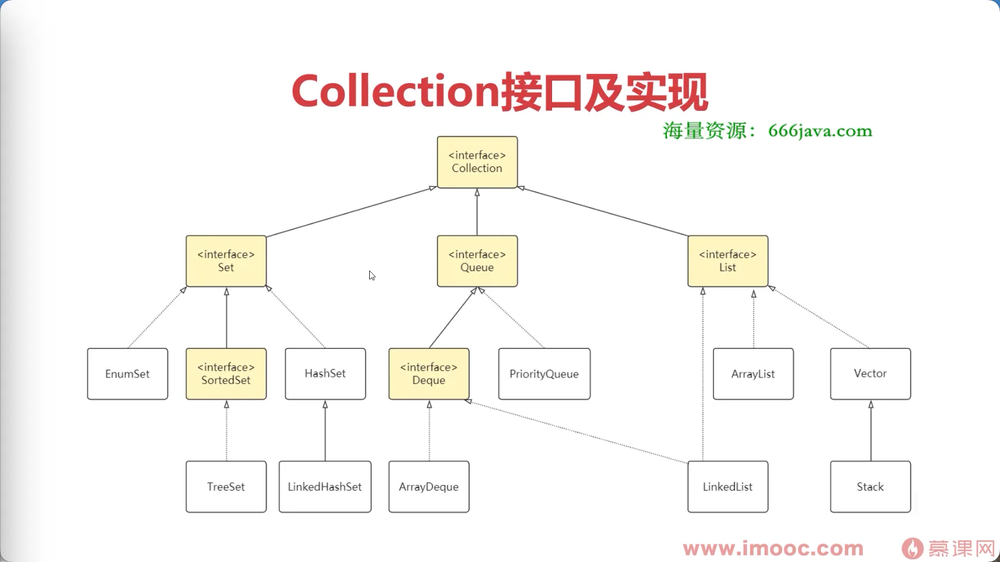
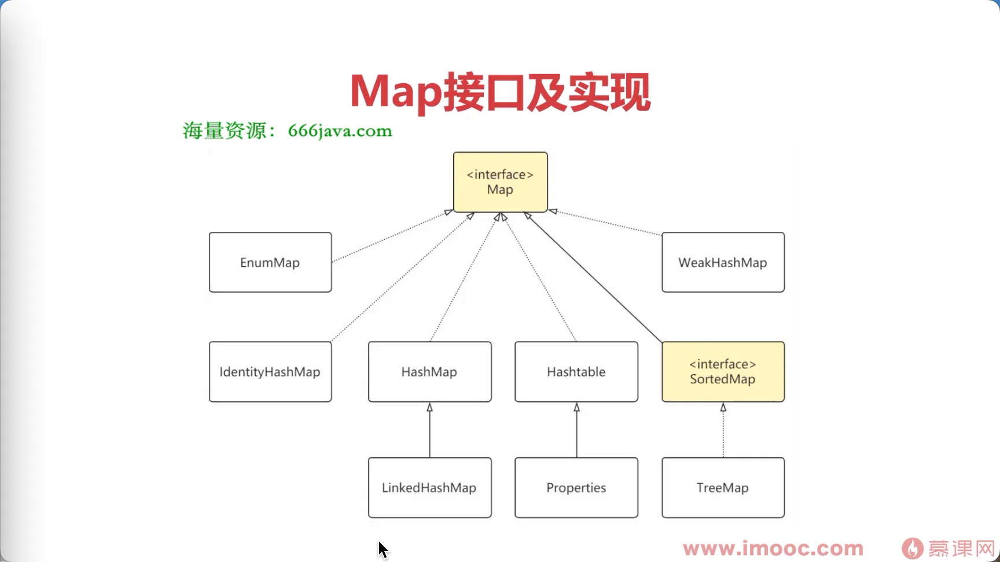

# 集合&#x20;

**Collection**

> 主要是代替数组存取数据；方便保存；检索；修改操作；

[简介](./简介/index.md "简介")

[Map](./Map/index.md "Map")

[Collection](./Collection/index.md "Collection")

[迭代器Iteration](./迭代器Iteration/index.md "迭代器Iteration")
