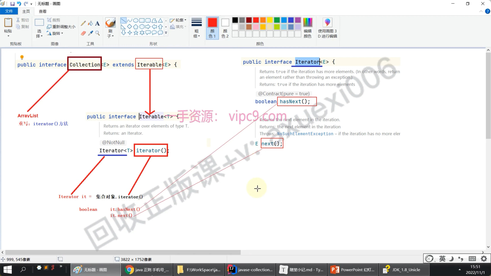
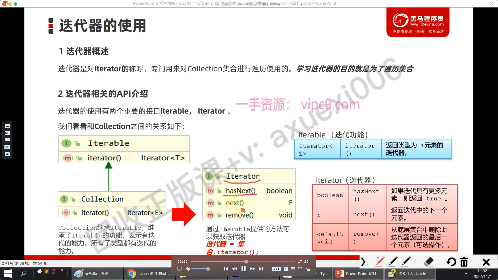
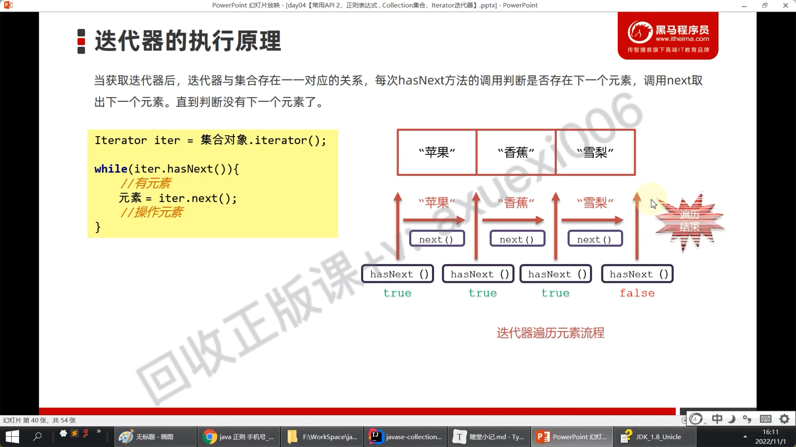
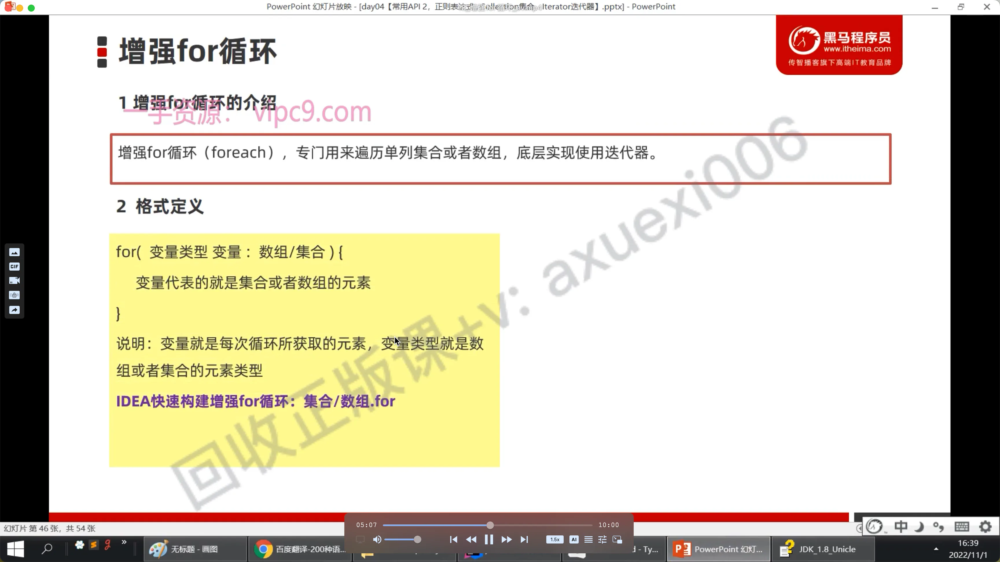

# 迭代器Iteration

## 目录

- [什么用](#什么用)
- [关系（collection）](#关系collection)
- [常用方法](#常用方法)
- [执行原理](#执行原理)
- [注意事项](#注意事项)
- [增强for循环](#增强for循环)

# 什么用

**遍历集合的**

# 关系（collection）





# 常用方法

```python 
hasNext()
next()
```


```java 
Collection<String> col = new ArrayList<String>();
        col.add("java");
        col.add("Strrr");
        col.add("python");
        Iterator<String> it = col.iterator();
        while (it.hasNext()){
            String s = it.next(); // 必须要有泛型；否则要强制转换
            System.out.println(s);
        }
```


# 执行原理

- hasNext 可以理解为指针
- next 是去移动指针；



# 注意事项

- 当迭代器获没有元素后不能继续用next 获取元素；否则会报错；`NoSuchElementException`
- 在**迭代器遍历过程中：不能用集合删除**；可以用**迭代器对象删除；** 因为集合的长度在迭代中已经固定了；你删了就少了一个
  - 只能删除；目前没法增加；

# 增强for循环

- 就是基于普通for循环进行强化；**底层就是使用迭代器；**
- 针对数组或者集合 进行遍历；
- 在迭代器的注意事项在增强**for里同样实用；** 不能删除；会引发异常

```c# 
for(元素类型 元素：容器){

}
```



